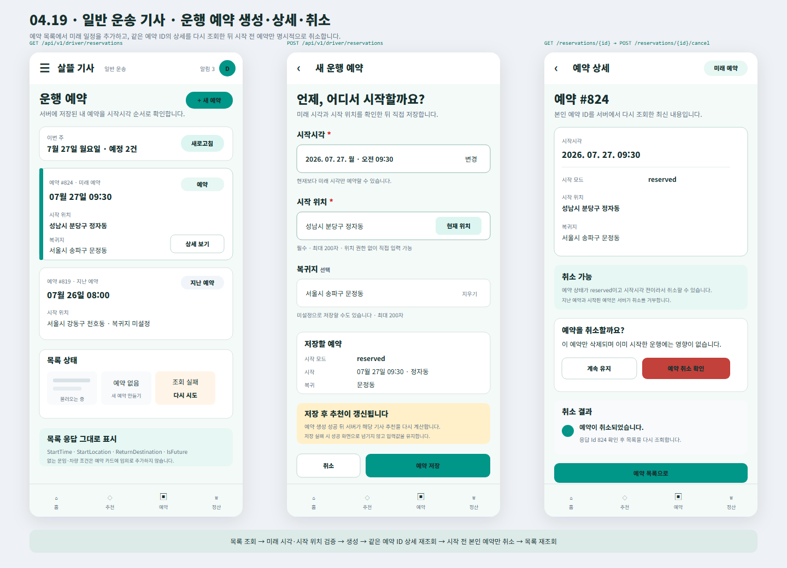

# Driver 운행 예약 생성·상세·취소

## 결과

- Figma `04 Driver`에 실제 사용자 화면 `04.19 · Driver · Reservation Create Detail Cancel`을 추가했다.
- 예약 목록은 `GET /api/v1/driver/reservations`의 `StartTime`, `StartLocation`, `ReturnDestination`, `IsFuture`만 사용하고 운임이나 차량 조건을 임의로 섞지 않는다.
- 새 예약은 서버 검증과 동일하게 `reserved` 시작 모드, 미래 시작시각, 필수 시작 위치, 선택 복귀지로 구성했다.
- 생성 성공 뒤 추천 갱신이 일어나는 점을 안내하고, 실패하면 입력값을 유지한 채 성공 화면으로 넘기지 않도록 정리했다.
- 예약 상세는 본인 예약 ID를 다시 조회한 최신 값을 보여 준다.
- 취소는 `reserved` 상태인 시작 전 본인 예약에만 노출하고, 취소 성공 응답의 ID를 확인한 뒤 목록을 다시 조회하도록 연결했다.
- 불러오는 중, 빈 목록, 조회 실패와 재시도 상태를 예약 목록 안에 함께 표현했다.

## 화면

## 확인

- Figma `04 Driver`에 [`04.19 · Driver · Reservation Create Detail Cancel`](https://www.figma.com/design/0KhuQLc1MleUBIQnARC21Z/ssalddle?node-id=2275-2) 프레임으로 배치했다.
- 프레임 위치 `X 70 / Y 7600`, 크기 `1440 × 1040`을 확인했다.
- SVG 원본과 PNG 시각 산출물을 함께 보존한다.
- `Helvetica Neue` 제품 글꼴 계열과 기존 `04 Driver`의 청록색 모바일 화면 규격을 유지한다.
- 이번 변경은 Figma와 변경 기록만 포함하며 `DriverApp`, `FDriverApp`, 서버 코드는 수정하지 않는다.
