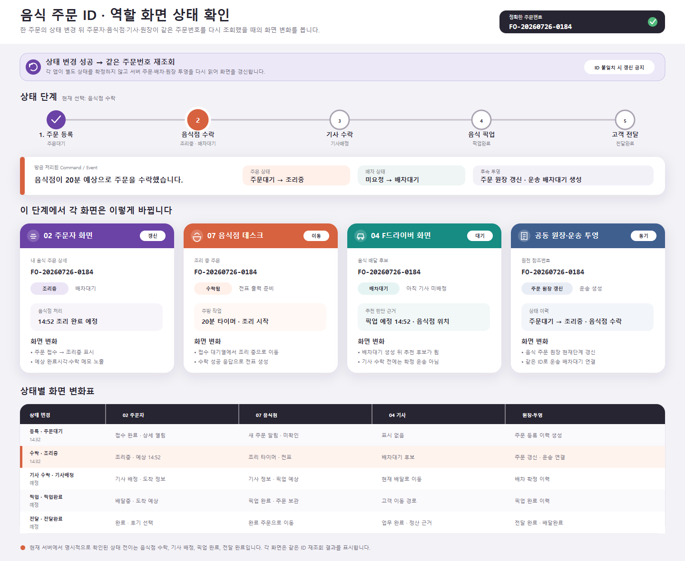

# 음식 주문 ID 중심 역할 화면 상태 변화

## 결과

- 하나의 음식 주문번호를 기준으로 주문자, 음식점 데스크, F드라이버, 공동 원장·운송 투영의 화면 변화를 함께 보는 UI를 추가했다.
- 상태 단계를 `주문 등록 → 음식점 수락 → 기사 수락 → 음식 픽업 → 고객 전달` 순서로 배치하고, 선택한 단계에서 네 화면이 무엇을 새로 표시하는지 동시에 비교한다.
- 각 앱이 로컬 상태를 별도로 확정하는 화면으로 보이지 않도록 `상태 변경 성공 → 같은 주문번호 재조회` 원칙을 화면 상단에 고정했다.
- 현재 예시는 음식점이 20분 예상으로 주문을 수락한 직후이며, 주문 상태 `조리중`, 배차 상태 `배차대기`를 함께 표시한다.

## 화면

- 기준 크기: 1440×1180 데스크톱
- 기준 주문번호: `FO-20260726-0184`
- 선택 상태: 음식점 수락
- 비교 역할: `02 주문자`, `07 음식점 데스크`, `04 F드라이버`, `공동 원장·운송 투영`

PNG는 Figma에 넣는 동일 SVG를 1440×1180 Chrome 렌더링으로 확인한 시각 기록이다. SVG는 텍스트와 벡터 레이어를 유지해 Figma에서 편집할 수 있다.

## Figma

- 파일: `0KhuQLc1MleUBIQnARC21Z`
- 페이지: `Flow · Food Order`
- Frame: `FLOW.01 · Food Order ID · Cross-App State`
- Node: `2269:177`
- 크기·위치: `1440×1180`, `X=0`, `Y=0`
- 가져오기 형식: 편집 가능한 SVG 텍스트·벡터 레이어

Figma에서 페이지·Frame 이름, Node, 크기·위치와 주문번호·상태 단계·역할별 화면·상태 변화표 레이어 존재를 확인했다. Figma 자체 PNG 내보내기는 수행하지 않았다.

## 상태별 화면 의미

| 상태 변경 | 주문자 화면 | 음식점 화면 | 기사 화면 | 원장·투영 |
| --- | --- | --- | --- | --- |
| 주문 등록 | 접수 완료와 주문 상세 | 실시간 새 주문 알림 | 표시 없음 | 주문 등록 상태 이력 |
| 음식점 수락 | 조리중, 예상 완료시각, 배차대기 | 접수 대기에서 조리 중으로 이동, 전표 | 배차대기 추천 후보 | 음식 주문 원장 갱신, 운송 배차대기 연결 |
| 기사 수락 | 기사 배정과 도착 정보 | 기사 정보와 픽업 예상 | 현재 배달로 이동 | 배차 확정 이력 |
| 픽업 완료 | 배달중과 도착 예상 | 픽업 완료 주문 | 고객 이동 경로 | 픽업 완료 이력 |
| 전달 완료 | 완료와 후기 선택 | 완료 주문 | 업무 완료와 정산 근거 | 주문 전달완료, 배차 배달완료 |

## 실제 서버 경계

- 음식 주문 등록은 `음식주문등록됨Event`를 발행하고 음식점 실시간 알림과 음식 주문 원장 동기화를 수행한다.
- 음식점 수락은 `음식점주문수락됨Event`를 발행한다. 즉시 픽업이 아니면 `조리중`, 즉시 픽업이면 `픽업대기`가 된다.
- 음식점 수락 후 같은 주문번호를 원천 참조번호와 운송의뢰 ID로 사용해 배차대기를 생성하고, 음식 주문의 배차 상태를 `배차대기`로 갱신한다.
- 기사가 제안을 수락하면 음식 주문은 `기사배정`, 픽업을 확인하면 `픽업완료`, 고객 전달을 확인하면 `전달완료`가 된다.
- 주문자 상세는 정확한 주문번호 한 건과 상태 이력을 조회하며 다른 주문으로 대체하지 않는다.

## 표현 경계

- 배차대기가 생성되었다는 사실과 기사에게 제안이 확정 노출되었다는 사실을 구분했다. 기사 화면은 추천 후보 단계이며 기사 수락 전에는 확정 운송이 아니다.
- 화면 간 갱신은 같은 주문번호를 기준으로 하지만, 주문 상태와 배차 상태는 서로 다른 필드로 나눠 표시한다.
- 음식점 데스크의 전표는 음식점 수락 성공 응답을 기준으로 준비하며 주문 알림만으로 출력하지 않는다.
- 이 UI는 상태를 직접 변경하는 관리자 도구가 아니라, 역할별 화면 반영을 이해하고 확인하는 디자인 기준이다.

## 확인

- `음식주문상태코드`, `음식주문배차상태코드`, 음식점 수락 EventHandler, F드라이버 상태 전이, 주문자 정확한 상세 화면을 대조했다.
- 동일 SVG의 1440×1180 PNG 렌더링을 확인했다.
- Figma `Flow · Food Order`의 Frame 이름·Node·크기·위치와 내부 레이어를 확인했다.
- 요청 범위에 따라 MAUI 앱과 서버 코드는 수정하거나 빌드하지 않는다.
