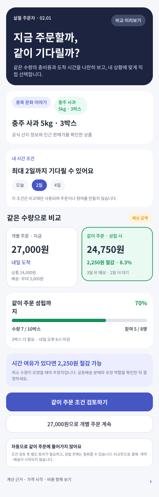

# 주문자 개별 주문·같이 주문 비용·시간 비교

## 결과

- 주문자가 같은 상품과 수량을 `개별 주문`할 때와 `같이 주문` 성립을 기다릴 때의 총예상비용, 단위비용, 예상 절감액, 추가 대기시간을 한 화면에서 비교하도록 Figma `02.01` 화면을 추가했다.
- 문화 이야기에서 발견한 상품과 반경 7km 안의 매장 상품 모두 같은 비교 화면으로 이어질 수 있도록 출처 문맥을 함께 표시했다.
- 같이 주문은 최소 수량, 현재 참여자·수량, 모집 마감, 물류·부대비용과 위험 예비비를 포함한 추정치로 계산한다. 더 비싸거나 사용자의 최대 대기 가능 시각을 넘으면 절감으로 권하지 않는다.
- 비교에는 기본 선택이 없고, 같이 주문은 조건 검토 뒤 별도 동의가 있어야 한다. 비교만으로 자동 집단화, 결제, 계약 또는 배송을 실행하지 않는다.

## Figma

- 파일: `0KhuQLc1MleUBIQnARC21Z`
- Section: `2233:176` — `02 · 주문자 · 같이 주문 비용 비교 · 0.5→1.0`
- Screen: `2233:177` — `02.01 · 개별 주문 vs 같이 주문`
- 기존 숨김 주문자 문화 우선 참고안의 보라색 계열과 `Noto Sans KR` 타이포를 이어받고, 서버 테스트 예시와 같은 `27,000원 vs 24,750원`, `2,250원·8.3%`, `7/10박스`, `5/8명`, `2일 추가 대기`를 사용했다.

## 서버 계약

- `POST /api/v1/orderer/order-mode-comparisons/preview`
  - 상태를 저장하지 않는 읽기 전용 비교 API다.
  - 기존 `CollectiveProcurementEconomicsEngine`을 재사용해 공동 수량별 공급가격, 고정·단위·용량·비율 비용과 위험 예비비를 계산한다.
  - 같이 주문 모집 마감, 개별비용 우위, 대기 한도 초과, 성립 대기, 절감 가능을 서로 다른 신호로 반환한다.
- `/group-purchase/compare/{ProductId}`
  - `0.5` 개별 주문에서 `1.0` 같이 주문 검토로 넘어가는 공개 읽기 전용 stable route다.
  - 현재 `GroupPurchaseDemandWorkflow` 기능 경계를 따르므로 기본 비활성 배포에서는 노출되지 않는다.
- 제품·화면·새 서버 계약에서는 `같이 주문`을 표준 용어로 쓴다. 기존 API route, 저장 코드와 이미 공개된 DTO의 `GroupPurchase`·`공동주문` 식별자는 연동 호환을 위해 유지한다.

## 확인

- 주문 방식 비교, 같이 주문 용어, 동적 주제 검색, API metadata·경계, roadmap, 배차·HR 표시 대상 테스트 297개 통과
- `eng/validate-changes.ps1 -Level Task -NoRestore -Paths ...` 통과
  - `Ssalddel.v3.5.slnx` build
  - 관련 targeted test 24개 filter
  - `git diff --check`
- Figma metadata와 390×1213 실제 PNG를 확인했다.
- 요청 범위에 따라 MAUI 주문자 앱 코드는 수정하거나 실행하지 않았다.
