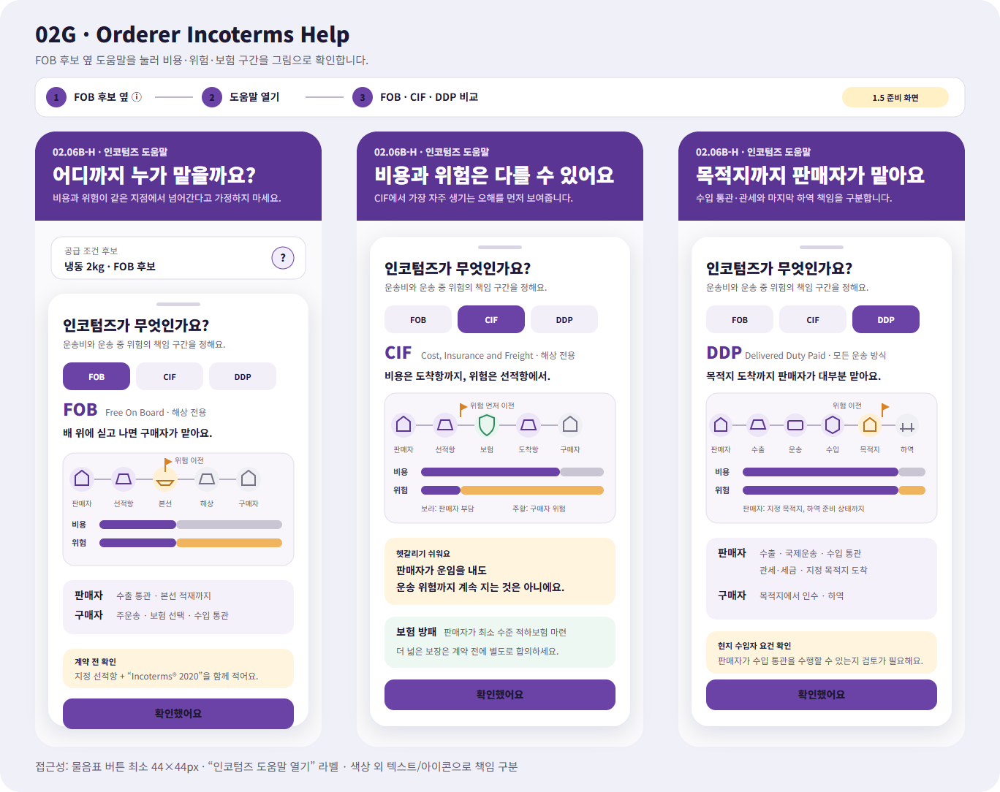

# 주문자 인코텀즈 그림 도움말

## 결과

- 주문자가 공급 조건 옆 `?` 도움말을 눌러 `FOB`, `CIF`, `DDP`의 비용·위험·보험 책임을 짧은 그림으로 확인하는 화면을 추가했다.
- Figma `02 Orderer`에 `02G · Orderer · Incoterms Help` 프레임을 추가하고 기존 주문자 보라색 카드 계열과 맞췄다.
- `CIF`는 판매자가 도착항까지 운임·보험을 마련해도 위험은 출발항의 본선 적재 시점에 먼저 구매자에게 이전된다는 차이를 두 개의 막대로 분리했다.
- 도움말은 계약 조건을 자동 선택하거나 저장하지 않으며, 사용자가 내용을 확인한 뒤 기존 화면으로 돌아간다.

## Figma

- 파일: `0KhuQLc1MleUBIQnARC21Z`
- 페이지: `02 Orderer`
- Frame: `02G · Orderer · Incoterms Help`
- Node: `2266:176`
- 위치: 기존 `02E` 아래, `X=-85`, `Y=7900`
- 가져오기 형식: 편집 가능한 SVG 벡터·텍스트 레이어

PNG는 Figma에 넣은 동일 SVG를 1368×1084 Chrome 렌더링으로 확인한 시각 기록이다. Figma에서는 Frame 이름, Node, 크기와 위치 및 내부 텍스트·벡터 레이어 존재를 확인했으며 Figma 자체 PNG 내보내기는 수행하지 않았다.

## 서버 조화

- `GET /api/v1/orderer/trade/incoterms/help?termCode=CIF&languageCode=ko-KR`
- `Incoterms도움말응답`은 화면 문구와 함께 구간별 비용 부담자, 위험 부담자, 위험 이전 지점, 보험 표시 여부를 제공한다.
- 지원 코드 범위는 주문자 화면에서 우선 설명할 `FOB`, `CIF`, `DDP`로 제한했다. 기존 원장 계약의 다른 Incoterms 후보 코드는 변경하지 않았다.
- 한국어·영어·일본어 표시를 지원하고 잘못된 코드는 `400 Bad Request`로 명시적으로 거부한다.
- API는 `CustomsAndTradeDataWorkflow` 1.5 Feature 경계 안의 인증된 읽기 전용 조회이며 선택·저장·계약·결제·신고·외부 전송을 수행하지 않는다.

## 공식 근거와 표시 경계

- 국제상업회의소(ICC)의 [Incoterms® rules](https://iccwbo.org/business-solutions/incoterms-rules/)와 [Incoterms® 2020](https://iccwbo.org/business-solutions/incoterms-rules/incoterms-2020/)을 기준으로 설명을 요약했다.
- `FOB`와 `CIF`는 해상·내수로 운송에 쓰며, `DDP`는 모든 운송 방식에 쓸 수 있다는 운송 범위를 함께 표시한다.
- 실제 계약에는 지정 항구·장소와 `Incoterms® 2020`을 함께 적도록 안내한다.
- 이 도움말은 가격·대금 지급·소유권·품질 조건이나 현지 법규 검토를 대신하지 않는다. 실제 계약·통관 전에는 보험 범위와 전문가 검토가 필요하다.

## 접근성

- 도움말 버튼은 구현 시 최소 44×44px 터치 영역과 `인코텀즈 도움말 열기` 접근성 이름을 사용한다.
- 판매자·구매자 책임은 색만으로 구분하지 않고 텍스트, 역할명, 위험 이전 깃발과 보험 방패를 함께 표시한다.
- 화면을 닫아도 Incoterms 후보를 자동 선택하거나 사용자 입력을 변경하지 않는다.

## 확인

- `Incoterms도움말` 대상 테스트 6개 통과
- `Ssalddel`, `Ssalddel.Contracts`, `Ssalddel.Tests`와 관련 소비 프로젝트 컴파일 통과
- 동일 SVG의 1368×1084 PNG 렌더링 확인
- Figma `02 Orderer` Frame 이름·Node·크기·위치·내부 레이어 확인
- 요청 범위에 따라 MAUI 앱은 수정하거나 실행하지 않았다.
