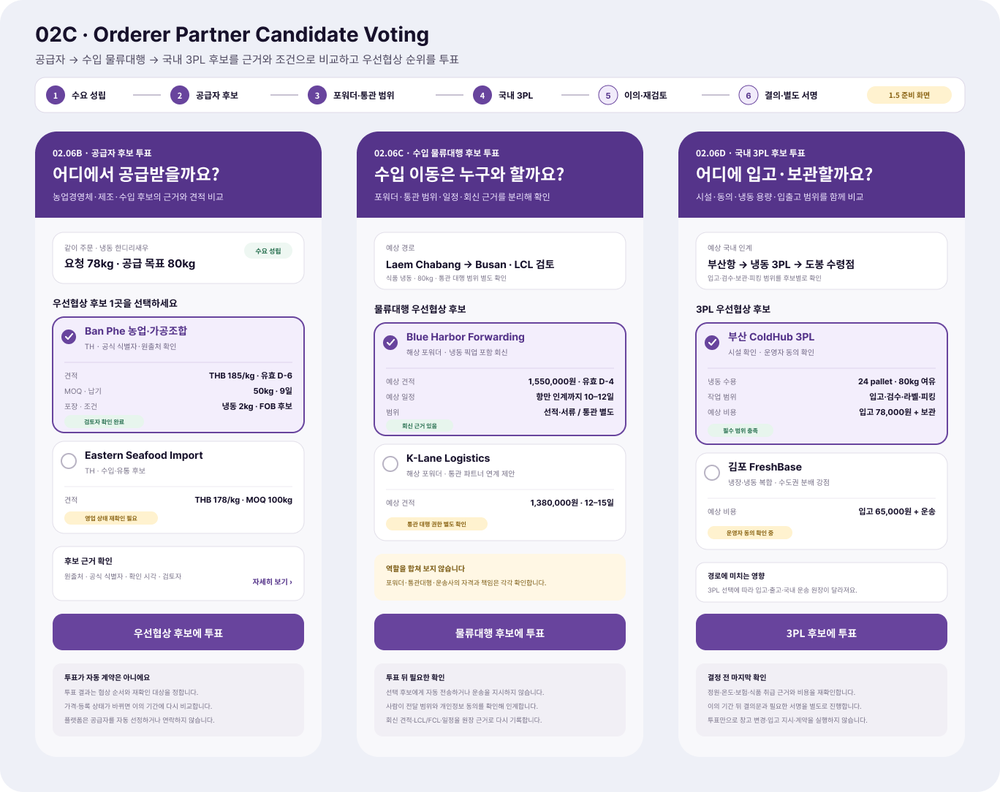

# 주문자 공급자·수입 물류대행·3PL 후보 투표

## 결과

- Figma `02 Orderer`에 `02C · Orderer · Partner Candidate Voting` 화면 묶음을 추가했다.
- `02.06B · 공급자 후보 투표`에서 농업경영체·제조·수입 후보의 공식 식별자, 원출처, 견적, MOQ, 납기, 포장과 Incoterms 후보를 비교한다.
- `02.06C · 수입 물류대행 후보 투표`에서 포워더의 견적·일정·회신 근거를 비교하고 통관대행·운송사 역할과 자격을 따로 확인한다.
- `02.06D · 국내 3PL 후보 투표`에서 운영자 동의, 시설 확인, 온도·용량, 입고·검수·라벨·피킹 범위와 예상 비용을 비교한다.
- 각 투표는 계약 상대를 즉시 확정하지 않고 `우선협상 후보`의 순서를 정한다. 이후 `이의·재검토 → 결의 → 별도 서명`으로 이어지며 자동 연락·계약·운송 지시를 실행하지 않는다.

## Figma

- 파일: `0KhuQLc1MleUBIQnARC21Z`
- 페이지: `02 Orderer`
- Frame: `02C · Orderer · Partner Candidate Voting`
- 위치: 기존 `02B` 아래, `X=-85`, `Y=4020`
- 화면 예시의 업체명과 금액은 사용자 흐름을 검토하기 위한 sample이며 실제 업체 추천이나 견적이 아니다.

## 서버 조화

- `CommunityVoteCreateRequest`는 일반·구조화 선택지, 복수 선택, 마감, 결의문과 서명 여부를 지원한다.
- 공동구매 원장 진행 단계에는 `counterparty`, `supply-negotiation`, `objection`, `resolution`, `signature`가 이미 구분되어 있다.
- `같이수입준비원장Dtos`는 공급자 후보의 공식 식별자·원출처·확인 시각·검토자와 견적의 통화·MOQ·단가·납기·포장·Incoterms 후보를 검증한다.
- `CommunityGroupImportLedgerConversionRequest`는 사람이 정한 포워더·물류대행업체명과 회신 근거, 창고 운영자 동의·시설·입고·보관·출고 가능 여부를 받는다.
- 현재 범용 투표 선택지에는 업체 역할·공식 식별자·견적 근거를 직접 담는 전용 구조가 없다. 화면을 실제 저장 흐름으로 연결할 때에는 범용 투표의 옵션과 검증된 업체 후보 snapshot을 별도 참조로 연결하는 계약이 필요하다.

## 제품 경계

- 투표권은 국적·언어·경제력 같은 대리 지표로 차등하지 않는다.
- 저가 후보가 자동 우승하지 않으며 자격, 책임 범위, 최신성, 식품·온도 취급 근거와 총비용을 함께 공개한다.
- 플랫폼은 공급자·포워더·3PL을 자동 선정하거나 외부로 자동 전송하지 않는다.
- 계약·결제·신고·운송 지시·창고 변경은 투표와 분리된 권한·동의·서명·운영 검증 뒤에만 가능하다.

## 확인

- Figma 데스크톱에서 새 Frame을 실제 배치하고 57% 확대 상태에서 화면 구조와 기존 보라색 주문자 디자인 계열의 조화를 확인했다.
- Figma에서 1368×1084 PNG를 직접 내보내 시각 기록으로 보존했다.
- 요청 범위에 따라 MAUI 앱과 서버 코드는 수정하거나 실행하지 않았다.
