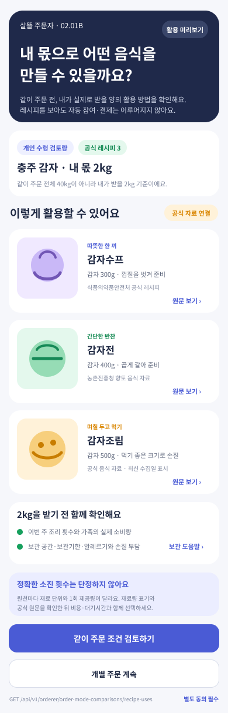

# 주문자 같이 주문 전 레시피 활용 판단

## 결과

- 기존 `OfficialFoodDish → OfficialFoodRecipeVariant → OfficialFoodRecipeIngredient` DB와 식재료별 관련 레시피 색인을 그대로 재사용했다.
- 개별 주문과 같이 주문 비용·시간 비교 다음에, 주문자가 **같이 주문 전체 물량이 아니라 자신이 실제로 수령할 몫**으로 만들 수 있는 음식을 확인하는 Figma `02.01B`를 추가했다.
- 레시피 카드에는 음식명, 해당 식재료의 원문 사용량, 손질 메모, 공식 제공기관, 원문 링크와 수집 시각을 표시할 수 있도록 했다.
- 원천마다 단위와 1회 제공량이 달라 정확한 소진 횟수는 단정하지 않는다. 레시피 조회만으로 같이 주문 참여, 결제, 계약 또는 배송이 실행되지 않는다.

## Figma

- 페이지: `02 Orderer`
- Frame: `2277:245` — `02.01B · 같이 주문 전 레시피 활용 확인`
- 링크: https://www.figma.com/design/0KhuQLc1MleUBIQnARC21Z/ssalddle?node-id=2277-245
- 기존 주문자 화면의 `Noto Sans KR`, 짙은 남색 헤더, 보라색 행동 버튼, 초록색 공식 근거 강조를 재사용했다.

## 서버 계약

- `GET /api/v1/orderer/order-mode-comparisons/recipe-uses`
  - 상품 키·상품명, 개인 수령 검토 수량·단위, 선택 식재료 키를 받는다.
  - 기존 공식 음식 식재료 색인에서 일치 재료와 게시 가능한 최신 관련 레시피를 조회한다.
  - `Matched`, `IngredientNotMatched`, `RecipeNotFound`를 구분한다.
  - `같이주문자동전환금지=true`, `같이주문별도동의필수=true`를 명시한다.
  - 레시피 단위가 정규화되지 않은 경우 정확한 소진 횟수를 만들지 않는다.

## 검증

- Figma Frame 이름·Node·크기 `390 × 1213`과 `Noto Sans KR` 글꼴을 확인했다.
- Figma에서 선택 Frame을 PNG로 직접 내보내 변경 기록에 저장했다.
- `같이주문레시피활용UseCaseTests`의 일치 자료·미일치 자료 경계를 검증했다.
