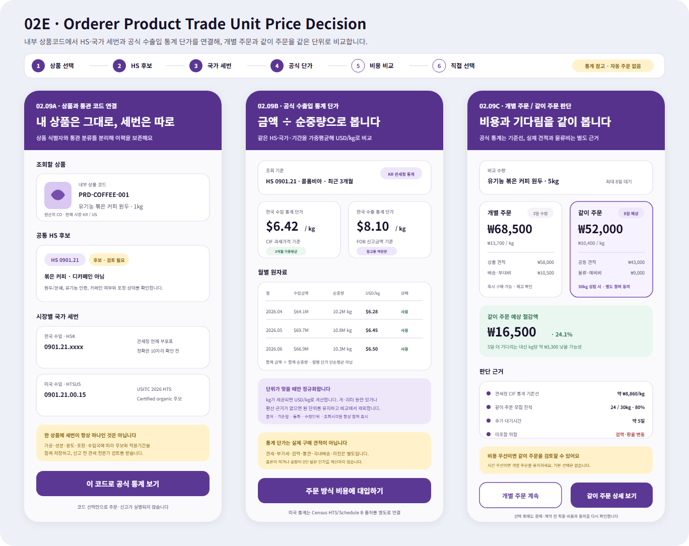

# 주문자 상품·HS/HTS·공식 수출입 통계 단가 판단

## 결과

- 내부 상품코드는 주문·판매·재고에서 쓰는 안정 식별자로 유지하고, HS 공통 6자리와 한국 HSK·미국 HTSUS 같은 국가 세번은 적용 시장·기간·검토 상태가 있는 별도 참조로 표시했다.
- 관세청 `품목별 국가별 수출입실적`의 월별 수입·수출 금액과 순중량을 함께 읽어 수입 CIF와 수출 FOB 통계 단가를 각각 `USD/kg`로 계산하도록 기존 서버 응답을 확장했다.
- 기간 단가는 월별 단가의 단순평균이 아니라 `기간 합계 금액 ÷ 기간 합계 순중량` 가중평균으로 계산한다. 순중량이 없으면 `USD/kg`를 만들지 않는다.
- 통계 단가는 실제 견적이나 도착원가가 아니므로, 개별 주문과 같이 주문 비교에서는 공급 견적·국제 물류·관세·부가세·검역·통관·국내배송·위험 예비비·추가 대기시간을 별도 근거로 표시한다.
- 비교만으로 같이 주문 참여, 결제, 계약, 수입 신고 또는 운송이 자동 실행되지 않는다.

## Figma

- 파일: `0KhuQLc1MleUBIQnARC21Z`
- 페이지: `02 Orderer`
- 시각 참조 레이어: `02E - Orderer Product Trade Unit Price Decision - Visual Reference`
- 위치: 기존 `02D` 아래, `X=-85`, `Y=6480`
- 화면:
  - `02.09A` 내부 상품코드 → HS 후보 → 시장별 HSK/HTSUS 연결
  - `02.09B` 공식 수출입 통계의 원자료·단위·가중평균·가격 기준 확인
  - `02.09C` 개별 주문과 같이 주문의 총비용·단위비용·대기시간·모집 진척 비교

## 서버 계약

- 기존 `POST /api/v1/orderer/public-data/customs/hs-country-import-unit-price-simulation` 호출 경로는 유지했다.
- `HsCountryMonthlyTradeUnitPriceRequest`
  - `InternalProductCode`, `ProductName`: 내부 상품과 통계 조회 문맥 연결
  - `HsCode`, `HsCodeScheme`: 관세청 통계 조회에 사용하는 HS/HSK 코드
  - `NationalTariffCodeScheme`, `NationalTariffCode`: 미국 HTSUS 등 시장별 국가 세번 참고
- `HsCountryImportUnitPriceSimulationResult`
  - 월별·기간 합계의 수입 중량·금액·CIF 단가와 수출 중량·금액·FOB 단가
  - `QuantityUnit`, `CalculationMethod`, `DataSource`, `DataSourceUrl`
  - `IsStatisticalUnitValue=true`, `IsLandedCost=false`와 분류·가격 한계 경고
- 기존 수입 단가 필드는 그대로 유지했으므로 현재 소비자의 역호환성을 깨지 않는다.
- 현재 실제 외부 조회 구현은 한국 관세청 신고통계다. 미국 시장은 USITC HTS 세번 확인과 Census International Trade 통계 어댑터를 별도 출처로 붙여야 하며, 한국 관세청 값을 미국 수입 통계로 재해석하지 않는다.

## 공식 근거와 한계

- 관세청 품목별·국가별 수출입실적은 HS 코드, 상대국, 월별 수출입 금액과 순중량(kg)을 제공한다. 한국 수입은 CIF, 수출은 FOB 금액 기준이다.
- 미국 수입은 HTS, 수출은 Schedule B 기준 통계를 사용한다. 미국 Census International Trade API는 금액과 함께 품목별 수량 단위 필드를 제공하므로 단위가 호환되는 관측값만 정규화해야 한다.
- HTSUS 예시는 USITC 2026 HTS의 `0901.21.00.15` 유기농·비디카페인 볶은 커피 후보를 사용했다. 실제 상품 신고 전에는 원재료, 가공, 인증, 포장과 용도에 맞는 최신 세번을 다시 확인한다.

## 확인

- `HsCountryTradeUnitPriceLookupServiceTests` 1개 통과
  - 내부 상품코드와 HS/HTSUS 참조 보존
  - 월별 기간 문자열·국가코드·상품명 정규화
  - 수입 USD 2.75/kg·수출 USD 6.00/kg 기간 가중평균과 환율 변환
- Figma 데스크톱에서 시각 참조 레이어를 실제 배치하고 `X=-85`, `Y=6480`, `1368×1084` 크기와 기존 보라색 주문자 디자인 계열을 확인했다.
- PNG는 동일 SVG의 로컬 렌더링을 Figma 시각 참조 레이어로 배치한 결과다. SVG 직접 가져오기 중 생긴 빈 참조 그룹은 삭제하지 않고 숨김 처리했다.
- 요청 범위에 따라 MAUI 앱은 수정하거나 실행하지 않았다.
