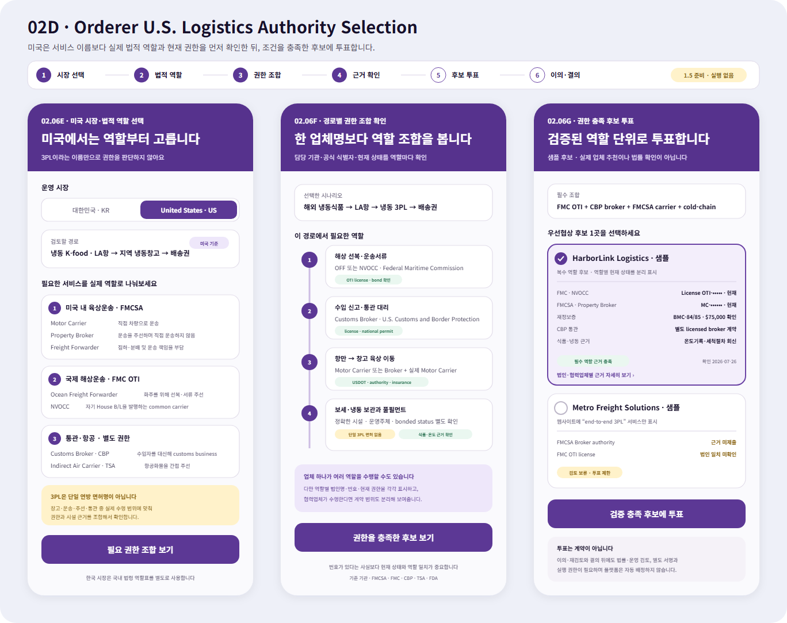

# 주문자 미국 물류 역할·권한 선택

## 결과

- Figma `02 Orderer`에 `02D · Orderer · U.S. Logistics Authority Selection` 화면 묶음을 추가했다.
- `02.06E`에서 운영 시장을 한국과 미국으로 먼저 나누고, 미국에서는 `Motor Carrier`, `Property Broker`, `Freight Forwarder`, `Ocean Freight Forwarder`, `NVOCC`, `Customs Broker`, `Indirect Air Carrier`를 실제 역할별로 선택한다.
- `02.06F`에서 해상 선복·통관 대리·미국 내 육상 이동·보세 및 냉동 보관을 하나의 `3PL` 이름으로 합치지 않고, 담당 기관과 필수 근거를 경로 순서대로 확인한다.
- `02.06G`에서 역할별 공식 식별자와 현재 권한을 충족한 후보만 우선협상 투표 대상으로 표시하고, 근거가 없거나 법인명이 맞지 않는 후보는 `검토 보류`로 제한한다.
- 한국 시장은 미국 역할 코드를 번역해 재사용하지 않고 국내 법령 역할표를 별도로 적용한다.

## Figma

- 파일: `0KhuQLc1MleUBIQnARC21Z`
- 페이지: `02 Orderer`
- Frame: `02D · Orderer · U.S. Logistics Authority Selection`
- 위치: 기존 `02C` 아래, `X=-85`, `Y=5250`
- 화면의 업체명과 번호는 사용자 흐름을 검토하기 위한 sample이며 실제 업체 추천·면허 확인·견적이 아니다.

## 공식 기준

- FMCSA는 motor carrier, broker, freight forwarder를 운송 수행·주선·운송 책임 여부에 따라 구분한다.
- FMC는 Ocean Transportation Intermediary를 Ocean Freight Forwarder와 NVOCC로 나누고, 미국 기반 사업자의 license와 financial responsibility를 확인한다.
- CBP의 Customs Broker는 다른 사람을 대신해 customs business를 수행하는 별도 license 대상이다.
- TSA의 Indirect Air Carrier는 항공기를 직접 운항하지 않고 항공화물 운송에 간접 참여하는 역할이다.
- FDA 식품 위생 운송 규칙은 적용 대상인 shipper, loader, motor/rail carrier, receiver의 온도·세척·오염 방지·기록·교육 책임을 구분한다.

상세 공식 확인 경로와 사용 기준은 [미국 3PL 후보 디렉터리](../Architecture/UnitedStatesThirdPartyLogisticsProviderDirectory.md#역할별-공식-확인-경로)를 따른다. 이 기록은 2026-07-26 화면 설계용 조사 스냅샷이며 법률 자문이나 현재 권한의 개별 확인을 대신하지 않는다.

## 서버 조화와 남은 계약

- 기존 `UnitedStatesThirdPartyLogisticsProviderCatalog`는 FMCSA authority·insurance, FMC OTI, CBP bonded warehouse·customs broker·in-bond·customs bond 확인 경로를 `3PL` 서비스 주장과 분리해 둔다.
- 기존 디렉터리는 플랫폼 자동 선택을 금지하고 정확한 법인·시설·현재 권한을 다시 확인하도록 한다. 새 화면의 `근거 확인 → 후보 투표 → 이의·결의` 경계와 맞는다.
- 현재 범용 투표 선택지는 미국의 시장, 역할 코드, 담당 기관, authority number, 현재 상태, 확인 시각을 전용 필드로 저장하지 않는다. 실제 API 연결 단계에서는 검증된 업체 역할 snapshot을 투표 선택지와 별도 참조로 묶어야 한다.
- 현재 서버 규제 확인 카탈로그에는 TSA IAC와 FDA 식품 위생 운송 resource code가 없다. 이번 변경에서는 기존 서버 코드를 건드리지 않고 기준 문서에 공식 확인 경로를 먼저 보강했다.

## 제품 경계

- `3PL`은 하나의 연방 면허명으로 표시하지 않는다. 실제로 맡길 업무에 따라 필요한 권한 조합을 보여준다.
- 번호가 있다는 사실만으로 통과시키지 않고 법인명·역할·현재 상태·확인 시각의 일치를 확인한다.
- 투표는 우선협상 순서를 정할 뿐 계약·통관 대리·운송 지시·창고 배정이 아니다.
- TSA 보안 프로그램의 민감 정보는 플랫폼 화면이나 후보 snapshot에 수집하지 않는다.

## 확인

- Figma 데스크톱에서 새 Frame을 실제 배치하고 `X=-85`, `Y=5250`, `1368×1084` 크기와 기존 보라색 주문자 디자인 계열의 조화를 확인했다.
- 같은 편집 가능 SVG를 1368×1084 PNG로 로컬 렌더링해 시각 기록으로 보존했다. PNG는 Figma 내보내기 결과가 아니라 Figma에 배치한 원본 SVG의 동일 렌더링이다.
- 요청 범위에 따라 MAUI 앱과 서버 코드는 수정하거나 실행하지 않았다.
