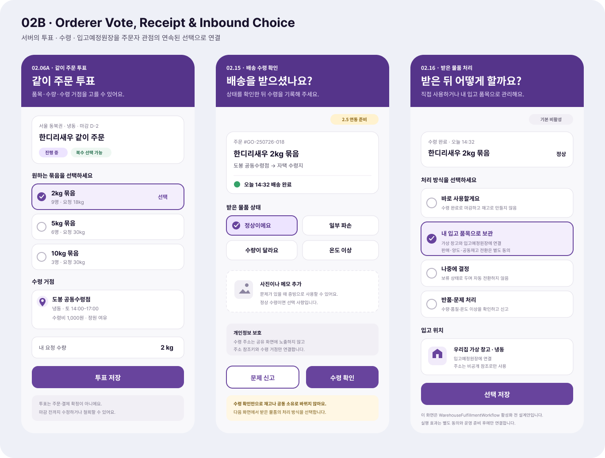

# 주문자 같이 주문 투표·수령 확인·내 입고 품목 선택

## 결과

- Figma `02 Orderer`에 `02B · Orderer · Vote, Receipt & Inbound Choice` 화면 묶음을 추가했다.
- `02.06A · 같이 주문 투표`에서 묶음별 참여자·요청 수량, 복수 선택, 마감, 수령 거점, 본인 요청 수량을 확인하고 투표를 저장하도록 구성했다.
- `02.15 · 배송 수령 확인`에서 정상·파손·수량·온도 이상을 구분하고 사진·메모, 문제 신고, 수령 확인으로 이어지게 했다.
- `02.16 · 받은 물품 처리`에서 `바로 사용`, `내 입고 품목으로 보관`, `나중에 결정`, `반품·문제 처리`를 분리했다.
- 수령 확인만으로 재고·공동 소유·판매 대상으로 자동 전환하지 않으며, 내 입고 품목 전환도 판매·양도·공동재고 전환 동의와 분리했다.

## Figma

- 파일: `0KhuQLc1MleUBIQnARC21Z`
- 페이지: `02 Orderer`
- Frame: `02B · Orderer · Vote, Receipt & Inbound Choice`
- 기존 `02.01~02.14` stable ID는 유지하고, 보라색 주문자 화면 계열과 `Noto Sans KR` 타이포에 맞췄다.
- `02.15`와 `02.16`은 `WarehouseFulfillmentWorkflow` 활성화 전 설계안임을 `2.5 연동 준비`, `기본 비활성`으로 표시했다.

## 서버 근거

- `공동구매수요투표Controller`는 같이 주문 수요 투표의 목록·상세·생성·투표와 원장 진행 조회를 제공한다.
- `CommunityVoteDtos`에는 복수 선택, 마감 시각, 선택 옵션, 요청 수량, 배송권, 반경, 수령 거점과 집계 결과가 정의되어 있다.
- `공동구매수령창고Service`는 주문자 자택 수령지를 개인 소유 `가상창고`로 연결할 수 있다.
- `공동구매개별주문원장Service`는 도착 창고와 `입고예정` 의미 상태를 개별주문 원장 참조에 남긴다.
- 실제 입고·재고 실행은 `WarehouseFulfillmentWorkflow`의 `2.5` 경계이며 현재 기본값은 `false`다.

## 확인

- Figma 데스크톱에서 새 Frame을 실제 배치하고 57% 확대 상태에서 문구·정렬·대비를 확인했다.
- Figma에서 1368×1036 PNG를 직접 내보내 장기 변경 기록으로 보존했다.
- 요청 범위에 따라 MAUI 앱과 서버 코드는 수정하거나 실행하지 않았다.
