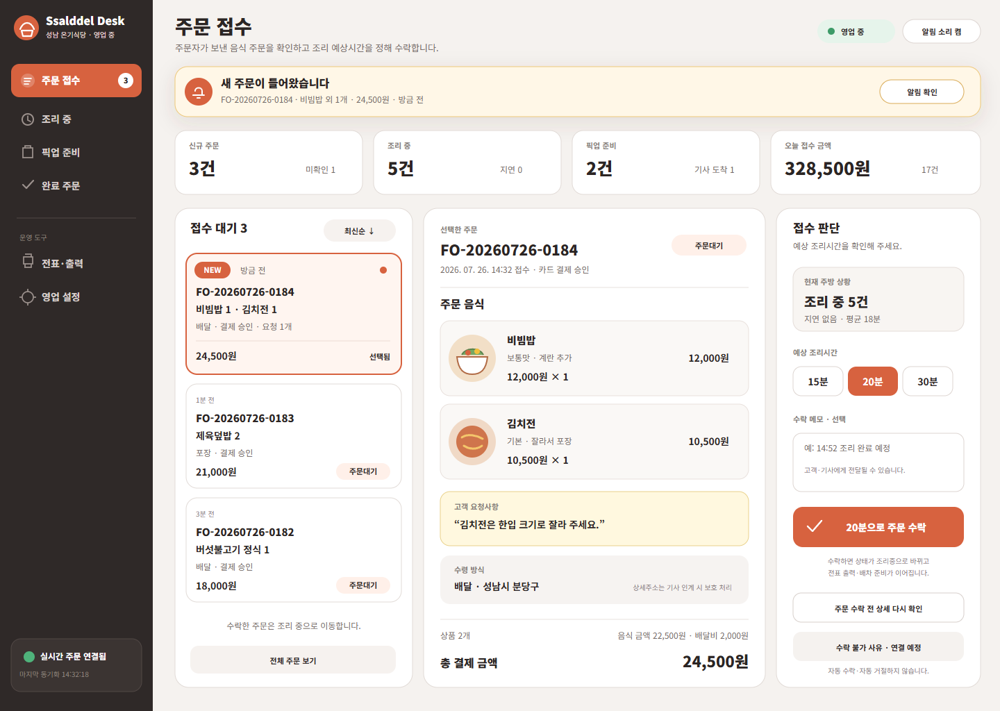

# 음식점 데스크 새 음식 주문 접수

## 결과

- 주문자가 음식 주문을 등록한 직후 음식점 데스크톱에 `새 주문이 들어왔습니다` 알림이 나타나는 운영 화면을 구성했다.
- 새 주문, 조리 중, 픽업 준비를 한 화면에서 구분하고 새 주문 한 건의 음식·옵션·결제·요청사항을 확인한 뒤 조리 예상시간을 정해 명시적으로 수락하도록 했다.
- 고객 상세주소는 음식점의 조리 판단에 필요하지 않은 정보로 보고 지역까지만 표시하고, 기사 인계 시 보호 처리한다는 경계를 적었다.
- 현재 서버에 거절 상태 전이 API가 없으므로 `수락 불가 사유`는 연결 예정의 비활성 항목으로 표현했다. 화면이 지원하지 않는 상태 변경을 수행하는 것처럼 보이지 않게 했다.

## 화면

- 기준 크기: 1440×1024 데스크톱
- 역할: 음식점 주문 접수 담당자
- 대표 상태: 실시간 연결됨, 신규 주문 3건, 선택한 주문은 `주문대기`
- 주요 행동: 조리 예상시간 선택, 주문 상세 재확인, `20분으로 주문 수락`

PNG는 Figma에 넣는 동일 SVG를 1440×1024 Chrome 렌더링으로 확인한 시각 기록이다. SVG는 텍스트와 벡터 레이어를 유지해 Figma에서 편집할 수 있다.

## Figma

- 파일: `0KhuQLc1MleUBIQnARC21Z`
- 페이지: `07 Restaurant`
- Frame: `07.01 · Restaurant · New Order Intake`
- Node: `2267:177`
- 크기·위치: `1440×1024`, `X=0`, `Y=0`
- 가져오기 형식: 편집 가능한 SVG 텍스트·벡터 레이어

Figma에서 페이지·Frame 이름, Node, 크기·위치와 내부 주문 문구·벡터 레이어 존재를 확인했다. Figma 자체 PNG 내보내기는 수행하지 않았다.

## 서버 조화

- 주문 등록: `POST /api/v1/food-orders`
- 음식점 수락: `POST /api/v1/food-orders/{orderNo}/restaurant-acceptance`
- 대표 상태: `주문대기 → 조리중 → 픽업대기`
- 수락 입력: 음식점 정보, `조리예상분`, 즉시 픽업 가능 여부, 수락 메모
- 수락 결과: 음식점 수락 시각, 조리 예상 완료 시각, 상태 이력, 음식 주문 원장 동기화
- 음식점 데스크는 실시간 알림으로 주문을 수신하고, 수락 성공 응답을 기준으로 전표 출력과 후속 배차 준비를 이어 간다.

## 화면 판단 경계

- 새 주문 알림은 자동 수락이 아니며 담당자가 음식과 현재 주방 상황을 확인한 뒤 수락한다.
- 결제 승인 여부, 음식 품목과 수량, 옵션, 요청사항, 수령 방식을 접수 판단 전에 함께 보여 준다.
- 수락 후에는 서버 상태를 다시 조회해 `조리중` 상태와 조리 예상 완료 시각을 화면에 반영해야 한다.
- 거절·조리 완료 상태 전이는 현재 계약에 추가되지 않았으므로 이 화면 기록만으로 구현 완료로 보지 않는다.

## 확인

- 실제 `음식주문응답`, `음식점주문수락요청`, 음식점 데스크 주문 모델과 수락 API 경계를 대조했다.
- 동일 SVG의 1440×1024 PNG 렌더링을 확인했다.
- Figma `07 Restaurant`의 Frame 이름·Node·크기·위치와 내부 레이어를 확인했다.
- 요청 범위에 따라 `RestaurantDeskApp`과 다른 MAUI 앱 코드는 수정하거나 빌드하지 않는다.
