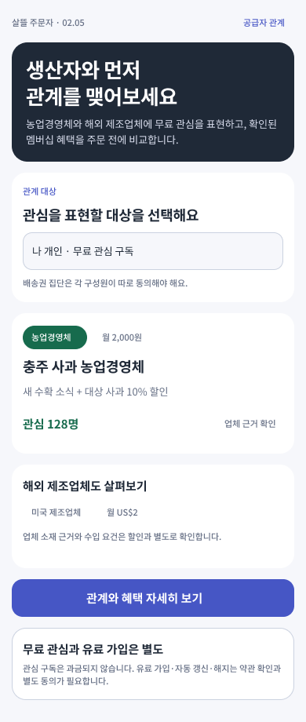
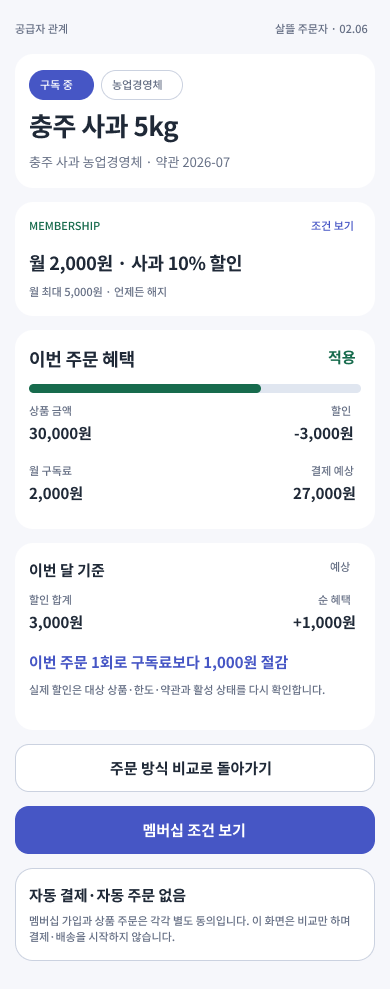

# 농업경영체·해외 제조업체와 주문자의 구독 관계

## 목표

주문자 개인 또는 배송권의 주문자 집단이 국내 농업경영체와 해외 식품 제조업체에
먼저 관심을 표현하고, 공급자가 공개한 유료 멤버십 조건과 주문 혜택을 비교할 수 있게 한다.

`무료 관심 구독 → 유료 멤버십 조건 검토 → 명시적 가입 → 주문별 할인 확인`을
각각 다른 상태와 동의로 다룬다. 화면 진입이나 배송권 집단 대표의 선택만으로
구성원 전체를 가입시키거나 구독료·주문 금액을 결제하지 않는다.

## 화면 흐름

### 02.05 공급자 관계와 구독

- 주문자 개인과 배송권 집단 중 관심을 표현할 주체를 먼저 선택한다.
- 배송권 집단은 대표 한 명의 동의로 전체가 가입되지 않고 각 구성원의 별도 동의를 요구한다.
- 국내 농업경영체와 해외 제조업체를 같은 관계 구조로 보여 주되 업체 유형과 근거를 구분한다.
- 무료 관심 구독과 월 구독료가 있는 혜택 멤버십을 별도 상태로 표시한다.
- 해외 제조업체의 소재 근거, 수입 요건과 통관 준비는 할인 조건과 별도로 확인한다.

### 02.06 구독 혜택 주문 비교

- 상품 금액, 멤버십 할인, 월 구독료와 주문 예상 금액을 한 화면에서 비교한다.
- 할인액에서 월 구독료를 뺀 순 혜택과 예상 손익분기 주문 횟수를 함께 표시한다.
- 공급자 확인, 업체 근거, 대상 상품, 할인 한도와 약관 버전이 확인되어야 혜택을 표시한다.
- 멤버십 가입과 개별 주문은 별도 동의이며 이 화면에서는 결제나 배송을 실행하지 않는다.

## Figma

- 파일: `0KhuQLc1MleUBIQnARC21Z`
- Section: `2233:176` — `02 · 주문자 · 배송권에서 같이 주문 결정 · 1.0`
- Screen: `2249:176` — `02.05 · 공급자 관계와 구독`
- Screen: `2249:213` — `02.06 · 구독 혜택 주문 비교`
- 기존 주문자 화면의 보라색 행동, 초록색 관계·지역 강조, 흰 카드와
  `Noto Sans KR` 서체를 재사용했다.

## 서버 계약

- `POST /api/v1/orderer/supplier-relationships/{supplierKey}/interest-subscription-drafts`
- `GET /api/v1/orderer/supplier-relationships/{supplierKey}/interest-subscription-drafts/{draftId}`
- `POST /api/v1/orderer/supplier-relationships/{supplierKey}/membership-benefit-previews`
- 지원 공급자 유형
  - `DomesticAgriculturalBusiness`
  - `OverseasFoodManufacturer`
- 지원 관계 대상
  - `IndividualOrderer`
  - `DeliveryScopeGroup`
- 관계 상태
  - 무료 관심 구독 `InterestFollowing`
  - 가입 검토 초안 `EnrollmentDraft`
  - 활성·일시정지·해지 상태
- 계산 결과
  - 월 구독료
  - 잠재 할인과 실제 적용 할인
  - 주문 예상 금액
  - 구독료 차감 후 잠재 순 혜택
  - 예상 손익분기 주문 횟수

활성 멤버십이어도 공급자의 혜택 확인, 업체 근거와 대상 상품 조건이 확인되지 않으면
할인을 적용하지 않는다. 계산 응답은 항상 `MembershipChargeExecutionAllowed=false`,
`OrderExecutionAllowed=false`를 반환한다.

무료 관심 구독 초안은 요청 사용자 소유로 MongoDB에 저장하며 다른 사용자는 조회하지
못한다. 배송권 집단 관계도 현재 사용자의 동의만 기록하고 다른 구성원을 대신 가입시키지
않는다. 저장된 초안은 과금 필요, 멤버십 활성화와 공급자 연락처 공개를 모두 `false`로 둔다.

## stable page route

- `/group-purchase/supplier-relationships/{SupplierKey}`
- `/group-purchase/supplier-relationships/{SupplierKey}/membership`

## 제품 경계

- 이 기능은 `1.5`와 `CustomsAndTradeDataWorkflow` 뒤에 둔다.
- 현재 API는 무료 관심 구독 초안과 설명 가능한 혜택 미리보기까지만 지원하며
  유료 멤버십 활성화·자동 갱신·과금·환불을 수행하지 않는다.
- 해외 제조업체의 공식 근거는 거래 가능성, 법정 원산지나 수입 적합성을 자동 확정하지 않는다.
- 배송권은 관계 후보와 수요 집계에만 사용하고 구성원의 자동 가입 근거로 사용하지 않는다.
- 이번 작업에서는 MAUI 주문자 앱을 수정하거나 실행하지 않았다.

## 검증

- 공급자 유형, 무료 관심 구독 소유권, 관계 상태, 할인 적용, 배송권 집단 동의와 실행 금지 테스트
- stable page route 인코딩·빈값 거부 테스트
- Figma 두 화면의 390px PNG와 `Noto Sans KR` 적용 확인
