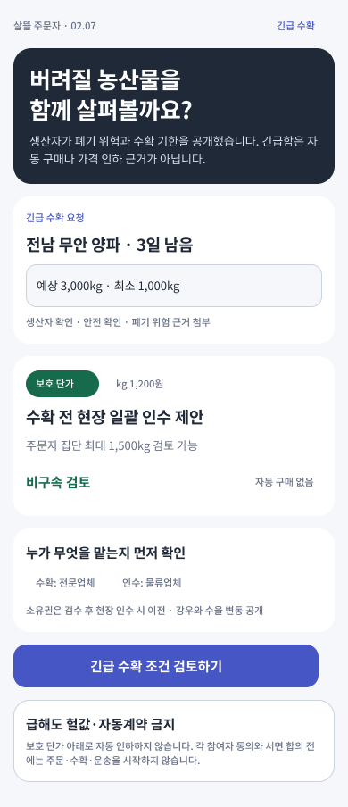
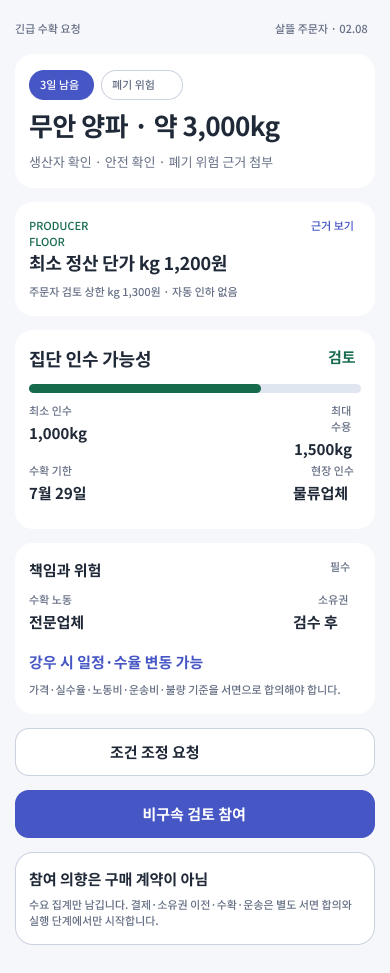

# 생산자 긴급 수확 요청과 주문자 집단의 비구속 검토

## 목표

판매 기한이 짧거나 판로가 끊겨 농산물을 폐기해야 할 위험이 있는 생산자가
이미 구성된 주문자 집단에 긴급 공급 조건을 제안할 수 있게 한다.

사용자 화면에서는 뜻이 불분명한 `급청`보다 `긴급 수확 요청`과
`긴급 수확 연결`을 사용한다. 수확 전 농산물을 일괄 인수하는 제안도 지원하되,
긴급하다는 이유만으로 구매·가격 인하·소유권 이전·수확·운송을 자동 실행하지 않는다.

## 화면 흐름

### 02.07 생산자 긴급 수확 요청

- 생산자가 공개한 폐기 위험 근거, 수확 기한, 예상 물량과 최소 인수 물량을 보여 준다.
- 기대 가격과 별도로 생산자를 보호할 최소 정산 단가를 표시한다.
- 주문자 집단이 감당할 수 있는 최대 검토 물량과 비구속 상태를 함께 표시한다.
- 수확 노동, 현장 인수, 소유권 이전, 기상·수율 위험의 책임을 먼저 확인하게 한다.
- 급해도 자동 구매, 자동 가격 인하와 참여자 동의 생략은 허용하지 않는다.

### 02.08 긴급 수확 조건 검토

- 생산자 최소 정산 단가와 주문자 집단의 검토 상한 단가를 나란히 비교한다.
- 최소 인수 물량, 집단 최대 수용량과 수확 기한을 한 화면에서 판단한다.
- 수확 노동과 현장 인수 담당, 소유권 이전 시점, 기상·수율 위험을 필수 조건으로 표시한다.
- 가격, 실제 수율, 노동비, 운송비와 불량 기준은 서면 합의 대상으로 남긴다.
- `비구속 검토 참여`는 수요 집계만 남기며 구매 계약이나 결제를 만들지 않는다.

## Figma

- 파일: `0KhuQLc1MleUBIQnARC21Z`
- Section: `2233:176` — `02 · 주문자 · 배송권에서 같이 주문 결정 · 1.0`
- Screen: `2251:176` — `02.07 · 생산자 긴급 수확 요청`
- Screen: `2251:213` — `02.08 · 긴급 수확 조건 검토`
- 기존 주문자 화면의 보라색 행동, 초록색 조건 강조, 흰 카드와
  `Noto Sans KR` 서체를 재사용했다.

## 서버 계약

기존 국내 공동구매 생산자 연결 흐름을 확장했다. 별도의 긴급 거래 시스템을 만들지 않고,
생산자 공급 제안 초안에 긴급 수확 조건을 추가한다.

- 생산자 공급 제안 초안
  - `POST /api/v1/orderer/domestic-group-purchases/{campaignId}/producer-connections/supply-offer-drafts`
  - `GET /api/v1/orderer/domestic-group-purchases/{campaignId}/producer-connections/supply-offer-drafts/{draftId}`
- 긴급 수확 조건 미리보기
  - `POST /api/v1/orderer/domestic-group-purchases/{campaignId}/producer-connections/urgent-harvest-compatibility-previews`
- 긴급 사유
  - `crop-destruction-risk`
- 필수 검토 조건
  - 현재 이후의 수확·출하 기한
  - 폐기 위험 근거 요약
  - 생산자 최소 정산 단가와 통화
  - 수확 노동과 현장 인수 책임
  - 수확 전 일괄 인수 시 소유권 이전 조건
  - 기상·수율 위험 공개
  - 가격·수확·운송·위험 책임에 관한 서면 합의

적합성 미리보기는 수확 기한이 14일 안인지, 주문자 집단의 최대 수용량이
최소 인수 물량을 충족하는지, 주문자 검토 상한이 생산자 보호 단가 이상인지,
책임과 근거가 확인되었는지를 설명 가능한 미확정 조건으로 반환한다.

응답은 항상 `AutoPurchaseAllowed=false`,
`AutoPriceReductionAllowed=false`, `UrgencyOverridesConsent=false`를 반환한다.

## stable page route

- `/group-purchase/urgent-harvest-offers/{SupplyOfferDraftId}`
- `/group-purchase/urgent-harvest-offers/{SupplyOfferDraftId}/review`

## 제품 경계

- 이 기능은 기존 `1.0` 같이 주문 생산자 연결 흐름 안에 둔다.
- 배송권이나 주문자 집단의 구매력은 검토 후보를 찾는 근거일 뿐 자동 가입·상대 선택·계약 확정 근거가 아니다.
- 생산자 보호 단가 아래로 자동 협상하거나 긴급성을 이용해 가격을 낮추지 않는다.
- 생산자 확인, 농산물 안전, 대표 역할과 폐기 위험 근거가 확인되지 않으면 긴급 검토를 시작하지 않는다.
- 실제 수확 전 일괄 인수는 별도 서면 계약, 법률·세무·보험 검토와 운영 준비가 필요하다.
- 이번 작업에서는 MAUI 주문자 앱을 수정하거나 실행하지 않았다.

## 검증

- 긴급 공급 제안 저장, 생산자 보호 조건과 자동 실행 금지 테스트
- 보호 단가 누락과 수확 전 일괄 인수 소유권 조건 누락 거부 테스트
- 수확 기한·집단 수용량·가격 하한·책임·근거 적합성 미리보기 테스트
- stable page route 인코딩·빈값 거부 테스트
- Figma 두 화면의 390px PNG, `Noto Sans KR` 적용과 0 크기 텍스트 없음 확인
