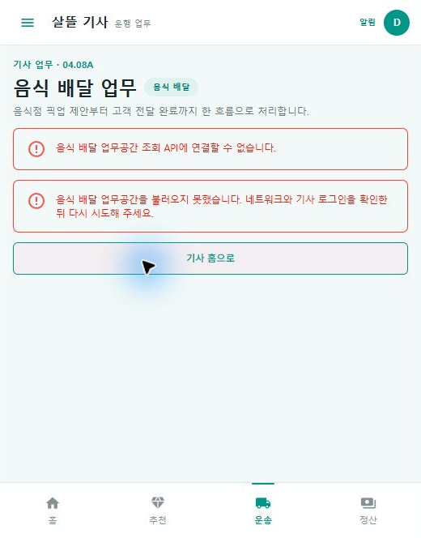

# 음식 주문 배차의 MAUI 앱 인계 흐름

## 결과

- `DriverApp`에 서버 `api/v1/driver/food-deliveries` 업무공간을 직접 사용하는 `04.08A 음식 배달 업무` Route를 추가했다.
- 기사 제안 수락·거절, 묶음 수락, 음식점 픽업 완료, 고객 전달 완료 뒤 같은 업무공간을 다시 조회한다.
- `RestaurantDeskApp` 주문 상세에는 음식점 수락 응답의 배차 상태와 요청 시각을 사용한 `배달 인계` 단계를 추가했다.
- 주문자 음식 주문 상세에는 배차불가·추천만료·수락취소·배차취소 때 자동 취소나 환불 확정으로 오인하지 않도록 복구 안내를 추가했다.
- 서버나 기사 로그인이 준비되지 않은 경우 샘플 제안으로 대체하지 않고 연결 실패와 확인 항목을 표시한다.

## 실제 Route

- 기사 업무: `/driver/food-deliveries`
- 음식점 주문 상세: `/orders/{OrderNo}`
- 주문자 음식 주문 내역: `/food-orders`

## 실제 렌더

Windows `DriverApp`에서 기사 홈 메뉴의 `음식 배달 업무`를 열었다. 서버를 실행하지 않은 검증 조건에서 `04.08A` 화면 코드, 청록색 기사 셸, 운송 하단 내비게이션과 API 연결 실패 안내가 함께 렌더되는 것을 확인했다.

캡처에는 기사 식별자, 주문번호, 음식점 주소, 고객 주소·연락처 또는 결제 정보가 포함되지 않는다. 실제 제안 카드와 픽업·전달 상태 전이는 인증된 기사 세션과 실행 중인 서버가 없어 이번 캡처에서 확인하지 못했다.

## 검증

- `DriverApp` Windows 대상 빌드: 오류 0개
- `RestaurantDeskApp` Windows 대상 빌드: 경고 0개, 오류 0개
- 관련 서버·공유 UI·화면 조립 테스트: 26개 통과
- `eng/validate-changes.ps1 -Level Fast`: 통과
- `eng/validate-changes.ps1 -Level Task`: 통과
- 실제 Windows MAUI 앱에서 기사 홈 → 메뉴 → 음식 배달 업무 Route 전환과 API 실패 상태 렌더 확인
