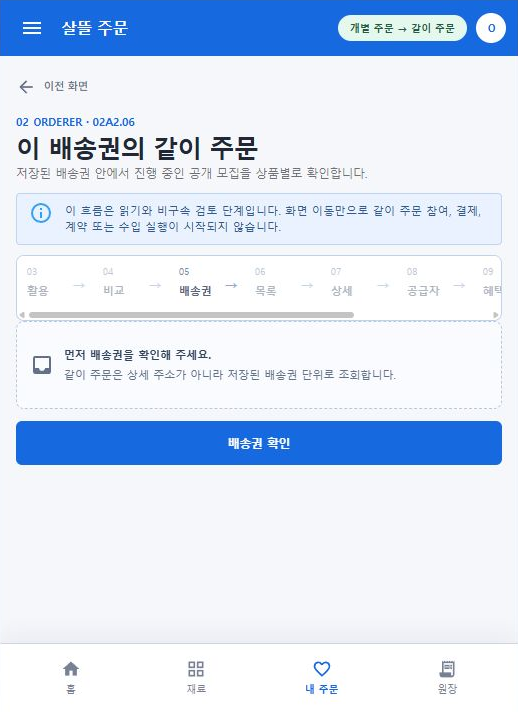

# Figma 02A2 주문자 여정의 실제 MAUI 전환

## 결과

- Figma `02 Orderer`의 재료 후보 이후 화면을 실제 Windows `OrdererApp`의 독립 Route로 옮겼다.
- 화면 상단에 `03 활용 → 04 비교 → 05 배송권 → 06 목록 → 07 상세 → 08 공급자 → 09 혜택 → 10 수확 → 11 검토` 지도를 두고 현재 화면과 이동 방향을 표시했다.
- 주문자 AppBar, 하단 내비게이션, 안내 영역과 주요 버튼을 파란색 계열로 통일했다.
- 기존 상품 카탈로그, 레시피 활용, 주문 방식 비교와 같이 주문 공개 목록·상세 API를 실제 읽기 경로에 연결했다. API 실패를 샘플 자료로 숨기지 않고 오류·재시도 상태로 표시한다.

## 실제 Route

- `/group-purchase/products/{ProductId}`
- `/group-purchase/recipe-uses/{ProductId}`
- `/group-purchase/compare/{ProductId}`
- `/group-purchase/delivery-scopes`
- `/group-purchase/delivery-scopes/{DeliveryScopeKey}`
- `/group-purchase/together-orders?scope={DeliveryScopeKey}`
- `/group-purchase/together-orders/{AutoGroupId}`
- `/group-purchase/supplier-relationships/{SupplierKey}`
- `/group-purchase/supplier-relationships/{SupplierKey}/membership`
- `/group-purchase/urgent-harvest-offers/{SupplyOfferDraftId}`
- `/group-purchase/urgent-harvest-offers/{SupplyOfferDraftId}/review`

## 수량·물류 표시 경계

- 개인 활용과 비용 비교는 같은 `25kg` 기준으로 표시한다.
- 같이 주문 상세는 공개 총수량을 `25kg 상자`로 환산해 KAMIS 표시단위와 연결한다.
- 이 상자 수는 이해를 돕는 참고이며 실제 공급 포장 규격으로 확정하지 않는다.
- LCL·FCL은 앱이 총중량만으로 자동 판정하지 않는다. 여러 재료의 총중량·부피·상자 규격을 받은 포워더 회신 전에는 `미판정`으로 표시한다.
- 참여가 더 모이면 공급 가격 구간과 FCL 가능성이 바뀔 수 있음을 함께 안내한다.

## 실제 렌더

익명 상태의 Windows MAUI 앱에서 메뉴로 `배송권의 같이 주문` Route를 열었다. 저장된 배송권이 없을 때의 선행 조건, 현재 `02A2.06` 위치, 앞뒤 단계 화살표와 고정 하단 내비게이션을 함께 확인했다.

캡처에는 사용자 이름, 상세 주소, 연락처, 결제 정보 또는 원장 식별정보가 포함되지 않는다.

## 검증

- `OrdererApp` Windows 대상 빌드: 경고 0개, 오류 0개
- Route, Figma 책임 코드와 기존 공동구매 페이지 조립 대상 테스트: 50개 통과
- 실제 Windows MAUI 앱에서 `재료 후보`, `내 배송권`, `배송권의 같이 주문` 화면 전환 확인
- 실제 렌더에서 파란색 AppBar·현재 단계 강조·화살표·고정 하단 내비게이션의 겹침이 없음을 확인
