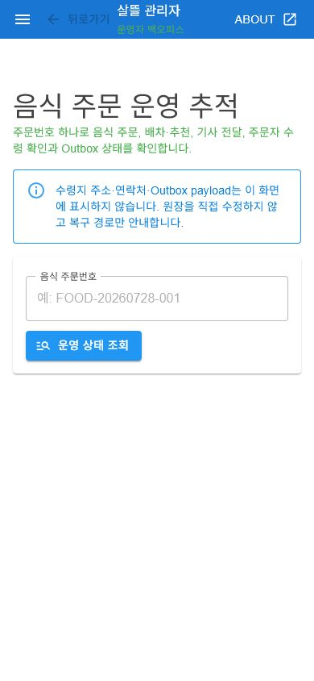

# 음식 주문 운영 추적

## 목적

음식 주문번호 하나를 기준으로 주문 원장, 배차·추천, 기사 전달, 주문자 수령 확인,
공동 원장 동기화와 기사 추천 알림 Outbox를 운영자가 한 화면에서 추적하도록 연결했다.

## 변경 내용

- 관리자 전용 `GET /api/v1/admin/food-orders/{orderNo}/operations-trace`를 추가했다.
- 음식 주문에 기록된 `배차대기Id`를 우선 사용하고, 누락 시 같은 주문번호와 음식 주문
  원본 유형으로 운송 실행 투영을 복구 조회한다.
- 추천 회차·만료 시각·노출 상태, 운송번호·상태, 공동 원장 ID·상태를 같은 응답에 모았다.
- 공동 원장 동기화 Outbox와 기사 추천 알림 Outbox는 payload, 기사 ID, 주소와 연락처를
  반환하지 않고 상태·시도 횟수·갱신 시각·운영자 확인 필요 여부만 제공한다.
- 추천 만료, 배차 원장 누락, stable ID 불일치, 원장 동기화 실패, 추천 알림 실패를
  경고와 복구 안내로 구분했다.
- SsalddelAdmin V1 탐색에 `음식 주문 추적`을 추가하고 데스크톱과 모바일에서 사용할 수
  있는 주문번호 검색 화면을 연결했다.
- 실제 서버가 없을 때 결과를 sample 성공으로 대체하지 않고 연결 오류를 화면에 표시한다.

## 화면 확인

- 직접 확인: 390×844 viewport에서 제목, 개인정보 비노출 경계, 주문번호 입력과 조회 버튼이
  잘림이나 가로 스크롤 없이 표시됐다.
- 직접 확인: 서버가 없는 상태에서 조회하면 sample 결과 대신 명시적인 연결 오류가 표시됐다.
- 간접 확인: 정상 완료·추천 만료·Outbox 실패 결과 카드와 체크포인트는 InMemory RDB
  테스트로 응답 조립을 확인했지만 실제 운영 DB 주문을 연결한 화면은 아직 렌더하지 않았다.

## 검증

- 음식 주문 운영 추적·Controller·화면 구성 테스트 10개 통과
- API 분류·운영 권한·V1 smoke 관련 테스트 47개 통과
- `Ssalddel` 서버와 `SsalddelAdmin` 빌드 경고·오류 없음
- 변경 파일 기준 Fast·Task 게이트에서 각각 `Ssalddel.v3.5.slnx` 빌드 오류 0개와
  선택 테스트 140개 통과. DriverApp 패키지 호환·nullable 경고 69개는 남아 있다.
- 동일 InMemory RDB를 새 `DbContext`로 다시 연 뒤 같은 주문번호의 완료 상태와 운송 이벤트를
  복구하는 서버 재시작 시나리오 통과

## 남은 운영 검증

- 별도 실제 관계형 DB와 주문자·음식점·기사·관리자 테스트 계정으로 정상·거절·추천 만료
  주문을 생성하고 이 화면에서 다시 조회한다.
- 운영자가 실패 Outbox를 재처리할 때 사유·요청 ID·전후 상태를 감사 기록으로 남기는 별도
  Command를 추가한다. 현재 화면은 원장을 직접 수정하지 않는 읽기·복구 안내 범위다.
