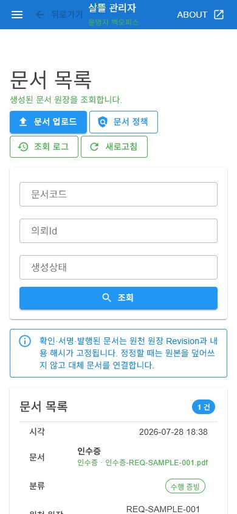
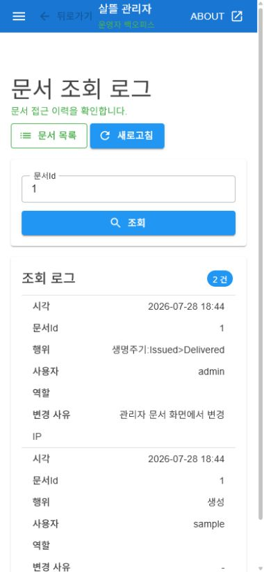
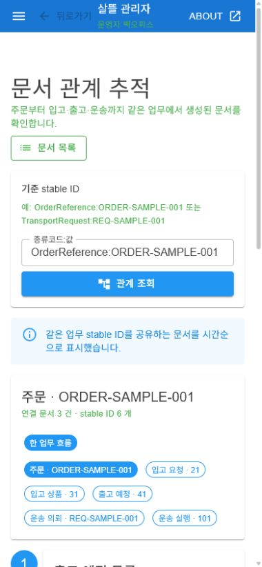

# 문서 생명주기와 관리자 관제

- 기준일: 2026-07-28
- 대상: `Ssalddel.Contracts`, `Ssalddel`, `SsalddelAdmin`, 창고·운송 Event
- 검증 성격: 공통 계약·서비스 테스트와 실제 390px 관리자 Web 렌더

## 반영 결과

기존 문서관리 저장·암호화·다운로드·감사 로그를 유지하면서 문서를 원장에
연결된 불변 스냅샷으로 확장했다.

- 7개 공통 분류와 초안부터 폐기까지의 허용 상태 전이를 정의했다.
- 문서에 원천 원장 ID·종류·Revision, 원천 문서 종류, 템플릿 버전, 생성
  모드, 발급 주체와 관련 stable ID를 기록한다.
- 원문 SHA-256을 생성 시 저장하고 다운로드 시 재검증한다.
- 같은 원천 Revision·종류·템플릿·내용의 재처리는 기존 문서를 반환한다.
- 확정 이후 정정은 원본을 덮어쓰지 않고 대체 문서 관계로 연결한다.
- 주문 결제 완료, 창고 피킹 완료, 창고 포장 완료 이벤트에서 각각
  `주문확인서`, `피킹완료표`, `포장완료표`를 자동 생성한다.
- 주문자의 실제 입고 확인 이벤트에서는 `수령확인서`를 자동 생성한다.
- 원장 관행 문서, 창고 출고 예정·기사 인계, 기사 상차·인수 문서가 같은
  문서관리 모듈에 축적된다.
- `종류코드:값` stable ID를 기준으로 주문→입고→출고→운송 문서를
  양방향 추적하며, 같은 숫자라도 원장 종류가 다르면 연결하지 않는다.

## 실제 관리자 화면

로컬 `SsalddelAdmin`을 메모리 검증 모드로 실행하고 390×844 viewport에서
문서 분류, 원천 원장 Revision, 생명주기, SHA-256, 암호화·다운로드 정책이
카드형 표로 접히는 것을 확인했다. 상태 변경 메뉴에서 샘플 인수증을
`발행 완료 → 전달 완료`로 바꾸고 성공 안내와 변경된 상태를 다시 확인했다.

같은 문서의 감사 로그에서 이전·대상 상태와 `관리자 문서 화면에서 변경`
사유가 별도 메타데이터로 보관되어 모바일 표에 표시되는 것도 확인했다.

후속 구현에서는 `OrderReference:ORDER-SAMPLE-001`을 기준으로 입고 요청,
입고 상품, 출고 예정, 운송 의뢰와 운송 실행 stable ID 6개가 순서대로
연결되고, 세 문서가 `1 → 2 → 3` 카드 흐름으로 복구되는 것을 같은
390×844 viewport에서 확인했다.

검증 도중 서버를 다시 빌드·재시작하면서 남은 Blazor 재연결 경고는 의도한
재시작 시각의 로그다. 재시작 뒤 새 화면 조회와 상태 전이는 정상 동작했다.

## 후속 자동 문서 연결

새 화면을 추가하지 않고 기존 문서 목록·관계 추적 화면이 다음 자동 문서를
그대로 조회하도록 서버 문서 chain을 확장했다.

1. `주문결제완료됨Event` → 주문 확인서
2. `창고피킹완료됨Event` → 피킹 완료표
3. `창고포장완료됨Event` → 포장 완료표
4. 기존 출고 예정 목록 → 출고 인계 확인서
5. `주문자상품입고완료됨Event` → 수령 확인서

피킹·포장 UseCase는 문서 handler가 live DTO를 다시 조회하지 않도록 주문,
입고상품, 출고예정, 상품·수량, 적재대·포장 유형을 이벤트 스냅샷에 함께
싣는다. 서버 테스트에서는 주문 참조번호 하나로 위 여섯 문서와 입고 요청,
입고 상품, 출고 예정, 운송 의뢰 stable ID가 복구되는 것을 확인한다.

화면 구조 변경은 없으며 기존 관리자 문서 화면이 공통 응답을 표시한다.

## 운영 경계와 후속

- 관리자 수동 업로드는 기본 `Draft`이며, 관리자가 업무 당사자 대신 계약이나
  인수를 확정하지 않는다.
- `Superseded` 전이는 유효한 다른 문서 ID를 요구한다.
- 문서 정책·메타데이터·감사 로그는 로컬
  `App_Data/documents/metadata.json`에 원자 저장되고 재시작 때 복구된다.
  자동 생성 요청은 같은 스냅샷의 영속 Outbox에 먼저 예약되며, 실패 시
  최대 5회·30초 간격으로 재처리한다.
- 주문·창고·기사 업무 이벤트의 자동 문서는 모두 이 Outbox를 사용한다.
  완료 payload는 삭제하고, 중복 이벤트는 문서 내용 SHA-256과 기존 문서
  스냅샷 멱등성으로 중복 생성을 막는다.
- 현재 저장은 단일 서버 로컬 영속 경계다. 다중 서버 배포에서 필요한
  DB lease·공유 Object Storage와 운영자 수동 재처리 화면은 후속이다.
- 창고·운송 원장에는 아직 명시적 Revision 필드가 없어 해당 자동 문서는
  stable ID와 내용 해시를 우선 보존한다.
- 주문 확인서는 기존 물류 예정 생성과 같은 `주문결제완료됨Event` 소비
  경계에 연결했다. 현재 저장소 안에는 이 이벤트를 발행하는 주문 결제
  adapter가 확인되지 않으므로 운영 활성화 전 결제 Outbox 또는 내부
  publisher 연결을 별도 검증해야 한다.

## 검증

- 문서 분류·상태 전이·해시·대체·재처리, typed stable ID 관계 그래프,
  원장 관행 보관, 창고 문서 Event: 19개 통과
- `eng/validate-changes.ps1 -Level Task`: 자동 선택 테스트 122개 통과
  (`artifacts/local/validation/20260728-184721`)
- 주문 확인·피킹·포장·수령 확인 자동 문서 후속: 관련 테스트 18개 통과,
  `Ssalddel.v3.5.slnx` build 통과
  (`artifacts/local/validation/20260728-194540`)
- 로컬 메타데이터 재시작 복구와 자동 생성 Outbox 실패·재시도: 관련 테스트
  11개 통과
- `SsalddelAdmin` build: 경고 0개, 오류 0개
- 실제 390px 렌더, 상태 변경, 주문→창고→운송 문서 관계 복구 확인
