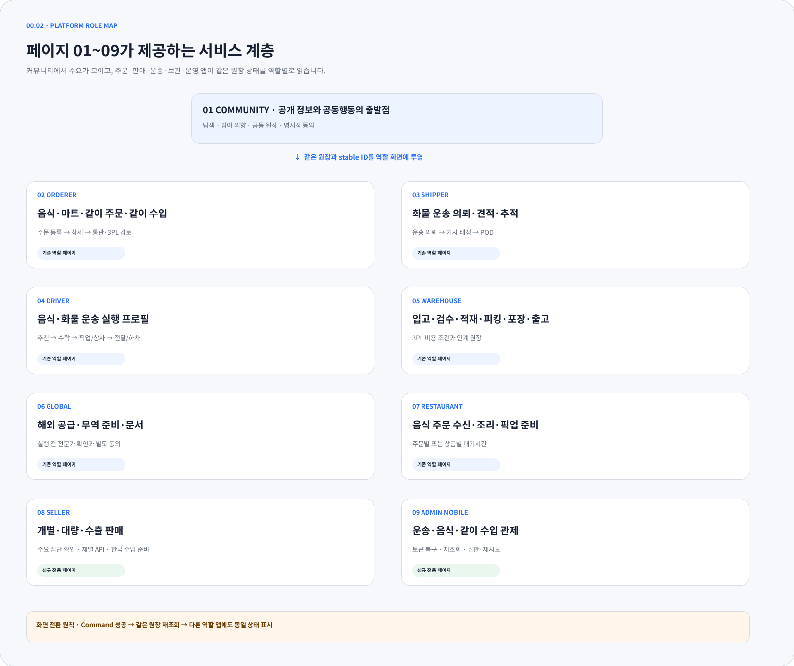
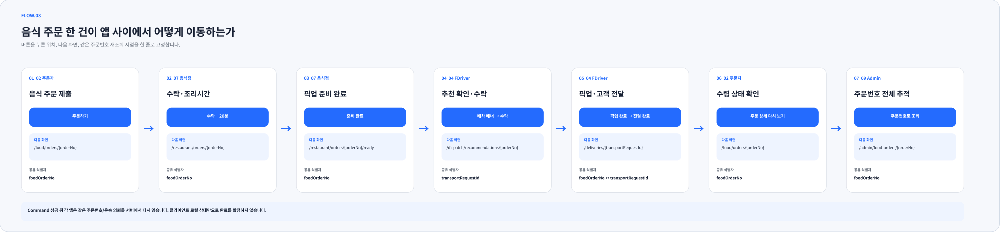
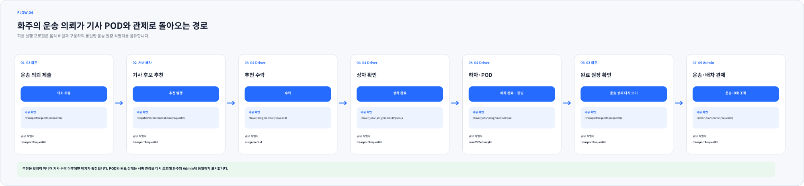

# Figma 서버·클라이언트 수렴

- 기준일: 2026-07-28
- Figma: [ssalddle](https://www.figma.com/design/0KhuQLc1MleUBIQnARC21Z/ssalddle?node-id=0-1)
- 계획: [서버·클라이언트 변화의 Figma 수렴 제안](../Versions/figma-code-convergence-proposal.md)
- 후속 코드 계획:
  [Figma·클라이언트·서버 코드 정렬 실행 계획](../Versions/figma-client-server-alignment-implementation-plan.md)
- 검증 성격: Figma 실제 node 생성·수정과 PNG 시각 확인

## 반영 결과

| 위치 | node ID | 반영 내용 |
| --- | --- | --- |
| `00 Overview` | `2427:243` | `01~09` 역할 앱의 서비스 계층과 같은 원장 재조회 원칙 |
| `02 Orderer` | `2425:301` | `02M.01~02M.07` 같이 수입 준비, 구매 목적·통관 판단, 온도별 3PL 필터, 비교 후보, 인계·별도 동의 |
| `03 Shipper` | `2438:64` | `03P1.01~03P1.07` 물류대행 계약 범위, 표준 요율, 온도·식품 조건, 예상 비용, 책임·증빙, 초안, 쌍방 서명 전 실행 차단 |
| `04 Driver` | `2438:455` | `04P1.01~04P1.06` 실시간 추천, 서버 만료시각 판정, 만료 수락 차단, SignalR 재연결과 30초 보완 조회, 로그인 세션 복구 |
| `05 Warehouse` | `2438:791` | `05P1.01~05P1.06` 출고 계획, 실제 하차지 누락 차단·확인, 운송의뢰 초안, 기사 인계 대기, 수락 후 출고 해제 |
| `07 Restaurant` | `2438:1127` | `07P1.01~07P1.06` 앱 재시작, 서버 미처리 주문 복구, SignalR 재연결, 주문번호 중복 제거, 음식점 소유권 확인, 상세·수락 복구 |
| `08 Seller` | page `2423:64`, section `2423:66` | 로그인, 집단 수요, 재고·상품, 개별·대량·수출 판매, 채널 API, 주문, 한국 수입식품 준비 |
| `09 Admin Mobile` | page `2423:65`, section `2423:67` | 로그인·토큰 복구, 운영 개요, 운송 관제, 원장·배달권 검색, 음식 주문 추적, 같이 수입 검토, 오프라인·권한·재시도 |
| `Flow · Food Order` | `2427:79` | 주문자 주문부터 음식점 수락·준비, FDriver 수락·전달, 주문자·Admin 재조회까지의 버튼-화면 흐름 |
| `Flow · Food Order` | `2427:161` | 화주 운송 의뢰부터 기사 추천·상차·하차·POD, 화주·Admin 재조회까지의 버튼-화면 흐름 |

기존 `00~07` 화면과 숨김 참고본은 삭제하거나 이동하지 않았다. 새 역할 화면은
파란색 계열을 공통 상호작용 색으로 사용하고 `Noto Sans KR Regular/Bold`로
통일했다.

## 시각 완성도 보완

초기 P0 화면은 route와 상태 경계를 검증하는 골격형 SRP였으나 배포 화면으로
보기에는 정보 밀도와 시각적 위계가 부족했다. 같은 node를 유지하면서 다음
요소를 실제 모바일 화면 수준으로 보완했다.

- 화면별 핵심 지표, 진행률과 보조 설명이 있는 요약 카드
- 필터·상태 chip과 우선 처리 목록
- 정상·주의 상태를 구분하는 색상과 카드 왼쪽 accent
- 화면의 다음 행동을 분명히 하는 하단 CTA
- Seller, Admin, Orderer 역할별 4개 목적지 하단 navigation
- 카드 elevation, 둥근 모서리와 앱별 일관된 상단 app bar
- 운영 데이터로 오해하지 않도록 모든 신규 app bar에 `예시 데이터` 표시

Seller는 토마토·루비 계열의 빨간색, Admin은 자주색, Orderer는 파란색을 역할
accent로 사용한다. 공통 배경·표면·본문·외곽선은 기존 로컬 변수에 맞췄다.
자격증명 화면은 secret 원문 대신 마스킹 상태만, 3PL 화면은 공개자료 후보와
직접 확인 경계를 계속 표시한다.

후속 P1은 기존 역할 팔레트를 유지했다. Shipper와 Restaurant은 파란색,
Driver는 청록색, Warehouse는 주황색을 사용한다. 기존 구역과 숨김 참고본을
이동하지 않고 각 페이지 오른쪽의 독립 section으로 추가했다.

## 화면 이동 원칙

새 흐름도는 각 단계에 다음 네 가지를 함께 표시한다.

1. 행동을 수행하는 역할 앱
2. 사용자가 누르는 버튼
3. 이동하거나 다시 조회하는 route
4. 앱 사이에서 유지할 주문번호·운송 의뢰 ID

상태 변경은 클라이언트의 로컬 성공 상태로 확정하지 않는다. Command 성공 뒤
같은 원장을 서버에서 다시 조회하고 다른 역할 화면도 동일한 상태를 표시하는
원칙을 명시했다. 배차 추천은 기사 수락 전까지 확정 배차로 표현하지 않았고,
3PL 후보 선택도 운영 배정·제휴·계약으로 표현하지 않았다.

## 실제 캡처

### 역할 앱 계층

### 독립 Seller와 Admin Mobile

### 주문자 통관·3PL

### 앱 간 폐쇄 루프

### 후속 P1 역할 앱

## 검증

- Seller, Admin Mobile, Orderer 신규 구역의 화면 간 교차 겹침이 없음을 node
  좌표로 확인했다.
- 세 구역의 텍스트 font family가 `Noto Sans KR`, style이 `Regular`,
  `Medium` 또는 `Bold`뿐임을 확인했다.
- 각 구역을 Figma에서 PNG로 다시 렌더링해 제목, route, 상태 카드와 하단
  화면이 잘리지 않는지 확인했다.
- 22개 모바일 화면이 모두 `393×852`이고, 화면과 중첩 frame의 하위 node가
  부모 경계를 벗어나지 않음을 좌표 감사로 확인했다.
- 후속 P1의 25개 모바일 화면도 모두 `393×852`이며, 누락 font와 하위 node
  overflow가 각각 `0`임을 네 section별 좌표 감사로 확인했다.
- 후속 P1 section을 Figma에서 각각 `1810×1940` PNG로 다시 렌더링해 단계
  번호, 화살표, route, 상태·차단 문구와 하단 CTA를 시각 확인했다.
- 흰색 앱 바 텍스트 대비는 Seller `5.18:1`, Admin `5.64:1`로 WCAG AA의
  일반 텍스트 기준 `4.5:1` 이상임을 확인했다.
- 화물 흐름의 긴 route가 카드 밖으로 번지는 문제를 발견해 카드 폭과
  클리핑을 수정한 뒤 다시 캡처했다.

## 후속 P1 반영과 남은 범위

P0에서 남겨둔 `03 Shipper` 물류대행 계약, `04 Driver` 추천 만료·재연결,
`05 Warehouse` 실제 하차지 오류·운송 인계, `07 Restaurant` 재시작 복구를
각 앱의 실제 route와 상태 문구를 기준으로 반영했다. 샘플 주소·운임·수량은
모두 `예시 데이터`로 표시했고, 계약 서명 전 실행, 만료 추천 수락, 주소 없는
배차 생성, 다른 음식점 주문 구독을 화면에서 차단했다.

남은 검증은 이 설계를 실제 MAUI 앱 렌더와 다중 앱 E2E로 확인하는 일이다.
특히 오프라인·토큰 만료·재연결 중 같은 주문 또는 운송 원장을 여러 앱이
동일하게 다시 읽는지는 Figma만으로 증명할 수 없다. 구현 순서와 slice별
완료 기준은
[Figma·클라이언트·서버 코드 정렬 실행 계획](../Versions/figma-client-server-alignment-implementation-plan.md)에
분리했다.

Figma 화면은 route와 상태 계약의 설계 증거이며 앱의 실제 렌더링 증거는 아니다.
이번 작업에서는 서버·클라이언트 코드를 변경하거나 빌드하지 않았다.
