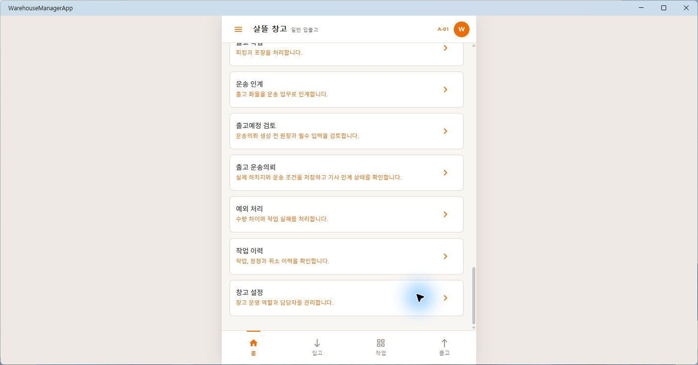

# 창고 출고예정의 실제 운송의뢰·기사 인계

- 기준일: 2026-07-28
- 대상: `WarehouseManagerApp`, `Ssalddel.Ui.Common`, `Ssalddel`
- 검증 성격: 실제 Windows MAUI 메뉴 렌더와 대상 코드·테스트 검증

## 반영 결과

기존의 로컬 운송의뢰 초안을 출고예정 원장에 연결된 실제 저장 흐름으로
전환했다. 창고 작업자는 출고예정 검토를 통과한 뒤 실제 하차지와 상세 주소,
희망 상차·도착 일시, 차량 조건과 취급 메모를 확인하고 명시적으로 저장한다.

저장은 기존 재고 운송인계 API를 재사용한다. 출고예정 ID를 멱등 키의 근거로
삼아 같은 원장의 중복 운송의뢰와 재고 예약을 막고, 성공 뒤 같은 출고예정
ID를 다시 읽어 배차 대기, 기사 수락, 운송 중과 완료 상태를 표시한다. 기사
수락과 결제·정산은 이 화면이 확정하지 않는다.

후속으로 기사 수락 뒤의 실제 출고 인계까지 닫았다. 서버는 다음 항목을 모두
재검증하며 하나라도 맞지 않으면 `409 Conflict`로 반출을 잠근다.

- 같은 `의뢰Id`의 화주 운송의뢰와 운송 실행 원장
- `배차확정`과 확정 기사 ID
- 활동 중 기사에게 등록된 차량과 요청 차량의 일치
- 운송의뢰 상품 할당수량과 출고예정 수량의 일치
- 출고 창고의 예약재고

현장 작업자는 서버가 확인한 기사·차량을 다시 대조하고 상품 상차를 확인한 뒤
완료 Command를 실행한다. 성공하면 예약재고가 한 번만 실제 출고로 전환되고,
출고예정·재고이력·재고이동·감사·Event·공동 원장 Outbox가 같은
`OutboundPlanId`와 `의뢰Id`를 유지한다. 재시도는 기존 완료 결과를 반환한다.

## 실제 MAUI 캡처

Windows용 `WarehouseManagerApp`을 실제 실행해 주황색 창고 셸, 모바일 폭,
`출고예정 검토 → 출고 운송의뢰` 순서와
`실제 하차지와 운송 조건을 저장하고 기사 인계 상태를 확인합니다.` 문구를
확인했다.

대상 화면 본문은 창고 업무 로그인을 요구했다. 개발 계정 비밀번호는 저장소에
두지 않고 외부 설정으로만 주입되므로 임의 자격증명을 만들거나 사용하지
않았다. 따라서 이번 실제 캡처는 메뉴와 인증 경계까지의 증거이며, 인증 뒤
입력 폼의 실제 렌더 증거는 아니다.

기사·차량 확인 카드를 추가한 뒤 Windows 앱을 다시 실행했으나 이번 확인에서는
Hybrid WebView 본문이 두 차례 모두 흰 화면으로 남았다. 공용 Razor 컴포넌트
빌드와 ViewModel 조립 테스트로 화면 구조를 간접 확인했으며, 위 기존 PNG를
신규 카드의 실제 렌더 증거로 재사용하지 않는다.

## 운영 경계

- `주문자:{id}` 같은 임시 문자열은 실제 하차지로 저장할 수 없다.
- 출고예정의 상품, 창고, 출고 가능 상태와 정확한 수량을 서버가 다시 검증한다.
- 운송의뢰가 이미 연결된 출고예정은 같은 핵심 입력일 때 기존 의뢰를 반환한다.
- 기사 본인 수락 전, 요청 차량과 기사 등록 차량이 다를 때, 예약재고가 부족할
  때는 출고 인계 완료 Command를 실행할 수 없다.
- 완료 뒤 Warehouse·Driver·Shipper는 같은 `의뢰Id`를 다시 조회한다. 이번
  slice는 다른 앱의 화면을 자동 조작하지 않는다.
- 정상 서버 시작은 기존 운송 자료의 빈 `request_id` 중복 때문에
  `AddTransportRequestUniqueIndex` 마이그레이션에서 중단됐다. 렌더 검증은
  DB 초기화를 끈 로컬 Simulation으로만 수행했으며 운영 데이터를 수정하지
  않았다.

## 검증

- `eng/validate-changes.ps1 -Level Task`: 통과
  (`artifacts/local/validation/20260728-160533`)
- 관련 서버·공용 UI 테스트: 34개 통과
- `WarehouseManagerApp` Windows build: 경고 0, 오류 0
- 자동 선택 Fast 검증의 전체 관련 테스트 묶음은 현재 작업 트리의 별도
  판매채널 DI 등록 불일치 1건 때문에 실패했다. 이번 Warehouse 대상 테스트와
  `Ssalddel.v3.5.slnx` build는 통과했다.
