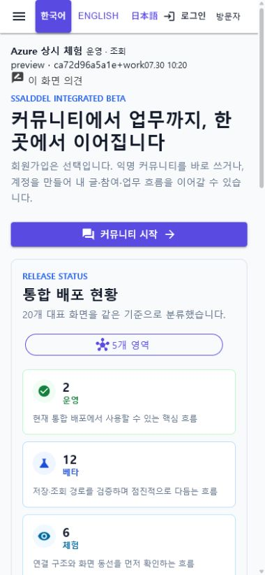
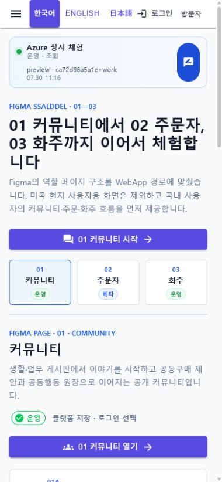

# Azure 상시 체험 포털

> 이후 상시 체험 포털은
> [01~05 역할 분리 WebApp](2026-07-30-role-separated-webapps.md)으로 전환되었다.
> 이 문서는 전환 전 통합 포털의 배포 기록으로 보존한다.

## 변경 기록

| 변경 축 | 화면 변경 여부 | 시각 증거 |
| --- | --- | --- |
| 기존 Azure 미리보기 재사용 | 화면 변경 | 새 Azure 리소스를 만들지 않고 기존 VM·Caddy·동일 출처 WebApp/API 구성을 유지 |
| 배포 식별 | 화면 변경 | 모든 통합 WebApp 화면에 Azure 상시 체험 상태, 화면별 실행 경계, 빌드 커밋과 배포 시각 표시 |
| 화면별 개선 제안 | 화면 변경 | 현재 주소의 query와 fragment를 제외한 복귀 경로를 붙여 커뮤니티 `개선 제안` 글쓰기로 연결 |
| Figma 역할 페이지 | 화면 변경 | `01 Community`, `02 Orderer`, `03 Shipper`를 포털의 세 역할로 재구성하고 Figma 묶음 번호를 실제 WebApp route에 연결 |
| 미국 현지 사용자 경계 | 화면 변경 | `02 Orderer · US 80`은 포털에 옮기지 않고 기존 미국 현지 구매자 전용 WebApp route와 navigation을 제거 |
| WebApp 전용 배포 | 간접 확인 | API·MySQL·MongoDB를 재시작하지 않고 정적 WebApp만 백업·교체하며 실패 시 이전 웹으로 복구 |

## 동작 경계

- 상단 상태 바의 `운영`, `베타`, `체험`과 `조회`, `플랫폼 저장`, `Simulation`은 기존 페이지 capability 카탈로그를 그대로 따른다.
- 빌드 표시는 배포 산출물의 커밋과 시각을 확인하기 위한 정보이며 기능 완성이나 운영 승인을 의미하지 않는다.
- 작업 트리에서 만든 산출물은 커밋 뒤에 `+work`를 표시해 커밋된 상태와 구분한다.
- 개선 제안 링크에는 현재 화면의 path만 포함하고 query와 fragment는 전달하지 않는다.
- 포털의 02 주문자는 `KR 01 탐색·가격 → KR 02 같이 주문 → KR 03 같이 수입·물류 → KR 04 원장·운영` 순서를 따른다.
- 미국 현지 구매자용 화면만 제외하며 한국 사용자가 가격·수입 판단에 참고하는 USDA 원천과 서버 저장 데이터는 삭제하지 않는다.
- KAMIS 국내 전용 화면은 `DomesticOnly` 표시를 사용해 KR 시장과 국내 유통단계만 노출한다.
- WebApp 전용 배포는 서버 이미지, DB 볼륨, Blob, 비밀 설정을 변경하지 않는다.
- 반복 배포 뒤 이전 scoped CSS가 남지 않도록 배포 릴리스 번호를 stylesheet 주소에 붙인다.

## 대표 화면

기존 Azure 공개 주소의 390×844 화면에서 상시 체험 상태, `preview` 빌드 정보와
`이 화면 의견` 진입점을 직접 렌더링했다. 공개 커뮤니티의 비식별 목록 외에 사용자
연락처, 주소, 결제·계좌 정보와 비밀값은 포함하지 않았다.

같은 공개 주소의 390×844 화면에서 세 역할이 한 줄에 보이고, 선택한 Figma page의
업무 묶음과 실제 WebApp 진입점이 먼저 나타나도록 확인했다. 배포 현황은 역할 화면
뒤로 내려 모바일 첫 화면의 주 목적을 가리지 않게 했다.

## 배포·검증

- 배포 릴리스: `azure-preview-20260730T021619Z`
- 배포 커밋 표시: `ca72d96a5a1e-working-tree`
- `Ssalddel.WebApp` Release build 경고 0개·오류 0개
- 역할 catalog·navigation·미국 구매자 공유 UI 경계 targeted test 34개 성공
- `Task` 검증의 `Ssalddel.v0.0.slnx` build 성공, 전체 test 3,981개 중 3,979개 성공
- 이번 변경과 무관한 기존 clean 경로의 test 2개는 실패: 창고 플랫폼 홈의 공용 업무 허브 조립 기대와 지역 커뮤니티·지역 특산물 route capability 분류
- 작업 경로 `Fast` 검증의 diff check와 `Ssalddel.Tests`·`Ssalddel.Ui.Common`·`Ssalddel.WebApp` build 성공, targeted test 204개 중 203개 성공
- `Fast`에서 실패한 1개는 기존 지역 커뮤니티·지역 특산물 route 두 개의 capability 분류 누락을 함께 검사하는 test이며, 이번 역할 포털 관련 targeted test는 재실행에서도 34개 전부 성공
- 커뮤니티 글쓰기 복귀 경로 test `CommunityWorkspaceRouteContextTests` 11개 성공
- WebApp 패키지 SHA-256 검증 후 기존 Azure VM에 정적 파일만 배포
- `/`, `/community`, `/orderer`, `/shipper`, `/information/kamis-domestic-price-comparison`, `/health/ready`, `/preview-build.json` 모두 HTTP `200`
- API·MySQL·MongoDB 컨테이너는 기존 실행 상태와 health를 유지
- 실제 브라우저에서 01·02·03 역할 전환, KAMIS 국내 전용 표시, 미국 구매자 전용 route의 `404` 전환과 console error 0개를 확인
