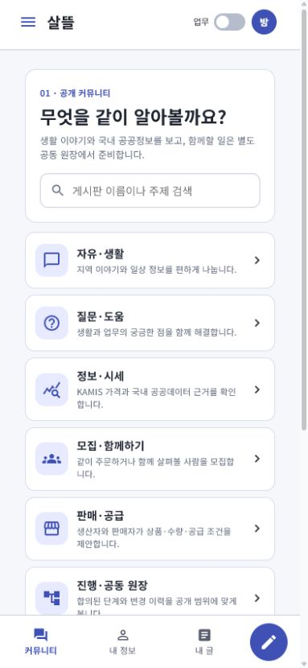
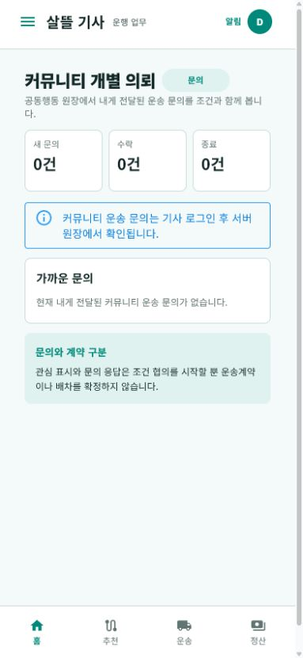
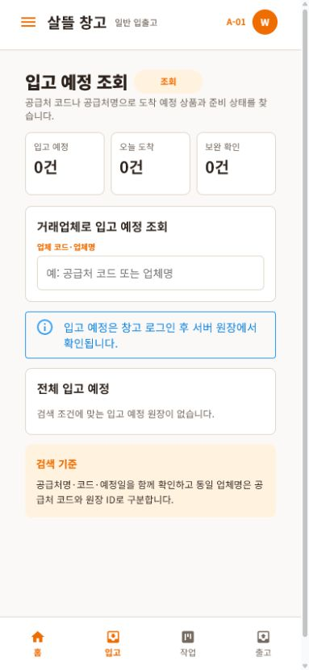

# Figma 역할 화면 우선순위 정렬

## 결과

Figma의 `01~05` 역할별 모바일 구조를 기준으로 상단 앱바, 역할 색상,
핵심 지표, 업무 목록, 하단 탐색을 독립 WebApp에 맞췄다.

| 역할 | 변경 |
| --- | --- |
| 01 커뮤니티 | 핵심 게시판·검색·개인정보 안내만 보이는 `/community/home`을 기본 진입으로 추가하고, 전체 업무 산맥은 `/community/boards/directory`에 남겼다 |
| 02 주문자 | 상품 탐색 홈, 국내 KAMIS 비교, 포장 근거 기반 FCL 공동 목표를 분리했다 |
| 03 화주 | 짧은 업무 요약 홈과 기존 전체 공용 허브 `/shipper/workspace`를 분리했다 |
| 04 기사 | 커뮤니티 개별 의뢰, 보낸 탐색 문의, 운행 예약을 실제 로그인 원장 조회 경계에 연결했다 |
| 05 창고 | 입고 예정·예외·최근 상태는 기존 원장에서 읽고, 미연결 설정·보세통관은 저장된 운영 상태처럼 표시하지 않았다 |

미국 사용자용 상품·가격 문구는 새 역할 홈과 주문자 흐름에 넣지 않았다.
기존 운영용 전체 게시판 디렉터리는 장기 데이터 소스 관리 화면이므로 별도 상세 화면에 보존했다.

## 화면

### 01 커뮤니티

### 04 기사

### 05 창고

393×852 모바일 viewport에서 직접 렌더했다. 로그인이나 운영 API가 없는 로컬 정적
미리보기에서는 서버 오류를 샘플 수치로 대체하지 않고 로그인·원장 연결 필요 상태로 표시했다.

## 실행 경계

- FCL 수량 입력은 브라우저 안의 검토 계산이며 발주·계약·배차를 생성하지 않는다.
- 기사 문의와 예약은 운송계약 또는 자동 배차 확정으로 표시하지 않는다.
- 창고 설정 저장은 권한·감사 API 연결 전까지 비활성이다.
- 보세·통관 화면은 자격 전문가 판단 결과를 참조하는 준비 화면이며 현재 완료 상태를 가장하지 않는다.

## 검증

- `Ssalddel.RoleWebApps.slnx`의 01~05 역할 WebApp build 성공
- 변경 경로 Fast 검증에서 역할 WebApp·통합 WebApp·테스트 project build 성공
- 변경 경로 Task 검증에서 `Ssalddel.v3.5.slnx` build와 targeted test 성공
- 변경 경로 targeted test 성공
- 01, 02, 03, 04, 05 대표 route를 393×852에서 직접 확인
- 05 설정 유형 선택과 보세·통관 상대 route 이동 확인

## Azure 배포

- 공개 주소: `https://ssalddel-v0-7q4m2k.koreacentral.cloudapp.azure.com/`
- 배포 릴리스: `azure-preview-20260730T053556Z`
- 배포 커밋 표시: `ca72d96a5a1e-working-tree`
- WebApp archive SHA-256:
  `a7e2653444927dcc356223b880fdb6132c5c3f646debdea4db95c97f76ad2a3f`
- 교체 전 WebApp 백업: `/opt/ssalddel/web-before-20260730T054004Z`
- 교체 전 Caddyfile 백업: `/opt/ssalddel/Caddyfile-before-20260730T054004Z`
- 루트 포털, 01~05 대표 경로, 공개 manifest와 `/health/ready`가 모두 HTTP `200`
- 기존 `/community`, `/orderer`, `/shipper`, `/driver`, `/warehouse` 경로의 역할 앱
  `308` 이동 확인
- 실제 공개 브라우저에서 01 커뮤니티, 02 FCL 목표, 03 화주, 04 기사, 05 창고
  화면의 새 역할 구조를 확인
- API·MySQL·MongoDB는 재시작하지 않고 Caddy와 정적 WebApp만 교체
- 현재 VM 서버 이미지에는 새 FCL 포장 분석 API가 아직 포함되지 않아 공개 FCL 화면은
  서버 `404`를 샘플 값으로 숨기지 않고 연결 실패로 표시한다
