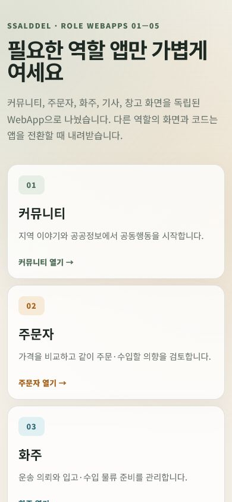

# 01~05 역할 분리 WebApp

## 결과

| 항목 | 확인 방식 | 결과 |
| --- | --- | --- |
| 첫 진입 포털 | 실제 브라우저 | JavaScript 0개인 정적 선택 화면에서 01~05 앱을 각각 연다 |
| 역할 분리 | 실제 브라우저 | 커뮤니티·주문자·화주·기사·창고가 `/roles/01/`~`/roles/05/`에서 독립 실행된다 |
| 직접 주소 | 실제 브라우저 | `/roles/02/community/group-purchase`를 새로 열어도 02 앱이 해당 화면을 렌더링한다 |
| 기존 링크 | 실제 브라우저 | `/community/group-purchase`가 02 앱의 같은 화면으로 이동한다 |
| 서버 경계 | 배포 로그·health | API·MySQL·MongoDB를 재시작하지 않고 Caddy와 정적 WebApp만 교체했다 |
| 배포 식별 | 공개 manifest | `azure-preview-20260730T031931Z`, `webAppMode: RoleSeparated` |

Release 산출물의 역할별 주 assembly는 664.3~879.8 KiB였다. 전환 전 통합 WebApp의
1,275.8 KiB와 비교하면 역할에 따라 약 31~48% 작다. Blazor 런타임과 공유 library까지
없어지는 것은 아니므로 이 수치는 전체 전송량이 아니라 역할 화면 코드 분리 효과다.

## 화면

390×844 모바일 viewport에서 역할 카드가 한 열로 배치되고 가로 넘침이 없음을 확인했다.
대표 화면은 첫 화면에서 01 커뮤니티, 02 주문자와 03 화주 진입점을 보여 준다.

## 검증

- `Ssalddel.RoleWebApps.slnx`의 5개 역할 앱 build 성공
- 통합 `Ssalddel.WebApp` build 성공
- 역할 경로·catalog·navigation targeted test 36개 성공
- 작업 범위 `Fast`와 `Task` 검증의 `Ssalddel.v3.5.slnx` build 및 targeted test 70개 성공
- Caddy 구성 검증 성공
- 공개 `/health/ready` 200
- 01~05 기본 화면의 숨겨진 시작 오류 0건
- 02 하위 route 직접 진입과 기존 통합 route 이동 성공

## 배포 안전장치

- 최종 archive SHA-256:
  `991a8aac3eb19dd9e17376527d6b126f56f1b1e59e594cf6599fea8444e72b5a`
- 교체 전 web 백업:
  `/opt/ssalddel/web-before-20260730T032317Z`
- 교체 전 Caddyfile 백업:
  `/opt/ssalddel/Caddyfile-before-20260730T032317Z`
- 배포 직후 Caddy 재시작 순간의 첫 readiness 요청은 연결되지 않았지만,
  3초 뒤 공개 readiness와 manifest를 다시 조회해 200을 확인했다.
