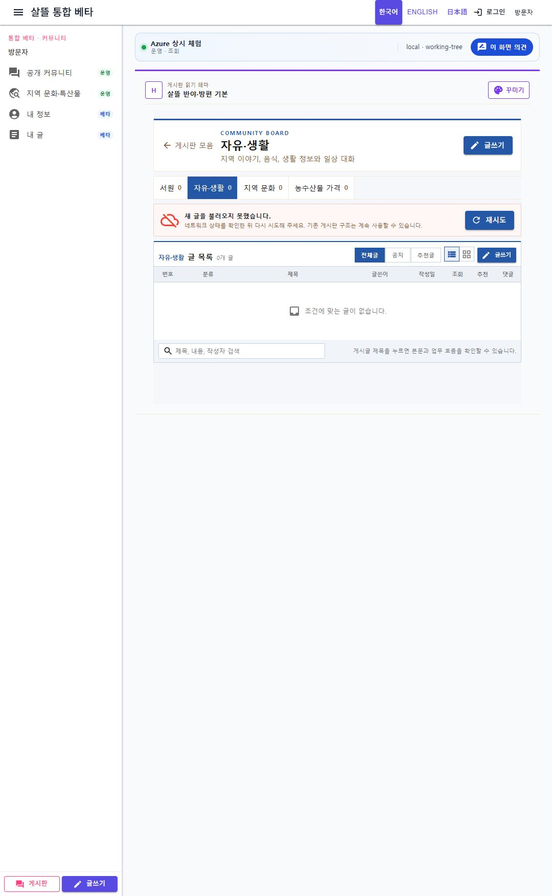

# 커뮤니티 게시판 네 탭 집중화

## 변경

- 커뮤니티에서 상시 노출하는 게시판을 `서원`, `자유·생활`, `지역 문화`, `농수산물 가격` 네 개로 정리했다.
- 커뮤니티 홈, 게시판 글 목록, 게시판 모음, 글쓰기 분류와 모바일 서랍에서 같은 네 게시판을 사용하도록 맞췄다.
- `지역 문화`를 별도 게시판 key로 추가하고 지역 문화·특산물 화면의 대화 경로를 연결했다.
- 기존 게시판 key와 과거 게시글은 삭제하지 않고 호환 조회용으로 유지해 저장 데이터와 직접 URL이 깨지지 않도록 했다.

## 실제 화면 확인

- 로컬 `Ssalddel.WebApp`의 `/community/boards?boardKey=free-life`를 브라우저에서 열어 네 탭만 표시되는 것을 확인했다.
- `전체`, `질문·도움`, `참여·모집`, `판매·공급`, `원장·진행` 등은 게시판 선택 탭에 나타나지 않는다.

