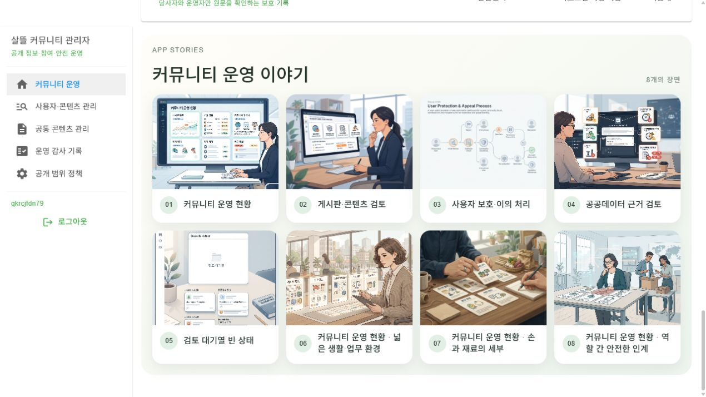

# DB·Object Storage 기반 앱 문맥 이미지 갤러리

## 변경

- 13개 앱 문맥 팩의 650장을 소스·정적 자원에 직접 포함하지 않고 `IObjectStorageService`에 게시하는 명시적 CLI를 추가했다.
- DB에 앱 팩, 장면 번호, 제목, 대체 text, 공개 URL, storage object, SHA-256, route 참조, 품질 상태와 활성 여부를 저장한다.
- 활성화된 자산만 팩별로 조회하는 익명 공개 API와 최대 8개 장면을 나타내는 공통 반응형 갤러리를 추가했다.
- 커뮤니티, 주문자, 운송·음식 배달 기사, 창고, 음식점, 판매자, 인사, 웹·모바일 관리자와 3개 업무 패키지 관리자에 각 팩을 연결했다.

## 실제 화면 확인

- 별도 MySQL 검증 DB와 개발용 로컬 Object Storage를 사용해 650장, 13개 팩, 팩별 50장을 게시했다.
- 공개 API의 `community-admin-web` 팩을 `SsalddelAdmin` 커뮤니티 운영 화면에서 읽어 8개 카드와 이미지가 실제 렌더되는 것을 확인했다.
- 이미지 URL은 같은 API 서버의 개발용 `/local-storage/` 경로에서 `200 image/jpeg`로 응답했다.

## 운영 경계

- 실제 Azure Blob은 현재 로컬 설정에 container·endpoint·identity 정보가 없어 쓰지 않았다. 같은 게시 명령은 Azure provider가 설정되면 외부 storage에서도 동작한다.
- 모든 AI 생성 이미지의 초기 품질 상태는 `미검토`다. 사용 가능·보정 필요·제외 판정은 별도 검수 흐름으로 남겨 둬다.
- 기존 개발 DB는 이전 운송 migration의 빈 `request_id` 중복으로 업데이트가 막혀 있어 임의로 수정하지 않았다.

## 검증

- 전체 solution build: 오류 0, 기존 AndroidX·nullable 경고 60
- 자산 조회 targeted test: 4개 통과
- DB: 650개 레코드, 13개 팩, 팩별 50개
- storage: JPEG 650개, 495,202,476 bytes
- 실제 브라우저: 커뮤니티 운영 갤러리 8개 렌더, console error 0
