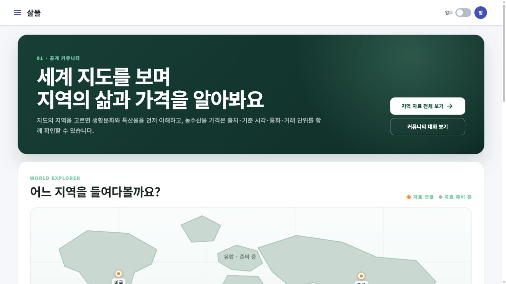

# 커뮤니티 웹 세계지도 시작 화면

## 변경

- 역할별 `01 커뮤니티` WebApp의 시작 경로 `/community/home`을 게시판 카드 중심 화면에서 세계지도 탐색 화면으로 바꿨다.
- 지도에서 미국·중국·대한민국·호주를 선택하면 지역별 문화 자료 준비 상태와 농수산물 가격 근거를 함께 보여준다.
- 미국 3개 주와 중국 3개 행정·문화권은 기존 `RegionalCultureSpecialtyCatalog`를 재사용하고 문화·특산물 상세로 연결한다.
- 한국 KAMIS, 미국 USDA NASS, 중국 연결 관측, 호주 ABS 가격 화면을 역할 앱 내부 경로로 조립했다.
- 가격은 구매가가 아니라 관측 정보이며 출처, 기준 시각, 통화, 원 거래단위, 시장 단계를 함께 확인해야 한다는 경계를 표시했다.
- 지도 선택은 조회 조건일 뿐 자동 가입, 상대 추천, 주문, 수입, 배차를 만들지 않는다.

## 실제 화면 확인

- 로컬 `Ssalddel.Web.CommunityApp`을 배포 기준과 같은 `/roles/01/` path base로 실행해 시작 화면과 미국 지역 선택을 확인했다.
- 미국 선택 뒤 메인·조지아·캘리포니아 문화 카드 3개와 USDA 가격 링크가 나타나며, `/roles/01/information/usda-us-price-comparison`에서 가격 조회 화면이 실제 렌더되는 것을 확인했다.
- 390×844 모바일 viewport에서 문서 전체 폭과 scroll 폭이 각각 380px로 일치하고, 지도 영역만 310px 안에서 720px 지도를 좌우로 이동하는 것을 확인했다.
- 데스크톱 viewport에서도 문서 전체 가로 넘침이 없고 지도·자료 상태·지역 표식이 표시된다.

## Figma·MAUI 대응 경계

- 기존 Figma `01A.07 · 지역 문화·특산물`과 MAUI `/community/regions` 카드 탐색은 그대로 유지했다.
- 이번 요청은 역할별 커뮤니티 **웹 시작 화면**에 한정되어 `/community/home`만 세계지도형으로 바꿨다. 대응 Figma 시작 화면은 이 작업에서 갱신하지 않았으므로 Web과 Figma·MAUI 시작 화면 구조는 아직 다르다.

## 검증

- `Ssalddel.Web.CommunityApp` build: 경고 0, 오류 0
- `Ssalddel.WebApp` build: 경고 0, 오류 0
- 세계지도·지역문화 관련 targeted test: 16개 통과
- 실제 브라우저: 시작 화면, 미국 선택, USDA 가격 화면, 390px 모바일 가로 넘침 확인
