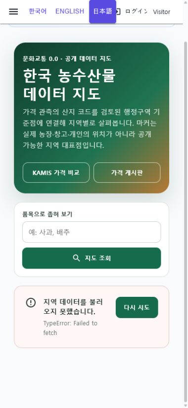

# 한국 농수산물 데이터 지도

## 화면 변화

- 기존 지역 농수산물 마커 API를 Web과 MAUI가 함께 쓰는 공통 화면에 연결했다.
- 한국 지도 개략도에서 검증된 행정구역 대표점을 마커로 선택하고, 품목·관측 기간·단위·통화·출처를 확인하도록 구성했다.
- 커뮤니티 세계지도에서 한국을 선택하면 이 화면으로 이동하고, KAMIS 비교와 `정보·시세` 게시판을 함께 오갈 수 있다.
- 조회 중, 데이터 없음, API 오류와 재시도 상태를 분리했다. 확인되지 않은 생산지·농장·창고·개인 위치는 추정 마커로 표시하지 않는다.

## 실제 렌더링

390px 폭 Web 화면에서 API 미연결 오류와 재시도 상태를 직접 확인했다. 로컬 서버는 DB migration 오류로 기동되지 않았으므로 실제 지역 마커 데이터가 표시된 상태는 확인하지 못했다.

## 검증

- 관련 지도·client·ViewModel·구성 테스트 55개 통과
- 전체 `Ssalddel.Tests` 4,070개 통과
- `Ssalddel.WebApp` 및 `SsalddelApp` Windows 대상 빌드 성공, 경고 0개
