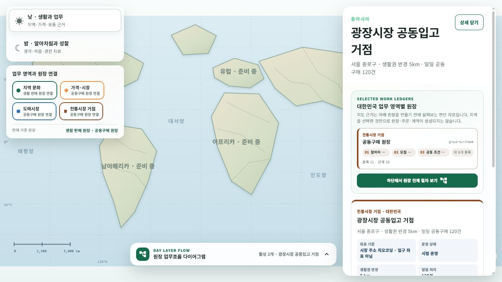
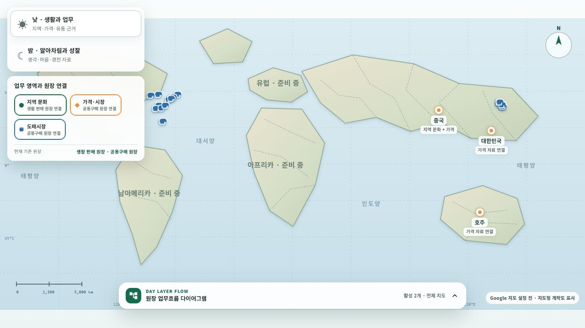
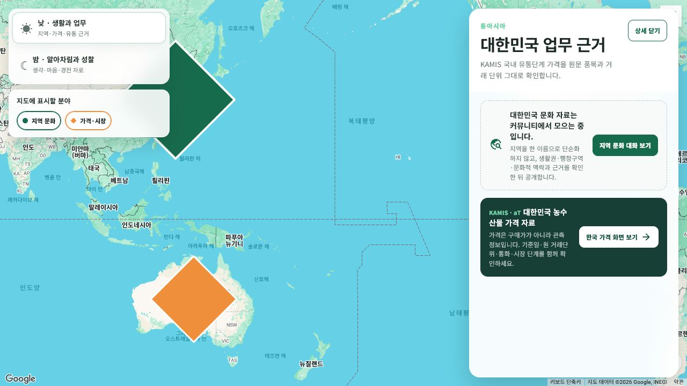
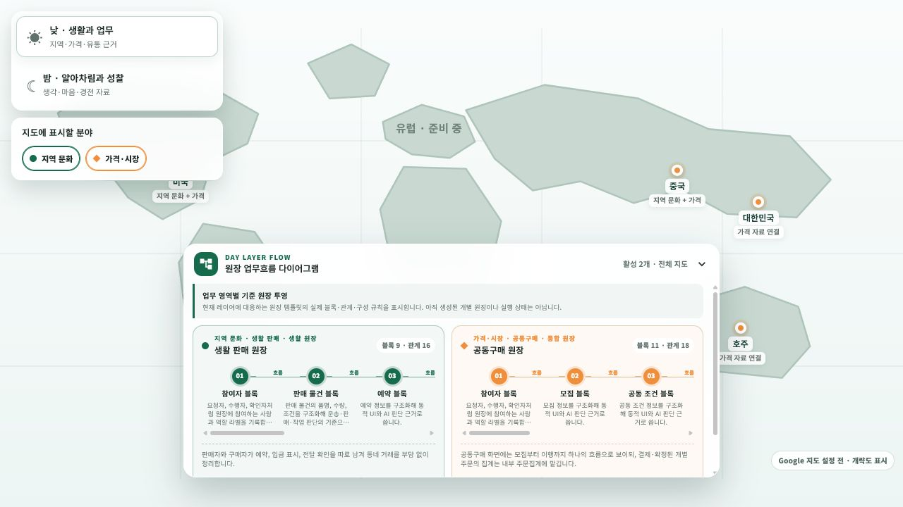
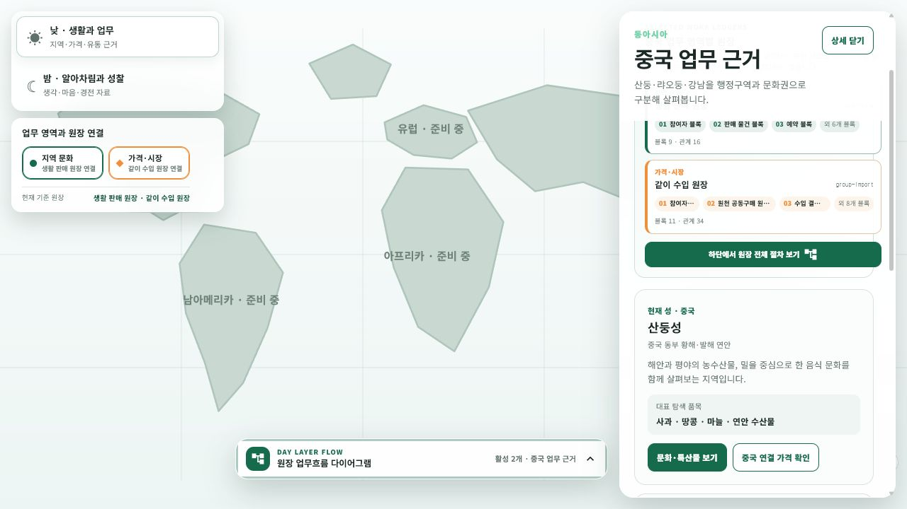
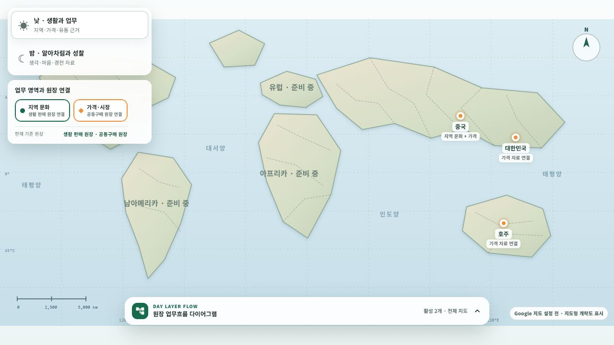

# 낮 업무·밤 알아차림 커뮤니티 세계지도

## 화면 변화

- `/community/home`은 `MapOnlyLayout`을 사용한다. WebApp 앱바·사이드 메뉴·페이지 바로가기는 표시하지 않고 세계지도 한 개가 브라우저 뷰포트 전체를 차지한다. 지도 왼쪽에는 dataset·레이어 조작 패널을, 마커를 선택한 뒤에는 오른쪽에 관련 자료·세부 화면 링크 패널을 지도 위에 표시한다.
- `/community/home` 세계지도에 `낮 · 생활과 업무`와 `밤 · 알아차림과 성찰` 데이터셋 전환을 추가했다. 내부 route 호환을 위해 `night-learning` key는 유지하지만 화면은 학습 주제 선택보다 가벼운 알아차림을 먼저 표현한다.
- 낮 지도는 기존 지역 문화·가격·유통 관측을 업무 판단 근거로 유지하고, `도매시장` 레이어에서 한국 6개 공영도매시장과 미국 12개 USDA 터미널 시장 보고 도시를 각각의 마커로 표시한다. `전통시장 거점` 레이어에는 시범운영 또는 운영 중이며 운영 동의·현장 확인·지도 좌표 검증을 모두 마친 공동 입고·수령 거점만 표시한다.
- 전통시장 거점 좌표에는 주소 지오코딩 대표점 또는 현장 확인 대표점이라는 정밀도, 확인 출처와 시각을 함께 저장한다. 출입구·배송 주소로 표현하지 않으며 외부 지오코딩 API나 과금 호출은 수행하지 않았다.
- 한국 좌표는 시장 탐색용 대표점이고 미국 좌표는 USDA 보고 도시의 중심점이다. 어느 좌표도 출입구·시설 경계·배송 주소로 사용하지 않으며, `좌표 기준`과 `시장 단계`를 observation metadata와 상세 카드에 함께 표시한다.
- 한국 목록의 공식 근거는 [농넷](https://www.nongnet.or.kr/front/index.do), 미국 보고 도시 목록의 공식 근거는 [USDA AMS Terminal Markets](https://www.ams.usda.gov/market-news/fruit-and-vegetable-terminal-markets-standard-reports)다. 미국 terminal wholesale report는 현지 도매시장의 일별 관측이라는 [USDA My Market News 설명](https://mymarketnews.ams.usda.gov/node/8570)을 적용했다.
- 밤 지도는 기존 `YouTube지식성찰채널Catalog`의 공개 학습 채널과 `ScriptureDecorationCatalog`의 경전·고전 공개 재생목록을 국가별로 보여 준다.
- 밤 모드는 `/community/home?dataset=night-learning`으로 공유할 수 있고 낮으로 돌아가면 질의가 제거된다.
- 밤 지도의 위치는 자료 제공 채널의 국가 맥락일 뿐 사상·경전의 기원, 신앙 분류나 우열을 뜻하지 않는다.
- 화면의 지도 renderer는 런타임 설정이 준비되면 Google Maps JavaScript API를 사용한다. 낮과 밤에 별도 지도를 만들지 않고 같은 지도 인스턴스의 Data 레이어와 스타일만 교체하며 일반·지형·위성 basemap, 축척, 확대·축소, 스트리트뷰, 전체화면 조작을 제공한다.
- Google 지도 키가 없거나 외부 API 로드에 실패하면 바다·육지 음영, 해안·국경선, 경위도 격자, 해양명, 방위와 축척을 갖춘 SVG 지도형 개략도와 국가 선택 버튼을 표시한다.
- 왼쪽 지도 조작 패널에서 낮의 `지역 문화`·`가격·시장`·`도매시장`, 밤의 `생각·성찰 자료`·`경전·고전 자료` 레이어를 켜고 끈다. 원형·마름모·시장 건물 모양과 분야별 색을 함께 사용해 색상만으로 구분하지 않는다.
- 접었다 펼 수 있는 하단 패널은 낮에 현재 업무 영역과 대응하는 원장의 내부 업무 절차를 표시한다. `지역 문화`는 `생활 판매 원장`, 국내 `가격·시장`·`도매시장`은 `공동구매 원장`, 해외 국가를 선택한 두 시장 레이어는 `같이 수입 원장`으로 투영한다. 같은 원장으로 모이는 두 레이어는 절차 카드를 중복 생성하지 않고 한 장에 업무 영역명을 함께 표시한다.
- 낮의 절차도는 별도 화면용 문구를 복제하지 않고 `CommunityLedgerTemplateCatalog`의 `LedgerBlocks`, `BlockRelations`, `CompositionRules`를 직접 읽어 원장 블록·연결 관계·구성 규칙을 그린다. 이는 현재 지도 맥락에 적합한 원장 형식을 보여 주는 투영이며, 생성된 개별 원장이나 거래·실행 상태를 뜻하지 않는다.
- 왼쪽 레이어 조작부도 각 업무 영역 아래에 대응 원장명을 함께 표시하고, 선택 국가가 바뀌면 `가격·시장`의 기준 원장을 국내 `공동구매`와 해외 `같이 수입` 사이에서 즉시 갱신한다.
- 오른쪽 선택 상세에는 해당 국가에서 실제로 확인 가능한 활성 업무 영역만 원장 카드로 표시한다. 각 카드는 원장 template key, 실제 블록 3개의 미리보기, 전체 블록·관계 수를 보여 주며 하단 전체 절차 패널을 바로 펼칠 수 있다. 지도 근거는 원장 생성 전 판단 자료이며 지역 선택만으로 원장·주문·계약을 만들지 않는다.
- 밤의 하단 패널은 원장을 추론하지 않고 선택한 자료 레이어를 가볍게 알아차리는 흐름만 표시한다.
- `GET /api/v1/community/world-map/observations`가 `stableId`, 출처, 근거 확인 시각, 상세 경로와 안정적인 `revision`을 반환한다. 화면은 30초마다 현재 dataset을 다시 확인한다.
- 첫 snapshot은 즉시 연결하고 이후 revision 변경도 같은 지도 Data 레이어에 자동 반영한다. 자동 반영 시에는 현재 Google 지도 중심·확대 수준을 바꾸지 않는다.
- 서버 snapshot 연결이 실패하면 성공처럼 숨기지 않고 자동 갱신 실패를 알린 뒤, 첫 연결 전에는 내장 공개 카탈로그를, 연결 뒤에는 마지막 snapshot을 유지한다.

## Google 지도 운영 구성

- tracked `runtime-config.js`는 빈 객체만 유지하고, `eng/inject-web-runtime-config.ps1`가 전용 `GoogleMaps:BrowserApiKey` 또는 `SSALDDEL_GOOGLE_MAPS_BROWSER_API_KEY`를 publish 산출물에만 주입한다. 기존 unified·server 키로 fallback하지 않는다.
- 배포 allowlist에 정확히 일치하는 HTTPS origin에서만 Google loader를 시작한다. loopback HTTP는 로컬 개발에서만 허용하고, 그 밖의 origin은 Google API 호출 없이 개략도로 전환한다.
- origin을 키보다 먼저 검사하고 과거 meta-key fallback을 허용하지 않는다. 런타임 키를 읽은 뒤 전역 설정값과 동적 loader script를 제거한다. 브라우저 키 자체는 공개되는 credential이므로 Google Cloud의 HTTP referrer·Maps JavaScript API 제한이 실제 보안 경계다.
- 운영 키에 loopback origin이 섞이지 않도록 배포 스크립트가 개발·운영 origin 혼합을 거부한다. publish된 `index.html`에는 배포별 cache token을 넣어 회전 전 runtime 설정의 재사용을 줄인다.
- 운영 절차와 회전·검증 항목은 [Google Maps 브라우저 키 배포 보안](../Deployment/GoogleMapsBrowserKey.md)에 기록했다.
- 브라우저 API 키는 source·tracked config에 저장하지 않는다. 배포 결과에 `globalThis.ssalddelRuntimeConfig.googleMapsBrowserApiKey`를 주입하거나 `ssalddel-google-maps-browser-key` meta 값을 배포 단계에서 주입한다.
- 운영 키에는 해당 Web origin의 HTTP referrer restriction과 Maps JavaScript API restriction을 함께 적용한다. 역할 WebApp별 origin이 다르면 키도 분리한다.
- Google Cloud project의 Maps JavaScript API 활성화와 billing 연결은 별도 운영 승인 작업이다. 이번 변경은 외부 API 활성화나 결제 설정을 수행하지 않았다.
- 런타임 키 값은 로그·화면 capture·변경 기록에 포함하지 않는다.

## 개인정보·추천 경계

- 종교·철학·국적을 사용자 점수, 신뢰 점수나 추천 순위에 사용하지 않는다. 지도에서 자료를 알아차린 사실도 관심 등록·동의·추천 신호로 간주하지 않는다.
- 공개 자료 연결은 진리·권위·공식 제휴를 보증하지 않는다.
- 밤 데이터셋은 읽기 전용이며 주문·계약·배차·자동 가입을 만들지 않는다.

## 실제 렌더링

공개 observation contract는 기존 낮 자료와 개별 도매시장에 더해, 운영 조건과 좌표 검증을 통과한 전통시장 거점을 가변 건수로 제공한다. 데스크톱 `1280x720`에서는 왼쪽 `300px` 지도 조작 패널과 선택 후 오른쪽 `390px` 상세 패널이 전체 화면 지도 위에 나타났고, 모바일 `390x844`에서는 조작부가 상단 2열, 상세가 최대 화면 높이 56%의 하단 시트로 바뀌었다. 앱바·drawer는 계속 0개이고 페이지 overflow도 없었다.

전통시장 거점 수직 slice는 실제 WebApp 빌드를 `1280x720`에서 렌더하고 `artifacts/local`의 통제된 공개 snapshot으로 마커 선택을 확인했다. 광장시장 검증용 마커를 누르면 국가 일반 상세가 아니라 해당 마커의 stable ID로 선택되며, 오른쪽 패널에 `공동구매 원장`, 좌표 정밀도, 시범 운영 상태, 생활권 반경, 일일 처리량과 공식 출처가 나타났다. 제품 코드에는 샘플 fallback을 추가하지 않았다. 로컬 실제 API는 기존 DB 마이그레이션의 중복 `request_id` 때문에 기동하지 못했으므로, 이 캡처는 실DB 데이터 검증이 아니라 UI와 공개 contract 연결 검증이다.

이전 지도 renderer 검증에서는 사용자 비밀 저장소의 키를 source·로그·capture에 기록하지 않는 임시 로컬 런타임으로 주입해 Maps JavaScript API의 tile·Data 레이어·marker 선택을 확인했다. 이번 개별 시장 변경에서는 전용 `GoogleMaps:BrowserApiKey`가 없는 보안 경계를 유지해 실제 Google API를 다시 호출하지 않았고, 동일 marker dataset을 쓰는 SVG fallback에서 18개 시장 버튼을 직접 확인했다. Google adapter에는 시장 건물 symbol과 국가 선택 시 해당 국가 시장들을 `fitBounds`하는 동작을 구성 test로 고정했다.

내장 지도에서 한국 6개와 미국 12개 시장 마커가 각각 독립된 버튼으로 렌더링됐고, 모든 버튼은 시장명·시장 단계의 접근 가능한 이름을 가진다. 세계 축척에서는 밀집 지역의 점이 겹칠 수 있으나 Google 지도에서는 국가 선택 시 해당 국가 범위로 확대한다. `1280x720`에서 왼쪽 조작부 `300px`, 하단 접이식 원장 패널 `760px`, 페이지 전체 가로·세로 overflow 없음과 console 경고·오류 0건을 확인했다.

실제 renderer에서 확인했던 `가격·시장` custom diamond의 과도한 크기는 symbol 종류별 scale을 분리해 수정했다. 공개 observation API가 연결되지 않아 내장 밤 catalog를 쓰는 상태에서 `생각·성찰 자료`를 꺼도 국가 marker가 줄지 않는 fallback 필터 문제는 별도 수정 대상으로 남아 있다.

낮 하단 패널을 펼쳤을 때 `생활 판매 원장`은 9개 블록·16개 관계, `공동구매 원장`은 11개 블록·18개 관계로 실제 템플릿과 동일하게 렌더링됐다. 두 카드의 긴 절차는 각 카드 내부에서만 가로 스크롤되고 서로 침범하지 않았다. 미국을 선택하면 가격 영역이 `같이 수입 원장`으로 바뀌었으며, `1280x720`에서 왼쪽 조작부·오른쪽 상세부·하단 절차 패널이 겹치지 않았다.

좌측에는 활성 업무 영역과 원장 연결을, 우측에는 중국에서 확인 가능한 `생활 판매 원장`과 `같이 수입 원장`의 블록 미리보기를 표시했다. 대한민국을 선택하면 지역 문화 원장은 제외되고 `공동구매 원장` 한 장만 남았으며, 밤으로 전환하면 좌우의 원장 표시는 모두 알아차림 자료 표기로 복귀했다. 데스크톱 `1280x720`에서 좌측 `300px`, 우측 `390px`, 펼친 하단 `526px` 패널은 서로 겹치지 않았고 페이지 가로 overflow도 없었다.

Google 지도를 불러오기 전 화면도 지도임을 즉시 알아볼 수 있도록 낮에는 푸른 해역·육지 음영·행정 경계·경위도·방위·축척을, 밤에는 같은 지리 구조의 어두운 cartography를 실제 브라우저에서 확인했다. Google 연결 시 사용할 지도 유형·축척·확대·스트리트뷰 조작과 좌우 패널을 고려한 viewport padding은 구성 test로 확인했다. 현재 로컬 비밀 저장소에는 전용 `GoogleMaps:BrowserApiKey`가 없고 통합 key만 있으므로, 보안 경계를 유지해 새 Google 조작부의 실 API 재검증에는 통합 key를 재사용하지 않았다.

## 설계 원본과의 관계

대상 Figma 파일·node가 현재 작업 문맥에 제공되지 않아 Figma에는 반영하지 않았다. 이번 변경은 실행 route, 기존 검토 카탈로그와 실제 렌더를 기준으로 기록한다.

## 검증

- `CommunityWorldMapHomeCompositionTests` 15개와 `커뮤니티세계지도조회UseCaseTests` 5개, 합계 20개 통과
- 테스트 실행 과정에서 `Ssalddel.Contracts`, `Ssalddel.Ui.Common`, `Ssalddel`, `Ssalddel.WebApp`, `Ssalddel.Tests` 빌드 성공
- 공개 API의 낮 28건·밤 7건 snapshot과 같은 자료의 안정 revision 확인
- 한국 6개 시장 대표점과 미국 12개 USDA terminal-report 도시 중심점, stable ID·공식 출처·좌표 정밀도·시장 단계 metadata 확인
- SVG fallback의 시장 마커 18개와 접근 가능한 이름 18개, 단일 지도 container, `1280x720` 페이지 overflow와 console 경고·오류 부재를 실제 브라우저로 확인
- 낮·밤 route 전환과 dataset별 지도 marker 직접 렌더 확인
- 데스크톱·모바일에서 단일 지도 container 1개, 앱바·drawer 0개, 좌측 지도 조작·우측 또는 하단 선택 상세 패널과 페이지 overflow 없음 확인
- Google Maps 어댑터의 단일 container, 단일 map 생성, Data 레이어 교체, 런타임 키 경계와 source 내 키 부재를 구성 test로 확인
- 모의 전용 키로 publish 산출물 주입 성공, 출력 내 키 비노출, 외부 HTTP origin 거부, tracked source 대상 쓰기 거부를 확인
- 명시 없는 loopback, 개발·운영 origin 혼합, userinfo 포함 origin을 추가로 거부하고 publish index의 cache token 생성을 확인
- 임시 로컬 런타임 주입으로 Google Maps 실제 tile·Data 레이어·marker 선택과 console 오류 부재 확인. 배포 runtime의 origin 제한 browser key 연결은 별도 운영 구성
- 낮 업무 영역별 원장 template 선택, template 블록·관계·규칙 표시, 해외 국가 선택 시 `같이 수입 원장` 전환을 구성 test와 실제 브라우저로 확인
- 좌측 업무 영역별 원장명, 우측 선택 국가의 관측 가능 영역 필터와 원장 미리보기, 우측에서 하단 전체 절차 열기, 밤의 원장 비노출을 구성 test와 실제 브라우저로 확인
- Google 일반·지형·위성 유형, 축척·확대·스트리트뷰 조작, symbol별 marker scale과 패널 여백을 구성 test로 확인하고 낮·밤 SVG 지도형 cartography를 실제 브라우저로 확인
