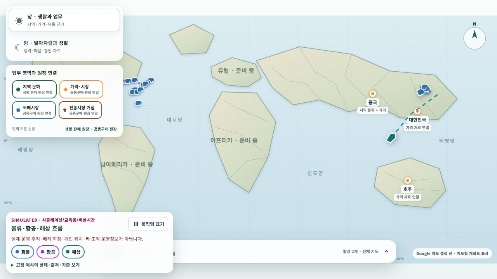

# 지도형 홈 운송 시뮬레이션 레이어

## 화면 변화

- `/community/home` 낮 지도에 화물·항공·해상 교육 레이어를 추가했다.
- panel 상단과 지도 접근성 설명에 `SIMULATED · 시뮬레이션/교육용/비실시간`을 표시하고, 실제 운행 추적·배차 확정·개인 위치·타 조직 운영정보가 아님을 명시했다.
- 화물·항공·해상 toggle을 각각 끌 수 있고 `움직임 끄기`로 경로 위 합성 진행을 정지할 수 있다. OS의 동작 감소 설정도 첫 렌더에 반영한다.
- 접힌 예시 정보에는 각 경로의 교육 상태, 고정 fixture 출처, 기준일, `자동 갱신 없음` 신선도와 simulation mark를 표시한다.
- Google Maps가 준비되면 지도 drag·zoom을 따르는 `OverlayView` Canvas를 사용한다. browser key가 없는 현재 로컬 환경에서는 같은 fixture를 기존 SVG 개략도 위에 표시한다.
- 낮은 zoom은 3개, 중간 zoom은 6개, 높은 zoom은 최대 12개로 표시 대상을 제한한다. 향후 WebGL/deck.gl renderer는 별도 registry adapter로만 추가한다.

## 데이터와 운영 경계

- 초기 화면은 `ssalddel-education-fixture-v1` 고정 예시 세 건만 사용한다. 실제 항공편명·호출부호·선명·차량·개인·조직 식별자나 수집 위치가 없다.
- 국토교통부 TAGO 국내항공운항정보, 해양수산부 선박운항정보, FAA SWIM SFDPS는 공식 catalog와 접근 경계만 계약에 기록했고 모두 `catalog-only`다.
- API 호출, 활용신청, 계정 생성, key 발급, scraping, 유료 호출은 수행하지 않았다.
- 기술 선택과 source별 판단은 [지도형 홈 운송 시뮬레이션 레이어](../Architecture/TransportSimulationMapLayer.md)를 기준으로 한다.

## 실제 렌더링

Google Maps browser runtime을 주입하지 않은 로컬 WebApp의 `/community/home`을 직접 열어 SVG fallback 위 세 경로, 경고, toggle, 움직임 정지와 예시 정보 disclosure가 함께 보이는지 확인했다. 데스크톱 화면에서 화물·항공·해상 toggle은 모두 활성 상태였고, 항공 toggle을 누르면 `aria-pressed=false`, 움직임을 끄면 버튼이 `움직임 켜기`와 `aria-pressed=false`로 바뀌었다.

모바일 `390x844`에서는 세 toggle과 경고가 한 panel에 유지되고 상세 disclosure는 숨겨 지도를 가리지 않도록 했다. 데스크톱·모바일 console 경고와 오류는 0건이었다.

## 검증

- 계약·구성 집중 test 4개 통과
- `Ssalddel.WebApp`과 소비 test project 포함 build 성공
- 두 JavaScript module의 `node --check` 통과
- 데스크톱·`390x844` 실제 브라우저 렌더, 화물·항공·해상 toggle, 움직임 정지와 console 오류 부재 확인
- Google runtime 미구성 SVG fallback 확인. 실제 Google `OverlayView` runtime은 key를 새로 발급·주입하지 않았으므로 구성·build 검증만 수행
