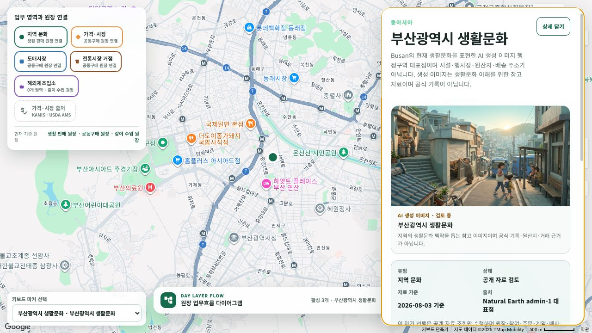

# 커뮤니티 지도 지역 이미지 상세 패널

## 화면 변화

- `/community/home`에서 서울을 제외한 한국 16개 시도, 미국 50개 주, 중국 31개 성급 행정구역을 각각 독립 지역문화 마커로 표시한다.
- 지역문화·도매시장·전통시장 거점 마커를 선택하면 기존 지역 설명과 출처 정보 위에 해당 지역의 생성 이미지를 함께 표시한다.
- 오른쪽 상세 패널 폭을 데스크톱 최대 `440px`로 조정하고, 이미지는 `16:9` 비율로 배치했다.
- 이미지 팩 로딩, 연결 이미지 없음, 조회 오류와 `다시 시도` 상태를 각각 제공한다.
- 생성 이미지는 품질 상태를 숨기지 않고 `AI 생성 이미지 · 검토 중`으로 표시하며, 공식 기록·원산지·거래 근거가 아니라는 경계를 함께 보여 준다.
- 마커 stable ID와 이미지의 지역 key를 연결한다. 예를 들어 `wholesale-market:kr-busan-eomgung`은 `kr-busan--scene-01`을 사용한다.
- 위치는 Natural Earth admin-1 대표점을 사용하며 시설·행사장·원산지·배송 주소가 아니라는 정밀도 경계를 상세 패널에 표시한다.

## 저장·조회 경계

- `regional-culture-one-each-v1` 팩의 서울 제외 97개 Blob URL과 DB metadata를 공개 읽기 API로 조회할 수 있도록 활성화했다.
- 품질 상태는 `미검토`로 유지했다. 화면 노출은 검토 완료나 공식 근거 승인을 뜻하지 않는다.
- 공개 이미지 조회는 지도 snapshot과 같은 읽기 전용 HTTP client를 사용하며 Blob credential과 내부 storage 위치를 client에 전달하지 않는다.

## 실제 렌더링

로컬 API와 WebApp을 연결한 `1280x720` 화면에서 `culture:kr-busan` 지역문화 마커를 키보드 선택 목록으로 선택했다. 지도는 부산 행정구역 대표 위치로 확대됐고, 오른쪽 패널에 부산광역시 생활문화 설명, Blob 생성 이미지, 검토 중 표기, 공식 근거 아님 경계와 Natural Earth 위치 출처가 함께 나타났다.

## 검증

- 공개 이미지 API에서 활성 자산 97건과 `kr-busan--scene-01` URL 확인
- 공개 지도 API에서 낮 observation 119건과 지역문화 observation 97건(한국 16·미국 50·중국 31, 서울 0) 확인
- 관련 지도·HS 가격·로딩 표시 대상 테스트 20개 통과 및 `Ssalddel`, `Ssalddel.WebApp` 빌드 성공
- 실제 Google 지도에서 부산 마커 선택, 설명·이미지·품질 경계 렌더 확인

## 남은 범위

97개 이미지는 모두 `미검토` 상태다. 독립 마커 공개와 별개로 각 지역의 최신 공식 문화 근거와 생성 이미지 표현을 사람이 검토한 뒤 `사용가능` 상태로 전환해야 한다. Natural Earth 좌표는 지도 탐색용 대표점이므로 길찾기·물류·원산지 판단에 사용하지 않는다.
