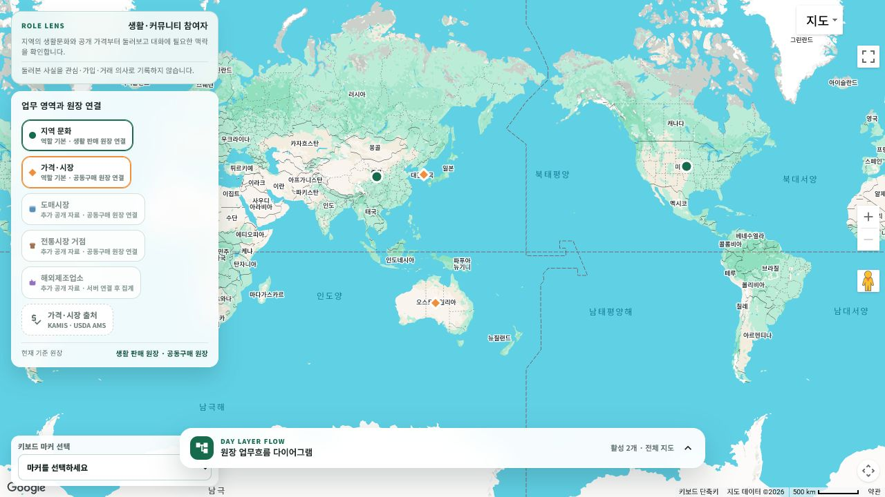
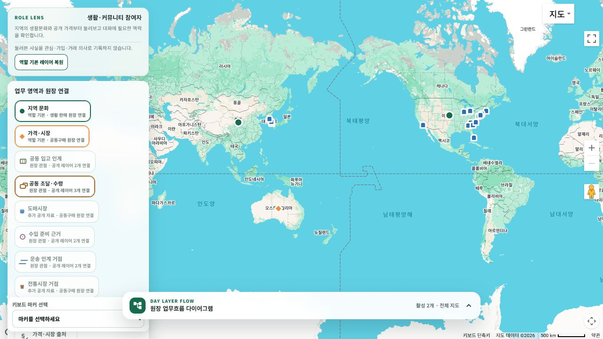

# 커뮤니티 지도 역할별 레이어 관점

- 날짜: 2026-08-03
- 화면: `/community/home`
- 범위: Web 세계지도 역할 관점, 원장 관점 레이어, 기본 레이어, 사용자 재선택

## 변경 내용

- 로그인 계정의 대표 역할을 생활·커뮤니티, 주문자, 판매자·화주, 기사·운송, 창고, 통관·무역, 플랫폼 운영 관점으로 정규화합니다.
- 역할별로 필요한 공개 레이어와 원장 관점 레이어를 먼저 배열하고 기본 활성화합니다.
- 원장 관점 레이어는 새 마커를 만들지 않고, 기존 공식·공개 관측을 해당 원장의 업무 인계 순서로 묶어 표시합니다.
- 사용자는 역할 기본값에 포함되지 않은 공개 레이어도 직접 켤 수 있습니다.
- 사용자가 레이어 구성을 바꾸면 `역할 기본 레이어 복원`으로 돌아갈 수 있습니다.
- 역할 관점은 화면의 공개정보 기본 조합일 뿐 권한, 상대 추천, 주문, 계약, 배차 또는 개인 위치 공개에 사용하지 않습니다.

## 역할별 기본 레이어

| 관점 | 기본 레이어 |
| --- | --- |
| 생활·커뮤니티 참여자 | 지역 문화, 가격·시장 |
| 주문자·구매 담당 | 공동 조달·수령, 지역 문화 |
| 판매자·화주 | 공동 조달·수령, 수입 준비 근거, 운송 인계 거점 |
| 기사·운송 담당 | 운송 인계 거점 |
| 창고·거점 관리자 | 공동 입고 인계, 운송 인계 거점 |
| 통관·무역 전문 역할 | 수입 준비 근거, 공동 조달·수령 |
| 플랫폼 운영자 | 원본 공개 레이어와 원장 관점 레이어 전체 |

## 원장 구조에서 추가한 지도 레이어

| 지도 레이어 | 연결 원장 | 재사용하는 공개 관측 |
| --- | --- | --- |
| 공동 조달·수령 | 공동구매 | 공개 가격, 도매시장, 전통시장 공동입고 거점 |
| 수입 준비 근거 | 육류 수입 준비 | 해외제조업소 권역 근거, 공개 가격 |
| 운송 인계 거점 | 화물 운송 | 도매시장, 전통시장 공동입고 거점 |
| 공동 입고 인계 | 공동 입고 | 도매시장, 전통시장 공동입고 거점 |

음식 배달, 살뜰 마트, 창고 출고, 개별 주문 원장은 정확한 상하차지·개인 위치·재고·계약·실행 상태가 필요하므로 공개 지도 레이어에서 제외했습니다.

## 검증

- `Ssalddel.WebApp` 단일 빌드: 경고 0개, 오류 0개
- 역할 profile catalog, 세계지도 구성, 조회 UseCase 테스트: 43개 통과
- 실제 렌더링: `http://localhost:5241/community/home`
- 방문자 관점에서 지역 문화·가격 레이어 2개가 기본 활성화되는 것을 확인했습니다.
- 공동 조달·수령 레이어를 선택하면 기존 한국 6개·미국 12개 도매시장 마커가 추가되고 레이어 버튼이 선택 상태로 바뀌는 것을 확인했습니다.
- 선택 레이어 추가 뒤 복원 버튼이 나타나고, 복원 뒤 추가 레이어가 다시 비활성화되는 것을 확인했습니다.
- 이 변경은 Web 전용 전체화면 지도 구성 변경이며 MAUI route나 Figma frame 구조는 변경하지 않았습니다.

## 화면

