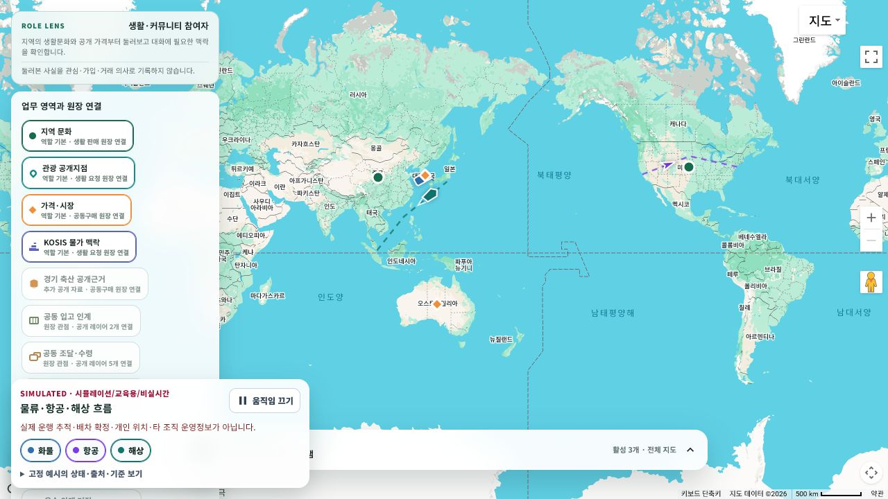

# 커뮤니티 지도 운송 시뮬레이션 통합

## 화면 변화

- `/community/home`에 `SIMULATED · 시뮬레이션/교육용/비실시간` 화물·항공·해상 경로를 통합했다.
- 화물·항공·해상 toggle과 움직임 정지 버튼을 추가하고 실제 운행 추적·배차 확정·개인 위치·타 조직 운영정보가 아님을 상시 표시한다.
- 해상 객체에는 선박 방향과 작은 항적을 함께 표시한다.
- Google 지도가 준비되면 pointer event가 없는 `OverlayView` Canvas 한 장을 사용하고, Google 미설정 시 같은 fixture를 기존 SVG 개략도 위에서 표시한다.
- OS 동작 감소 설정과 화면 숨김 상태에서는 움직임을 중지한다.

## 데이터와 운영 경계

- 초기 화면은 `ssalddel-education-fixture-v1` 고정 예시 3건만 사용한다.
- 실제 항공편명·호출부호·선명·차량·개인·조직 식별자와 실제 수집 위치는 포함하지 않는다.
- 공식 운항 source 후보는 `catalog-only`이며 API 호출, key 발급, 수집 또는 운영 연결을 수행하지 않았다.
- 기술 선택과 공개 경계는 [지도형 홈 운송 시뮬레이션 레이어](../Architecture/TransportSimulationMapLayer.md)를 기준으로 한다.

## 실제 렌더링

현재 checkout의 WebApp을 `http://127.0.0.1:5245/community/home`에서 실행해 Google 지도 runtime 위 Canvas와 시뮬레이션 panel을 직접 확인했다.

- Canvas가 지도 viewport `1280×720` 전체와 일치하는지 확인했다.
- 움직이는 두 프레임의 PNG SHA-256이 달라 실제 animation frame 진행을 확인했다.
- `움직임 끄기` 후 700ms 간격 두 프레임의 SHA-256이 같아 정지 동작을 확인했다.
- 해상 toggle의 `aria-pressed`가 `true → false → true`로 바뀌는 것을 확인했다.
- `390×844`에서 panel 폭 374px, 가로 overflow 없음, 상세 disclosure 숨김을 확인했다.

## 검증

- 운송 시뮬레이션 계약·구성 집중 test 4개 통과
- `Ssalddel.WebApp` build 성공, 경고 0개·오류 0개
- 두 JavaScript module의 번들 Node.js `--check` 통과
- Google `OverlayView` Canvas 생성·viewport 원점 보정·이동/정지·해상 toggle을 실제 브라우저에서 확인
- 390×844 반응형 화면 직접 확인
