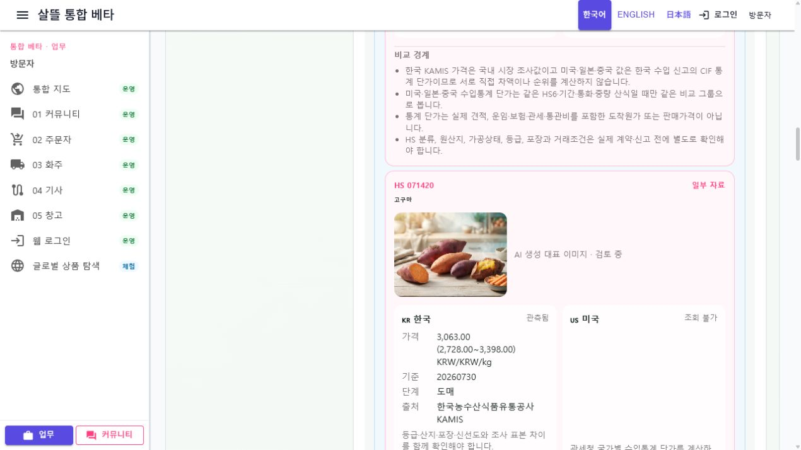

# HS 식품 국가별 가격 카드와 조회 로딩

## 화면 변화

- `/information/food-ingredients`의 재료별 HS 후보에서 중복을 제거한 HS6 단위 가격 카드를 제공한다.
- 사용자가 `국가별 가격 보기`를 눌렀을 때만 서버를 조회하고, 조회 중에는 spinner·진행 문구·비활성 상태와 `aria-busy`를 함께 표시한다.
- 대표 이미지와 한국·미국·일본·중국 관측을 한 카드에 배치하되 통화·단위·시장 단계가 다른 값의 차액이나 순위를 만들지 않는다.
- 이미지 또는 가격 catalog에 없는 HS 후보는 빈 비교 경계를 표시하지 않고 `가격 카드 준비 중` 상태로 구분한다.
- 같은 로딩 표현을 음식 검색, 공식 기업 자료 조회, HS 후보 대조에도 적용했다.

## 가격 경계

- 한국은 KAMIS 국내 시장 조사 가격이고, 미국·일본·중국은 한국 수입 신고의 CIF 통계 단가다.
- 관세청 연결 키가 없는 국가는 `조회 불가`, 기간 내 실적이 없는 국가는 `자료 없음`으로 구분한다.
- 대표 이미지는 분류 탐색용 AI 생성 이미지이며 원산지·등급·검역·인증·수입 가능성의 증거가 아니다.

## 실제 렌더링

로컬 WebApp에서 `강황고구마밥 → 고구마 → HS 후보 확인` 순서로 이동해 `071420` 카드를 조회했다. Blob 대표 이미지와 4개 국가 카드가 표시됐고 한국 KAMIS 도매 관측은 `관측됨`, 연결되지 않은 국가는 `조회 불가`로 나타났다.

## 검증

- `GET /api/v1/agricultural-fisheries/items/071420/country-price-card`: HS `071420`, 국가 4개, 대표 이미지 URL, `PartialData`
- 브라우저에서 HS `071290`, `071420` 두 카드의 대표 이미지와 4개 국가 상태 렌더 확인
- 관련 지도·HS 가격·로딩 표시 대상 테스트 20개 통과
- `Ssalddel`, `Ssalddel.WebApp` 분리 산출물 빌드 성공
