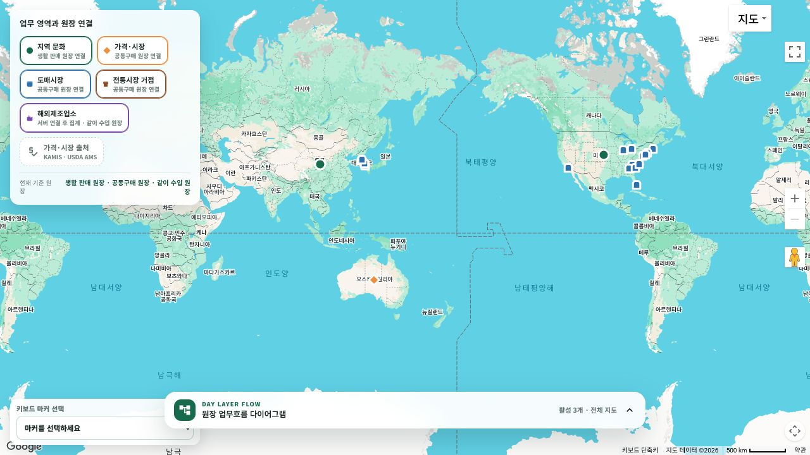

# 해외제조업소 권역 집계 지도 레이어

## 화면 변화

- `/community/home`의 낮 지도에 `해외제조업소` 레이어를 추가하고 `같이 수입 원장` 흐름에 연결했다.
- 검증된 제조업소 근거가 있는 경우 미국 주 또는 중국 운영 권역의 대표점에 공장 모양 마커를 표시한다.
- 마커 상세에는 제조업소 수와 재료 관계 근거 수를 표시한다.
- 개별 시설 주소를 공개하지 않으며, 권역 대표점은 실제 공장 좌표·원재료 원산지·현재 공급 가능 여부를 뜻하지 않는다고 명시한다.

## 데이터와 위치 경계

- 식약처 해외제조업소 공식 데이터 근거 중 현재 유효하고 시설 코드가 확인됐으며 신뢰도 `0.9` 이상인 관계만 집계한다.
- 같은 권역의 제조업소는 조직 key로 중복 제거하고, 근거 수는 별도로 센다.
- 미국은 검증된 `US-USPS-STATE` 지리 대표점을 사용하고, 중국은 기존 지역문화 지도에서 검토된 랴오닝·산둥·강남 운영 권역 대표점을 재사용한다.
- 제조업소명과 주소는 공개 지도 응답에 포함하지 않는다.

## 실제 렌더링

별도 빌드 산출물을 `http://localhost:5241/community/home`에서 렌더링해 레이어 버튼, 공장 모양 범례, `같이 수입 원장` 연결을 확인했다. 표준 `5238` 개발 서버는 기존 정적 자산 해시가 남아 있어 별도 포트를 사용했다.

현재 로컬 공식 근거 DB에는 표시 가능한 해외제조업소가 `0건`이다. 따라서 실제 지도에는 가짜 마커를 만들지 않았고, 별도 포트 화면은 API origin 차이를 `서버 연결 후 집계`로 표시한다. 동일 빌드의 서버 API에서는 레이어 5개, 전체 관측 28건, 해외제조업소 마커 0건을 확인했다.

## 검증

- 권역 집계 reader, 세계지도 UseCase, 화면 조립 테스트 28개 통과
- InMemory 근거로 California 제조업소 2개·근거 3건과 Shandong 권역 마커 투영 확인
- 실제 개발 DB 기반 API에서 `overseas-manufacturer` 레이어 존재와 마커 0건 확인
- 실제 Google 지도에서 해외제조업소 레이어 버튼·공장 범례·같이 수입 원장 연결 확인

## 남은 범위

현재 환경에는 식약처 해외제조업소 OpenAPI key가 없어 신규 수집을 실행하지 않았다. key를 로컬 전용 설정에 연결하고 공식 근거 수집을 완료하면, 조건을 통과한 미국·중국 권역 마커가 같은 화면에 자동으로 나타난다. 외부 수집, 운영 배포, 개별 시설 좌표 공개는 이번 변경 범위에 포함하지 않는다.
