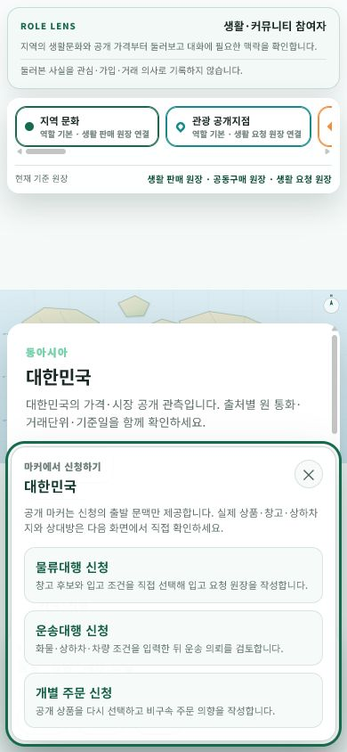

# 지도 신청 메뉴 입력 접근성

## 변경 목적

마우스 오른쪽 클릭만으로 열리던 지도 신청 메뉴를 키보드와 모바일 사용자도 같은 marker 문맥에서 열 수 있게 한다. 새로운 신청 route나 원장을 만들지 않고 기존 물류대행·운송대행·개별 주문 action sheet를 재사용한다.

## 입력과 초점

- SVG fallback marker는 오른쪽 클릭, `Shift+F10`, context-menu key와 touch long-press를 지원한다.
- Google Maps Data marker는 `contextmenu`와 650ms long-press를 같은 .NET callback으로 전달한다.
- 선택 상세 panel의 `신청 업무 열기` 버튼은 포인터 위치와 무관한 명시적 대체 진입점이다.
- 메뉴가 열리면 이름이 있는 dialog로 초점이 이동하고, 닫으면 선택 상세 panel로 초점이 돌아간다.
- long-press 뒤 발생하는 합성 click은 같은 marker의 다음 click만 억제해 메뉴가 즉시 닫히지 않게 한다.

## 안전 경계

- marker ID와 국가 code는 신청 출발 문맥이며 공급자·창고·상품·상하차지·계약 상대 확정값이 아니다.
- 신청 메뉴를 여는 동작은 원장 생성, 저장, 배차, 계약, 결제 또는 개인정보 전송을 발생시키지 않는다.
- Google runtime 설정이 JSON이 아니거나 연결되지 않으면 운영 자료를 sample로 대체하지 않고 Google 지도를 미설정으로 처리해 기존 공개 SVG 지도를 유지한다.

## 화면 검증

- 최종 URL: `http://localhost:5238/community/home?country=KR&layers=regional-culture%2Cpublic-price%2Ctourism-public-evidence%2Ckosis-statistical-context%2Cnews-publisher&marker=fallback%3AKR`
- 대한민국 fallback marker에서 `Shift+F10`으로 세 신청 메뉴가 열린 것을 확인했다.
- 초점이 `world-map-application-menu` dialog로 이동하고 닫은 뒤 `world-map-results`로 돌아오는 것을 확인했다.
- 390×844 viewport에서 메뉴의 좌우·상하 overflow가 없음을 확인했다.
- Google Data marker와 실제 touch long-press는 Google browser key와 touch 입력이 있는 별도 환경에서 추가 확인이 필요하다.
- 로그인, 신청 제출, 개인정보 전송, DB 원장 생성, 배차, 계약과 결제는 수행하지 않았다.

