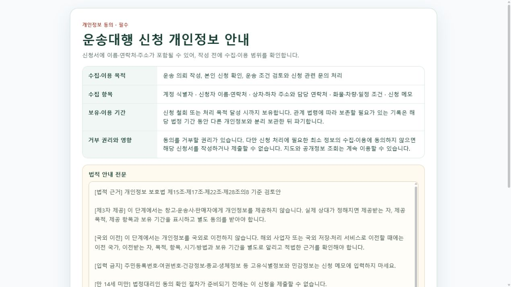

# 지도 마커 출발 신청 단독 페이지

## 변경 목적

지도 마커의 신청 메뉴에서 물류대행·운송대행·개별 주문 화면으로 이동한 경우에는 통합 앱의 상단 앱바, 좌측 역할 메뉴, 체험 운영 바를 제거하고 신청 내용에만 집중하는 단독 페이지로 표시한다.

## 적용 경계

- `source=community-map` 문맥과 허용된 신청 route가 모두 일치할 때만 단독 화면을 사용한다.
- 물류대행 신청과 후속 입고 상세, 운송대행 작성·단계별 입력, 개별 주문 신청 route를 허용한다.
- 일반 메뉴에서 같은 route를 직접 열거나 `source`가 다른 경우에는 기존 통합 메뉴와 역할 navigation을 유지한다.
- `/login`, `/community/home` 등 신청 이외 route에 `source=community-map`을 붙여도 메뉴를 숨기지 않는다.
- 개인정보 동의 전에는 기존 `지도로 돌아가기` 링크를 유지하며, 로그인은 원래 지도 신청 URL을 `returnUrl`로 사용한다.

## 화면 검증

- 단독 화면 URL: `http://127.0.0.1:5240/shipper/request?source=community-map&nodeTitle=연합뉴스&nodeKind=news-publisher&from=/community/home`
- DOM에 신청 개인정보 안내만 존재하고 `banner`, 역할 `navigation`, `Azure 상시 체험` 영역이 없음을 확인했다.
- 비교 URL `http://127.0.0.1:5240/shipper/request`에서는 상단 앱바, 좌측 역할 navigation과 체험 바가 그대로 표시됨을 확인했다.
- 로컬 fixture 렌더 검증이며 실제 신청 제출이나 운영 배포는 수행하지 않았다.

