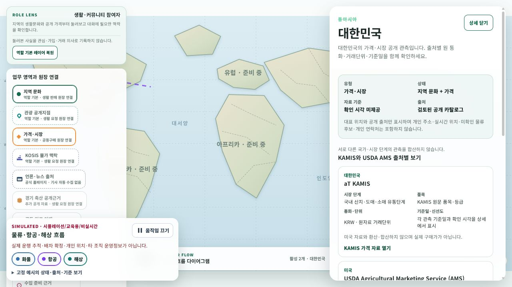

# 커뮤니티 지도 선택 stable deep link

- 날짜: 2026-08-04
- 화면: `/community/home`
- 범위: 국가·레이어·마커·관측 선택의 URL 저장과 복원

## 변경 내용

- 기존 `dataset` query 호환을 유지하면서 `country`, `layers`, `marker`, `observation` query 계약을 추가했습니다.
- 국가 코드는 현재 공개 지도 국가만 허용하고 대문자로 정규화합니다.
- 레이어는 지도 catalog 순서로 중복 없이 URL에 저장하며 아무 레이어도 선택하지 않은 상태는 `layers=none`으로 구분합니다.
- 마커와 관측 stable ID는 공백·제어문자·과도한 길이를 거부합니다.
- 관측 deep link를 server snapshot에 적용할 때 해당 관측의 국가와 source 레이어를 함께 복원합니다.
- snapshot에서 사라진 관측 ID는 선택과 URL에서 제거하고, 유효한 마커·국가·레이어 상태는 유지합니다.
- 지도 클릭, 키보드 선택, Google 지도 callback, 레이어 toggle, 전체 지도 복귀가 같은 URL 동기화 경로를 사용합니다.

URL의 지도 선택은 공개정보 조회 상태일 뿐 관심·참여·주문·계약·배차 또는 개인 위치 기록으로 사용하지 않습니다.

## 검증

- `CommunityWorldMapDeepLinkTests`와 지도 구성 test: 33개 통과
- scoped Fast: `Ssalddel.WebApp`, `Ssalddel.Tests` build와 관련 test 통과
- 직접 렌더 URL: `http://127.0.0.1:5238/community/home?country=KR&layers=regional-culture%2Cpublic-price&marker=fallback%3AKR`
- 대한민국 상세와 지역 문화·가격·시장 두 레이어가 URL에서 복원되는 것을 확인했습니다.
- 언론·뉴스 출처 레이어를 켜면 URL의 `layers`에 `news-publisher`가 추가되고 버튼이 선택 상태가 되는 것을 확인했습니다.
- 뒤로가기로 이전 URL과 두 레이어 선택이 복원됐고, 새로고침 뒤에도 대한민국 상세가 유지됐습니다.
- WebApp 내장 fallback으로 검증했으며 server observation deep link는 정규화·snapshot 적용 test와 build로 확인했습니다.
- 브라우저 console 오류는 없었습니다.

## 화면

