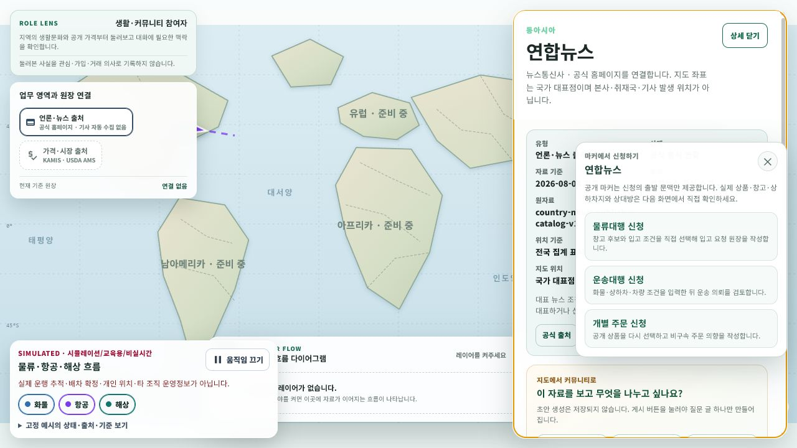

# 지도 마커 오른쪽 클릭 신청 메뉴

## 변경 목적

세계지도 마커에서 공개 정보를 확인한 다음 사용자가 별도의 신청 업무로 이동할 수 있도록 오른쪽 클릭 메뉴를 추가한다. 일반 클릭은 기존 상세 조회를 유지하고, 오른쪽 클릭 또는 macOS의 control-click은 신청 메뉴를 연다.

## 연결한 신청 업무

- 물류대행 신청: `/shipper/inbound/requests/new`
- 운송대행 신청: `/shipper/request`
- 개별 주문 신청: `/food/mart/order`

새 신청 시스템을 중복해서 만들지 않고 기존 입고 요청·운송 의뢰·비구속 마트 주문 화면을 재사용한다. 마커 stable ID, 표시명, 레이어와 국가를 제한된 query 문맥으로 전달하고 `/community/home` 복귀 경로를 유지한다.

## 안전 경계

- 공개 마커를 실제 공급자, 창고, 계약 상대, 상품 또는 상하차지로 확정하지 않는다.
- 물류대행 화면에서는 창고와 공급처를 사용자가 다시 선택한다.
- 운송대행 화면에서는 화물·상하차·차량 조건을 사용자가 직접 입력한다.
- 개별 주문 화면에서는 공개 상품을 다시 선택하고 비구속 주문 의향을 작성한다.
- 메뉴를 열거나 신청 화면으로 이동하는 것만으로 주문·계약·배차·결제·DB 원장이 생성되지 않는다.

지도에서 시작한 세 신청 화면에는 [개인정보 동의 관문](2026-08-04-map-application-privacy-consent.md)이 추가되었다. 수집·이용 필수 동의를 마치기 전에는 신청 양식을 열지 않으며, 제3자 제공과 국외 이전은 실제 상대와 조건이 정해진 뒤 별도 절차로 남긴다.

또한 [지도 마커 출발 신청 단독 페이지](2026-08-04-community-map-application-standalone-page.md)를 적용해 지도에서 들어온 경우에는 상단·좌측 업무 메뉴와 체험 바를 숨긴다. 같은 신청 route를 일반 메뉴에서 직접 열면 기존 통합 layout을 유지한다.

Google Maps Data 레이어는 deprecated된 `rightclick` 대신 `contextmenu` 이벤트를 사용한다. Google 지도 연결이 없는 경우에도 SVG 대체 지도의 마커 버튼에서 동일한 메뉴를 제공한다.

## 화면 검증

- 시작 URL: `http://localhost:5238/community/home`
- 연합뉴스 마커를 오른쪽 클릭해 세 신청 메뉴와 각 제한된 query URL을 확인했다.
- 물류대행과 운송대행 화면에서 `연합뉴스` 지도 출발 안내가 표시되는 것을 확인했다.
- 개별 주문 화면은 fixture에 상품 접근 API가 없어 오류 상태였지만, 오류보다 먼저 지도 출발 안내와 비구속 경계가 표시되는 것을 확인했다.
- 실제 신청 제출, 로그인, DB 저장, 배차, 계약, 결제는 수행하지 않았다.

