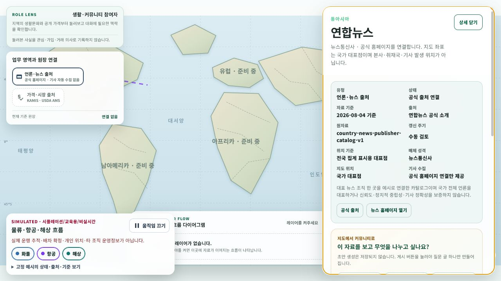

# 국가별 언론·뉴스 출처 마커

## 변경 목적

커뮤니티 세계지도에서 국가별 뉴스 맥락을 탐색할 수 있도록, 현재 주간 지도에 포함된 한국·미국·중국·호주에 대표 언론·뉴스 출처 마커를 추가한다. 마커는 언론사 본사나 취재 현장의 정확한 위치가 아니라 국가 단위 탐색을 위한 대표점이다.

## 구현 범위

- 한국: 연합뉴스 (`NewsAgency`)
- 미국: Associated Press (`NewsCooperative`)
- 중국: Xinhua News Agency (`StateNewsAgency`)
- 호주: ABC News Australia (`PublicServiceMedia`)
- `news-publisher` 전용 레이어, 신문 모양 마커, 역할별 추천 레이어 등록
- 언론사명, 매체 성격, 공식 소개, 공식 뉴스 홈페이지, 기준일, 데이터셋 key를 상세 패널에 표시
- 한 국가의 여러 언론사를 대표하거나 신뢰도·정치적 중립성·개별 기사 정확성을 보증하지 않는다는 경계 표시

각 항목의 좌표 정밀도는 `CountryRepresentative`이고 데이터셋 key는 `country-news-publisher-catalog-v1`이다. 국가 대표점은 본사·뉴스룸·기사 발생지·사용자 위치로 해석하지 않는다.

## RSS 파이프라인과의 경계

이번 마커는 언론사 공식 홈페이지로 이동할 수 있는 편집 맥락이다. 기존 공식뉴스 RSS 검토 후보는 정부기관 보도자료를 수집하는 별도 서버 파이프라인이며, 이번 마커에서 언론사 기사를 자동 수집하거나 커뮤니티 글로 자동 게시하지 않는다. 기사별 지도 카드와 사용자 선택형 글 초안 연결은 후속 범위다.

## 화면 검증

- 최종 URL: `http://localhost:5238/community/home`
- 로컬 fixture API로 `언론·뉴스 출처` 레이어를 선택하고 네 국가의 개별 마커를 확인했다.
- 연합뉴스 마커 선택 뒤 매체 성격, 국가 대표점, 공식 홈페이지 연결만 제공한다는 수집 경계, 공식 근거 URL을 확인했다.
- 데스크톱 화면에서 가로 overflow가 없음을 확인했다.
- 실제 외부 RSS 호출, 게시글 작성, DB 저장은 수행하지 않았다.

