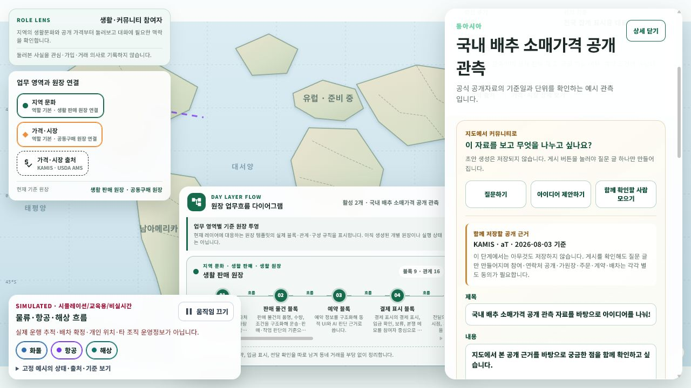

# 지도 공개 근거에서 커뮤니티 질문으로 이어지는 공통 Case 입구

- 날짜: 2026-08-04
- 범위: server contract, API, 게시글 영속성, migration, Web UI, test
- 화면: `/community/home` 지도 선택 상세의 출처 기반 커뮤니티 글 작성 패널

## 변경 내용

- 지도 observation stable ID와 dataset을 기준으로 저장 없는 질문 초안을 생성하는 API를 추가했다.
- 사용자가 출처 연결을 확인한 뒤에만 질문 게시글을 저장하는 별도 API를 추가했다.
- 질문 게시 직전에 server가 현재 지도 snapshot에서 observation을 다시 확인한다.
- 게시글에 observation stable ID, dataset code, snapshot revision과 공개 근거 JSON을 함께 저장한다.
- 게시글 재조회 응답에서도 같은 구조화된 공개 근거를 반환한다.
- 질문 게시글은 기존 `모집·함께하기` 참여 흐름을 사용하지만 게시 시점에는 가원장을 만들지 않는다.
- 가원장은 기존 정책대로 서로 다른 참여자 2명 이상과 작성자의 비구속성·알림·생성 확인 뒤에만 만들어진다.
- 지도 대체 화면의 국가 집계 마커는 개별 관측으로 가장하지 않고, 결과 카드의 `이 근거로 글 시작`에서 observation을 선택한다.
- 선택한 observation에서는 `질문하기`, `아이디어 제안하기`, `함께 확인할 사람 모으기` 중 목적을 고른다.
- 익명 사용자도 저장 없는 초안을 편집할 수 있지만 로그인·작성자명·글 비밀번호·출처 확인 전에는 게시할 수 없다.

## 화면

- 렌더 URL: `http://localhost:5238/community/home`
- 외부 공급자 호출과 DB 쓰기가 없는 로컬 fixture API로 화면만 검증했다.
- 공개 근거, 제목, 본문, 작성자명, 글 비밀번호, 출처 확인을 한 패널에서 검토한다.
- 390px viewport에서 문서 가로 overflow가 없음을 확인했다.

## API

- `POST /api/v1/community/world-map/observations/{observationStableId}/question-draft`
  - 공개 조회 가능
  - DB 변경 없음
  - 추천 제목·본문과 출처·기준시각·한계 반환
- `POST /api/v1/community/world-map/observations/{observationStableId}/questions`
  - 로그인 필요
  - `ConfirmSourceReference=true` 필요
  - 게시글만 저장하고 가원장·주문·계약·결제·배차는 생성하지 않음

## 영속성

`platform_community_posts`에 다음 nullable column과 조회 index를 추가했다.

- `SourceObservationStableId`
- `SourceDatasetCode`
- `SourceSnapshotRevision`
- `SourceEvidenceJson`
- `IX_platform_community_posts_source_observation`

기존 게시글은 모두 `null`을 유지하므로 직렬화와 조회 호환성을 보존한다.

## 검증

- 신규 질문 UseCase test 4개 통과
  - 초안 무저장
  - 출처 확인 없는 게시 거부
  - 확인 게시 후 observation·snapshot revision 영속과 재조회
  - 다른 dataset observation 게시 거부
- 게시글 생성, 참여·가원장 정책, UseCase port, migration model, API version metadata 회귀를 포함한 targeted test 102개 통과
- `eng/validate-changes.ps1 -Level Task -Paths <이번 변경 15개 파일>`: `Ssalddel.v3.5.slnx` build와 자동 선택 test 198개 통과
- `Ssalddel` build 성공, 경고 0개·오류 0개
- `Ssalddel.WebApp` build 성공, 경고 0개·오류 0개
- Web client 요청 test 2개 통과
  - 익명 초안 경로와 목적 전달
  - Bearer 인증 게시 경로와 출처 확인 전달
- 브라우저에서 국가 집계 마커 → 개별 공개 근거 → 아이디어 초안 편집을 확인했다.
- 전체 API 명명 분류 test에서는 이번 변경과 무관한 기존 `농수산정보Controller.Hs식품국가가격Card조회` 이름 규칙 실패 1건을 확인했다. 이번 slice에서는 해당 파일을 수정하지 않았다.

## 다음 slice

게시글 상세에서 구조화된 출처와 기존 참여·가원장 단계를 같은 Case 흐름으로 표시한다. 그 다음 게시글의 관심 역할 선택과 서로 다른 참여자 2명 조건을 가원장 생성 확인 화면까지 세로로 연결한다.
