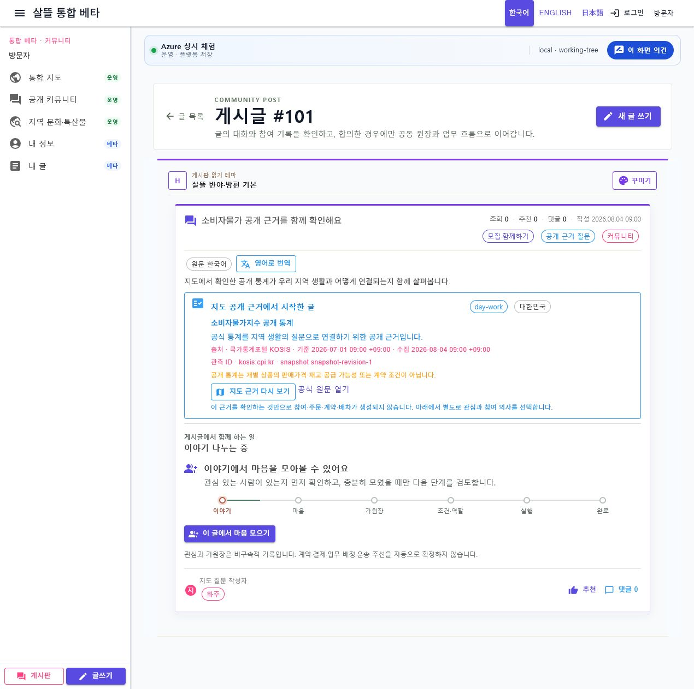
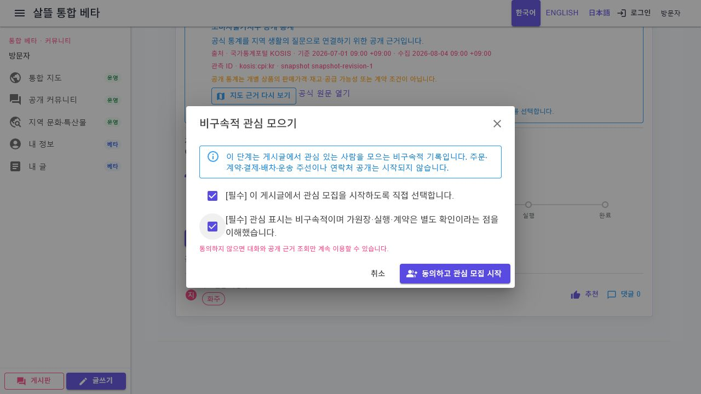

# 커뮤니티 게시글 상세 공개 근거 패널

## 변경 목적

지도 observation에서 시작한 질문 게시글의 상세 화면에서 사용자가 원래 공개 근거와 snapshot을 다시 확인한 뒤 기존 참여·가원장 흐름으로 내려가도록 Case 연결을 보강한다.

## 구현 범위

- 게시글 응답의 구조화된 `SourceEvidence`가 있을 때만 패널 표시
- dataset, 국가, 출처, 기준 시각, 수집 시각 표시
- observation stable ID와 snapshot revision 표시
- 지도 근거 상세와 공식 원문 link
- source boundary 안내 유지
- 근거 확인만으로 참여·주문·계약·배차가 생성되지 않는다는 경계 표시
- 기존 참여 패널보다 앞에 배치

별도 상태를 새로 만들지 않고 이미 게시글에 영속된 source evidence를 재사용한다. 다음 slice는 이 상세 흐름에서 명시적 참여 동의와 가원장 생성·재조회를 같은 Case로 검증하는 것이다.

## 참여 동의 연결

- 기존에는 공통 ViewModel이 `ConfirmExplicitStart`와 `ConfirmNonBindingParticipation`을 사용자 확인 없이 `true`로 채웠다.
- `이 글에서 마음 모으기`를 누르면 두 필수 확인이 기본 미선택인 대화상자를 먼저 연다.
- 명시적 시작 선택과 비구속성 확인을 모두 마쳐야 서버 요청 버튼이 활성화된다.
- 대화상자가 반환한 확인값을 그대로 서버 요청에 전달하며 client가 임의로 `true`로 바꾸지 않는다.
- 성공 뒤 참여 기회와 같은 게시글을 다시 조회한다.
- 연락처 공개, 가원장 생성, 주문·계약·배차는 이 동의에 포함하지 않는다.

## 검증

- 공통 상세 component 조립 test
- `Ssalddel.v0.0.slnx`와 Web 소비 화면 build
- `http://localhost:5238/community/posts/101?board=모집·함께하기&from=/community/home`에서 source evidence가 있는 게시글 상세을 실제 렌더링
- 공개 근거 패널 다음에 기존 `이 글에서 마음 모으기` 단계가 표시되고 browser error log가 비어 있음을 확인
- `이 글에서 마음 모으기`를 눌러 두 필수 확인이 기본 미선택이고 제출 버튼이 비활성임을 확인
- 한 항목만 선택했을 때 제출 버튼이 계속 비활성이고, 두 항목을 모두 선택했을 때만 활성화됨을 확인
- 화면 상태만 확인하고 실제 서버 제출은 실행하지 않아 주문·계약·외부 효과를 만들지 않음

브라우저 검증 중 WebAssembly 문화권 자료에서 `FR`을 찾지 못해 댓글 입력 component가 중단되는 기존 국가 카탈로그 초기화 오류를 발견했다. 공통 국가 목록은 런타임 문화권 자료가 부족해도 고정된 한국어·영문 이름으로 초기화하도록 보완했다.

