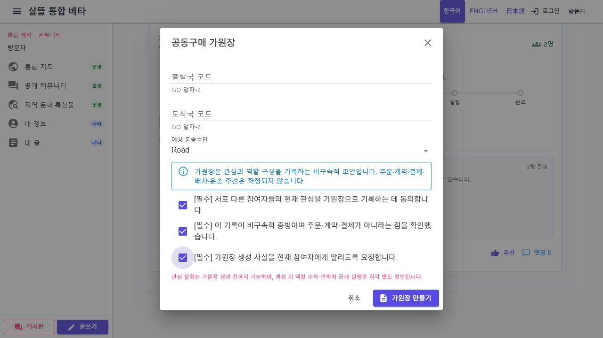

# 커뮤니티 관심 철회와 가원장 명시 동의

## 변경 목적

지도 공개 근거에서 시작한 게시글이 서로 다른 참여자의 비구속적 관심을 거쳐 가원장으로 이어질 때, 동일 사용자의 중복 집계와 사용자 확인 없는 승격을 막고 같은 게시글에서 결과를 다시 확인한다.

## 구현 범위

- 로그인 계정 ID를 참여자 기준으로 우선 사용해 브라우저 session key가 달라도 한 명으로 집계
- 한 사용자가 여러 역할을 선택해도 참여자 수는 한 명으로 유지
- 마지막 관심 역할을 해제하면 참여 자체를 철회하는 서버 Command 호출
- 철회된 참여는 활성 참여자 수에서 제외하고, 공개 응답에는 개인 식별자 없이 누적 철회 건수만 제공
- 서로 다른 활성 참여자 2명 미만이면 가원장 승격 거부
- 가원장 생성·비구속 증빙·참여자 알림을 각각 기본 미선택 필수 확인으로 변경
- 가원장 저장과 투표 연결은 기존 결정적 ledger ID와 멱등 재시도 경계를 재사용
- 성공 뒤 참여 기회와 같은 게시글을 다시 조회해 가원장 ID와 상태를 확인

가원장은 관심 snapshot을 기록하는 초안일 뿐 주문·계약·결제·배차·운송 주선이나 연락처 공개를 시작하지 않는다. 가원장 생성 뒤 역할 수락, 연락처 공개와 실행은 각각 별도 동의로 유지한다.

## 검증

- 동일 로그인 계정이 서로 다른 session key로 두 번 표시해도 참여자 1명으로 유지
- 철회 뒤 활성 참여자 0명, 철회 집계 1건이며 같은 철회를 재시도해도 중복 이력 없음
- 서로 다른 참여자 2명 이전 승격 거부
- 서로 다른 참여자 2명 뒤 가원장 한 번 저장, 재시도 시 기존 원장 재사용
- 승격 뒤 같은 게시글을 다시 조회해 동일 가원장 ID·생성 상태·참여자 수 확인
- 브라우저에서 세 필수 확인의 기본 미선택, 부분 선택 비활성, 전체 선택 활성 상태 확인
- 실제 가원장 생성 요청은 실행하지 않아 주문·계약·외부 효과 없음

