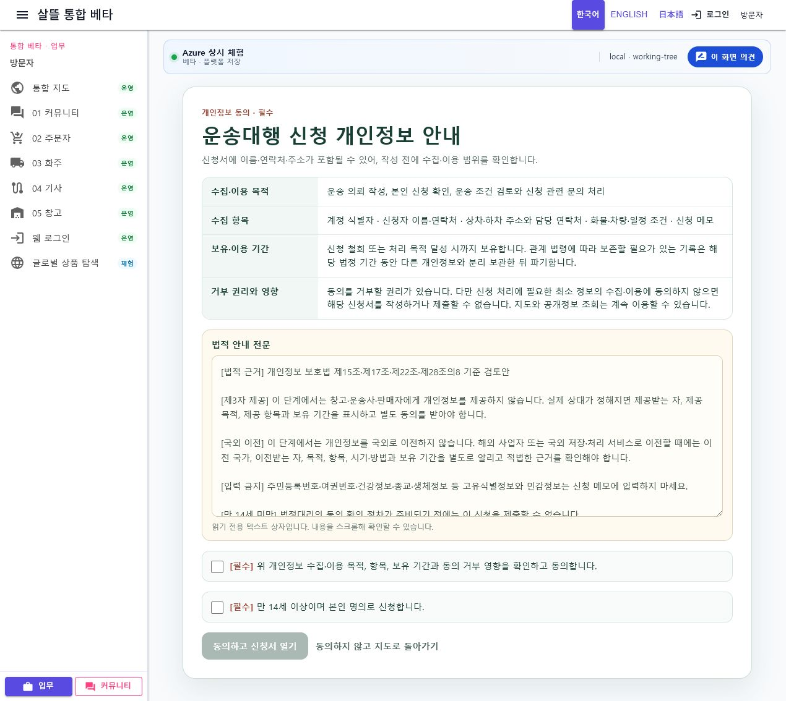
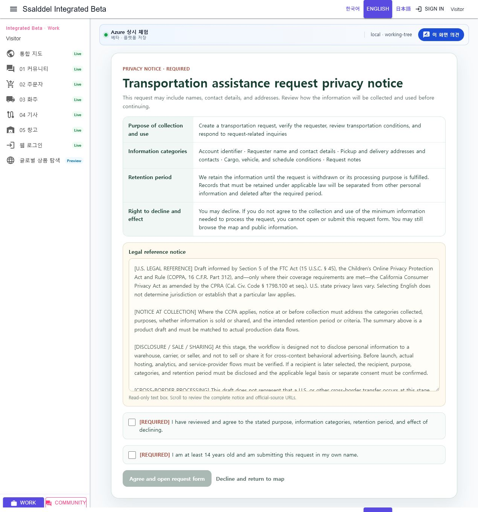
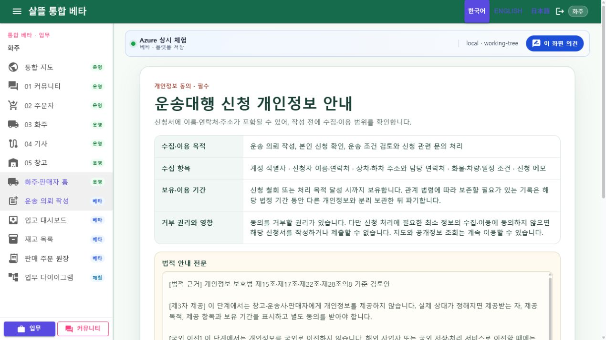

# 지도 출발 신청 개인정보 동의 관문

## 변경 목적

세계지도 마커에서 물류대행·운송대행·개별 주문 신청으로 이동할 때 이름, 연락처, 주소 등 개인정보 입력 전에 수집·이용 범위와 거부 권리를 확인하도록 공통 동의 관문을 추가한다.

## 구현 범위

- 물류대행, 운송대행, 개별 주문별 수집·이용 목적과 최소 항목
- 보유·이용 기간, 동의 거부 권리와 신청 제한 안내
- 제3자 제공, 국외 이전, 민감정보·고유식별정보 입력 금지와 운영 전 확인 문구를 한데 모은 스크롤 가능한 읽기 전용 법적 안내 텍스트 상자
- 만 14세 미만 법정대리인 동의 절차 미구현에 따른 제출 제한 안내
- 필수 체크박스 기본 미선택
- 수집·이용 확인과 연령·대리 권한 확인을 모두 마쳐야 신청 양식 공개
- 동의하지 않아도 `/community/home` 공개 지도 조회 가능
- 화면 언어가 English이면 목적·항목·기간·체크박스와 법적 안내 전문을 영문으로 표시
- 영문 법적 안내에는 FTC Act 제5조, COPPA, 적용 요건을 충족하는 경우의 California CCPA/CPRA를 공식 출처와 함께 참조하되, 표시 언어가 관할법 또는 적용 여부를 결정하지 않는다고 명시
- 로그인 계정 기준으로 동의 증적 ID, 업무·출처, 문안 버전, 목적·항목·보유기간, 문안 SHA-256, 동의 시각을 MongoDB 원장에 저장
- 같은 증적 ID의 사용자·업무·출처 재사용 방지와 철회 상태·시각 기록
- 지도 출발 물류대행·운송대행·개별 주문 Command에서 현재 버전의 활성 증적을 서버가 다시 검증하고, 누락·불일치·철회 증적이면 신청 저장 거부
- 지도 이외의 기존 신청 경로에는 새 증적을 강제하지 않음

안내 버전은 `application-privacy-consent-draft-2026-08-04`다. `draft`는 현재 문구가 운영 개인정보 처리방침과 실제 제공자 목록을 확정한 법률 문서가 아니라는 뜻이다.

## 법적 설계 근거

- [개인정보 보호법 제15조·제17조](https://www.law.go.kr/lsLinkCommonInfo.do?lsJoLnkSeq=1029334879): 동의에 근거한 수집·이용과 제3자 제공에는 목적, 항목, 보유·이용 기간과 거부 권리·불이익 등 법정 고지사항이 필요하다.
- [개인정보 보호법 제22조](https://www.law.go.kr/lsLinkCommonInfo.do?lsJoLnkSeq=1006184067)와 [시행령 제17조](https://www.law.go.kr/lsLinkCommonInfo.do?lsJoLnkSeq=1013462603): 동의 사항을 구분하고 구체적·명확하며 쉽게 이해할 수 있게 표시해야 한다.
- [개인정보 보호법 제28조의8](https://www.law.go.kr/lsLinkCommonInfo.do?chrClsCd=010202&lsJoLnkSeq=1029334953): 국외 이전은 이전받는 자, 국가, 목적, 항목, 시기·방법과 보유 기간 등 실제 이전 조건을 기준으로 적법 근거를 확인해야 한다.

영문판은 다음 미국 공식 자료를 참고한다. 미국은 주별 개인정보법과 업종별 법률의 적용 범위가 다르므로 영어 표시 자체를 미국법 적용 판정으로 사용하지 않는다.

- [FTC Privacy and Security](https://www.ftc.gov/business-guidance/privacy-security): 개인정보 약속과 실제 처리의 일치, 합리적인 보안, FTC Act 제5조의 불공정·기만행위 기준
- [FTC COPPA FAQ](https://www.ftc.gov/business-guidance/resources/complying-coppa-frequently-asked-questions): 적용되는 온라인 서비스가 13세 미만 아동의 개인정보를 수집하기 전 부모 고지와 검증 가능한 동의를 확보하는 기준
- [California Civil Code §1798.100](https://leginfo.legislature.ca.gov/faces/codes_displaySection.xhtml?lawCode=CIV&sectionNum=1798.100.): 적용 사업자의 수집 시점 항목·목적·판매 또는 공유 여부·보유 기간 고지와 필요·비례성 기준
- [California Attorney General CCPA 안내](https://oag.ca.gov/privacy/ccpa): 적용 사업자의 소비자 알 권리·삭제·정정·판매/공유 거부와 민감정보 제한 권리 개요

신청 시작 시점에는 실제 창고·운송사·판매자나 해외 이전 대상이 정해지지 않는다. 따라서 이 화면에서는 플랫폼 내부의 신청 처리용 수집·이용만 동의받고, 제3자 제공과 국외 이전은 실제 상대와 조건이 정해진 뒤 별도 관문으로 남긴다.

## 이번에 완결한 서버 범위

- 서버 원장에 동의 버전·동의 시각·업무 범위·계정 주체·문안 hash 저장
- 물류대행·운송대행·개별 주문 생성 경계에서 지도 출발 동의 증적 검증
- 사용자별 증적 조회와 철회 API, 철회 뒤 신청 재사용 차단
- 두 필수 확인의 기본 미선택과 서버 기록 성공 전 신청서 비공개

## 아직 완결되지 않은 운영 범위

- 업무별 실제 보유 기간을 집행하는 자동·수동 파기
- 위탁업체와 제3자 제공받는 자의 운영 목록
- 해외 서비스 사용 시 국외 이전 국가·수탁자·보호조치 확정
- 만 14세 미만 법정대리인 확인 workflow

따라서 이번 변경은 지도 출발 신청의 수집·이용 동의 증적과 Command Gate를 닫지만, 보유기간 집행·제3자 제공·국외 이전·아동 절차까지 포함한 법률 준수 또는 운영 준비 완료를 의미하지 않는다.

## 화면 검증

- URL: `http://127.0.0.1:5240/shipper/request?source=community-map&nodeTitle=연합뉴스&nodeKind=news-publisher&from=/community/home`
- 초기 필수 체크박스 두 개가 모두 미선택이고 계속 버튼이 비활성임을 확인했다.
- 법적 근거, 제3자 제공, 국외 이전, 입력 금지, 연령 제한, 안내 버전과 운영 전 확인 문구가 읽기 전용 텍스트 상자 안에 표시되는 것을 확인했다.
- English 선택 시 영문 목적·항목·기간·필수 확인과 미국 법률 참조문이 같은 관문에 표시되는 것을 확인한다.
- 한 항목만 선택하면 계속 비활성, 두 항목을 선택하면 활성화됨을 확인했다.
- 비로그인 상태에서는 로그인 후 같은 URL로 돌아오는 링크가 표시되고, 로그인 뒤에도 두 필수 확인은 다시 기본 미선택 상태임을 확인했다.
- 두 항목을 선택하고 계속 버튼을 누르면 브라우저 fixture의 동의 증적 API가 `201 Created`를 반환한 뒤에만 동의 관문이 닫히고, 연합뉴스 지도 출발 안내와 운송 신청서가 표시되는 것을 확인했다.
- 이 runtime 확인은 로컬 `SIMULATED` fixture 응답이며 실제 MongoDB 운영 저장, 개인정보 입력, 신청 제출과 외부 제공은 수행하지 않았다. 실제 저장·철회·Command Gate는 자동 test로 검증했다.

