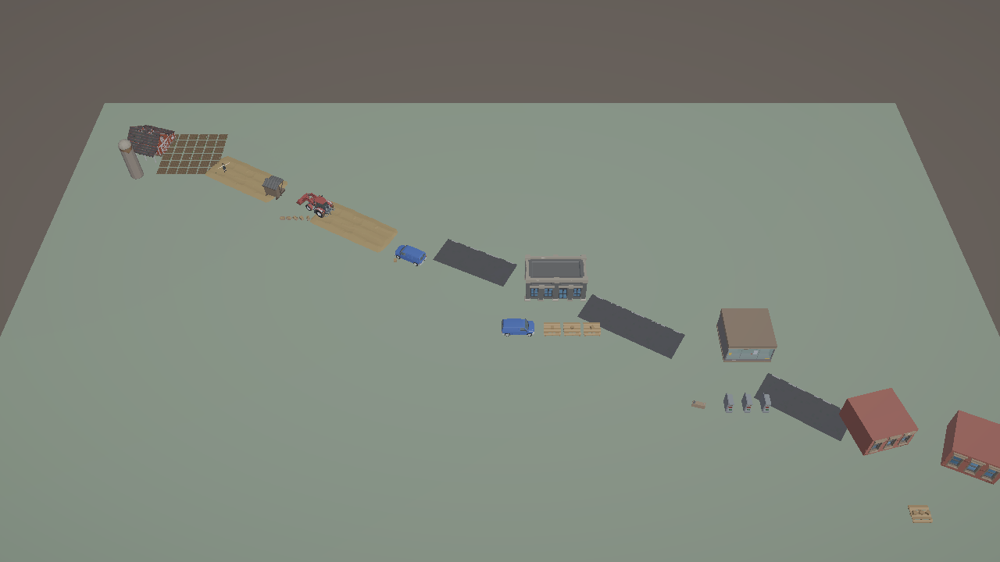
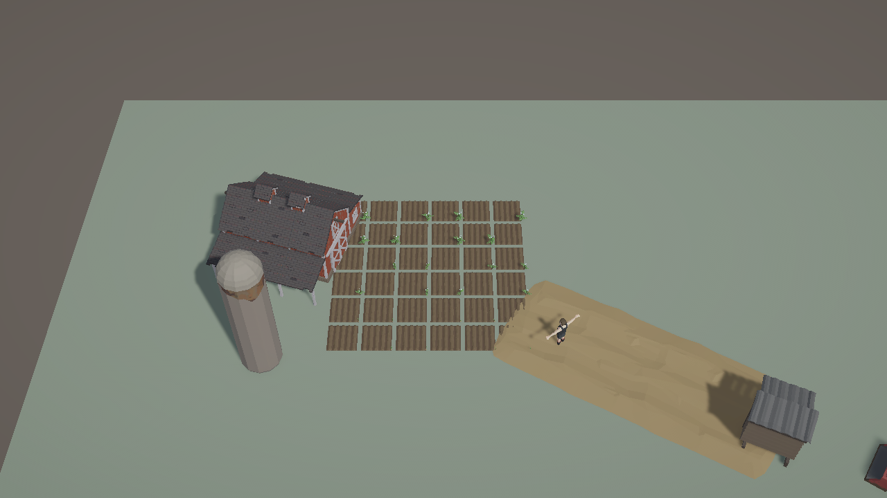
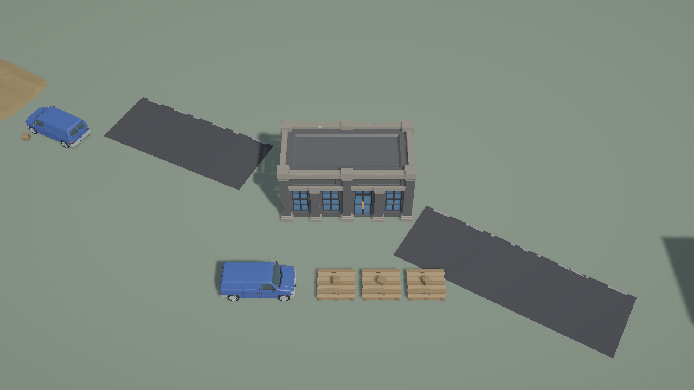
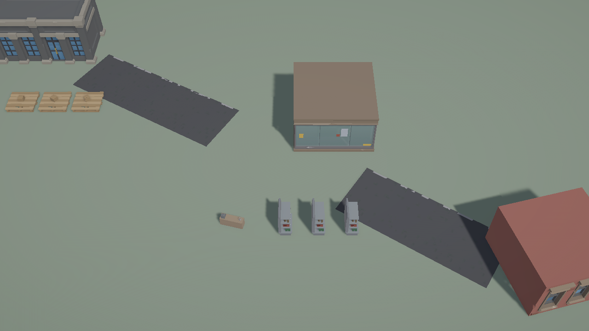

# Unity City·Farm Synty Presentation Catalog

## 결과

제품 Unity 프로젝트 `C:\Users\user\ssalddel`에 WORLD-1 primitive Scene을 보존한 별도 `Assets/Ssalddel/Experiments - 연구/CityFarmWorld/농장도시신티월드시제품.unity` Scene을 저장했다. Farm·Urban·Transition `WorldVisualCatalog` asset이 vendor-neutral VisualKey 21개를 실제 Synty prefab reference와 position·rotation·scale 보정으로 해석한다.

Scene hierarchy는 `공급망WorldZoneView → VisualRoot → WorldVisualInstanceView → VisualRoot → Synty prefab instance` 경계를 유지한다. Synty prefab 이름은 Data·Simulation·Operational contract나 stable ID로 사용하지 않는다.

## 대표 Game View

### World Overview

### Farm Production

### Urban Logistics

### Urban Market

## Asset·URP 경계

- Farm: Dirt Row, Potato S/M/L, Potato Box, Farmer, Barn, Silo, Produce Stand, Tractor
- Urban: Station 03, Shop 05, Apartment 01, Van 01, Pallet 01, Cardboard Box 01, Shelf 01, Desk 01
- Transition: Farm dirt road, City road
- 원본 vendor prefab/material은 수정하지 않음
- 기존 `PC_RPAsset`, `Mobile_RPAsset`, PC/Mobile Renderer와 SSAO 설정은 수정하지 않음
- 별도 Global Volume profile에 Color Adjustments, Neutral Tonemapping, 낮은 Bloom만 구성

## 검증

- Catalog·저장 Scene 집중 EditMode: 3/3 통과
- 전체 Unity EditMode: 36/36 통과
- 저장 Scene: active, dirty false
- 최종 recompile: up-to-date, Console error 0
- 기본 수량: MeshRenderer 142, Animator 1, ParticleSystem 0

Pipeline Test Runner가 결과 완료 후 상태 파일 sharing violation과 중복 callback 예외를 남겼으나 36개 test 결과는 모두 통과했다. 이후 Console을 비우고 재컴파일해 제품 코드와 저장 Scene 기준 Error 0을 다시 확인했다.

## 의도적 제외와 다음 Gate

이번 단계의 감자 S/M/L 배치는 품질 비교용 Presentation fixture이며 실제 CropStage 권위가 아니다. Cargo lineage runtime, NPC 업무 animation, Android 성능 최적화도 아직 연결하지 않았다.

WORLD-3에서는 기존 Farm tile, Logistics facility, Market surface/Card, Residential pickup View를 이 wrapper에 연결한다. Synty child를 WORLD-1 primitive fallback으로 교체해도 stable ID·선택·Presentation wiring이 유지되어야 한다.
