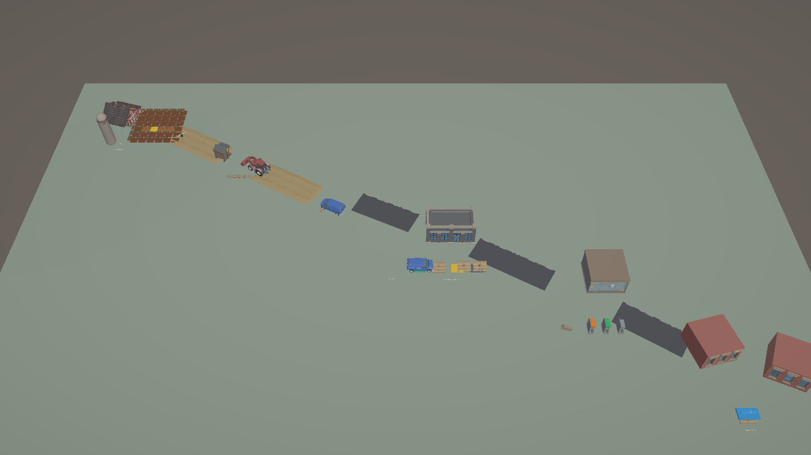
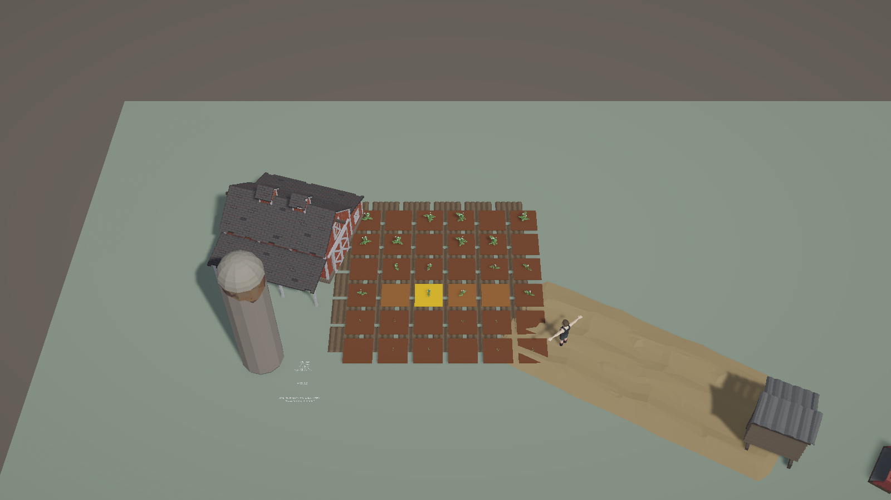
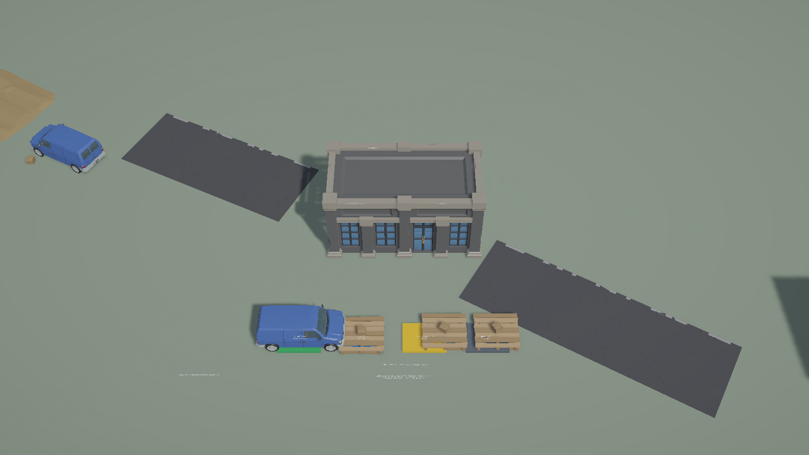
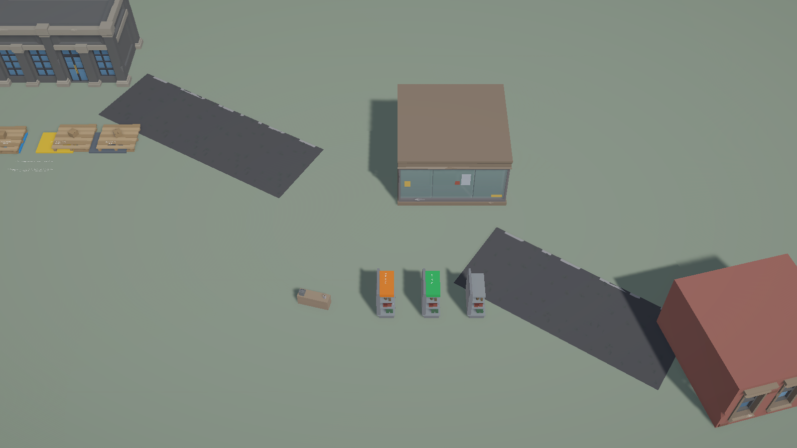

# Unity City·Farm 기존 업무 View 통합

## 결과

제품 Unity 프로젝트 `C:\Users\user\ssalddel`에 WORLD-2 Scene을 보존한 별도 `Assets/Ssalddel/Experiments - 연구/CityFarmWorld/농장도시업무화면통합.unity` Scene을 저장했다.

새 Domain·Simulation View를 만들지 않고 다음 기존 구현을 재사용했다.

- Farm `FarmSoilTileGridView`와 36개 `FarmSoilTileCellView`
- Logistics `LogisticsFacilityOverviewView`와 4개 handoff area
- Urban Market `도심마트ManagerShelfView`, `ConceptCardDeckView`와 7개 `ConceptCardView`
- 패키지 공식 Sample의 `ResidentialPickupView`와 `ResidentialPickupPointView`

`WorldPresentationFallbackView`는 `WorldVisualInstanceView.VisualRoot`와 primitive child만 전환한다. 업무 View, stable ID, 선택 callback과 PresentationModel은 교체 대상 밖에 남는다.

## 대표 Game View

### World Overview

### Farm Production

### Urban Logistics

### Urban Market

## Architecture Boundary

- Farm은 `FarmPotatoSoilTileSimulationFixture → Projector → Grid/Cell View`의 명시적 Simulation 표시만 사용한다.
- Logistics cargo는 기존 handoff Projection의 cargo·transport task·inbound task stable ID를 그대로 표시한다.
- Market shelf와 Card 선택은 `WorldSelectionEvidenceView`의 Presentation 선택만 바꾸며 수량·업무 상태를 재계산하지 않는다.
- Residential pickup은 서버 승인 관점과 같은 Snapshot/Applicator 경계를 사용하며 Operational 실패를 fixture로 대체하는 client나 `LifetimeScope`를 Scene에 두지 않는다.
- Market/Residential 상태 색은 `MaterialPropertyBlock`으로 적용하며 Synty 원본 prefab·material은 수정하지 않는다.
- NPC 도착, Animator, FX, Camera focus는 Command나 Simulation Tick을 발생시키지 않는다.

## 검증

- WORLD-3 집중 EditMode: 5/5 통과
- 전체 Unity EditMode: 41/41 통과
- 저장 Scene: active, dirty false
- 최종 recompile: 성공, Console error 0
- 기본 수량: active MeshRenderer 200, Animator 1, ParticleSystem 0, fallback socket 41

Game View 문자는 현재 3D `TextMesh` evidence라 작은 크기에서는 제한적으로 읽힌다. 정식 Card/UI occlusion과 draw-call·메모리 측정은 WORLD-5 품질 Gate에서 진행한다.

## 의도적 제외와 다음 Gate

이번 단계는 cargo stable ID를 Zone별로 보여 주었지만 Farm Yard→차량→물류센터→마트 전체 lineage reconcile은 아직 구현하지 않았다. Simulation Tick, Operational Command, 모든 NPC animation, Android quality tier도 추가하지 않았다.

WORLD-4에서는 같은 감자 cargo stable ID·lineage를 네 구간의 anchor와 Zone별 VisualKey에 연결한다. 차량이나 NPC 도착은 상태 완료 권위를 갖지 않는다.
