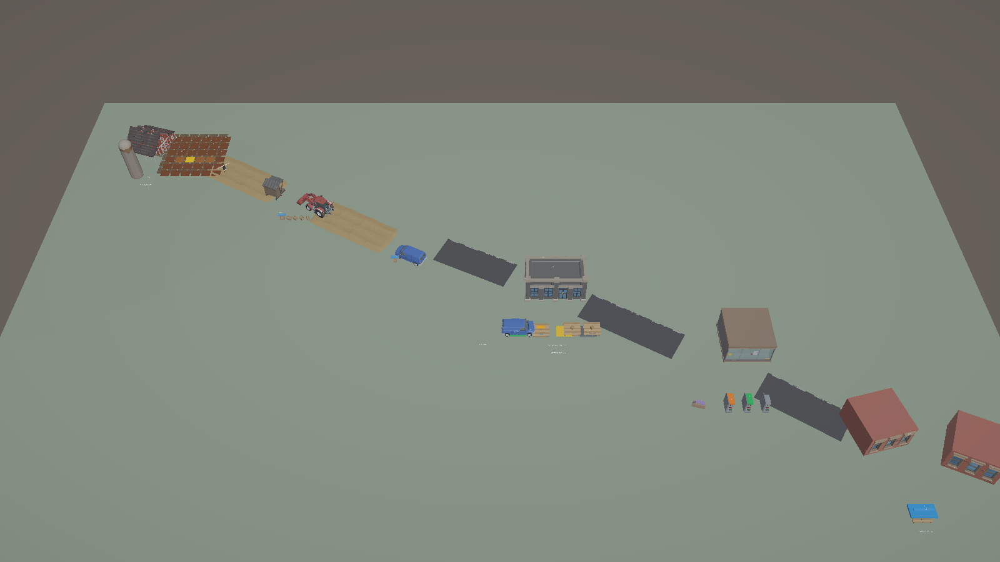
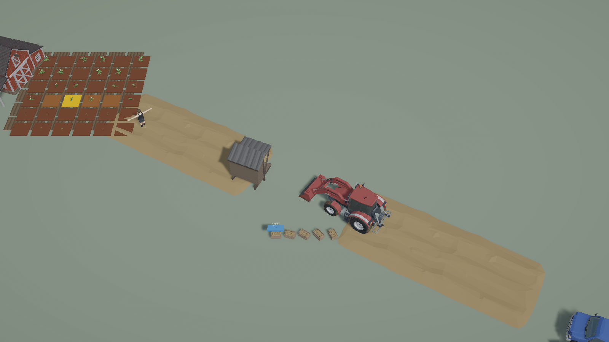
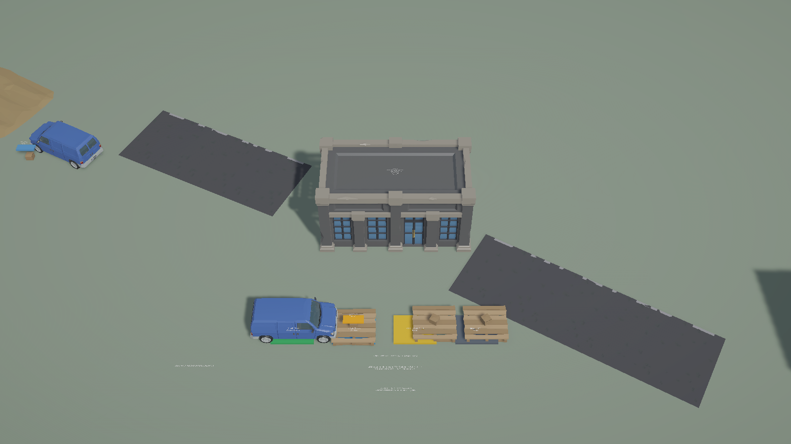
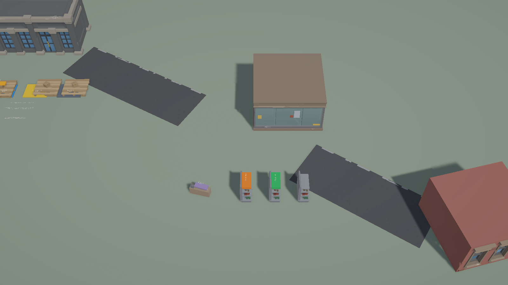

# Unity City·Farm Cargo Journey

## 결과

제품 Unity 프로젝트 `C:\Users\user\ssalddel`에 WORLD-3 Scene을 보존한 별도 `Assets/Ssalddel/Experiments - 연구/CityFarmWorld/농장도시화물이동.unity` Scene을 저장했다.

기존 `CargoWarehouseHandoffSnapshot`을 새 Presentation projector가 해석하며, 네 공간의 외형은 달라도 모두 같은 `cargo:transport-71`을 참조한다.

```text
Farm Yard potato box       Previous
  → Transport cargo box    Previous
  → Logistics pallet       Current
  → Market backroom box    Planned
```

현재 fixture는 `ArrivedAtWarehouse`까지만 증명한다. 따라서 Market box는 downstream 계획을 보여 줄 뿐 도착·입고 완료 사실로 표현하지 않는다.

## 대표 Game View

### World Overview



### Farm Yard



### Urban Logistics



### Urban Market



## Identity와 Architecture Boundary

- World identity: `cargo:transport-71`
- origin source: `farm-handoff:sim.potato.1` — Operational 사실이 아닌 명시적 Simulation Presentation fixture
- product source: `product:potato`
- handoff source: `cargo-handoff:transport-71.inbound-91`
- task source: `transport-task:71`, `inbound-task:91`
- 네 anchor의 prefab 선택은 `FarmVisualKey`/`UrbanVisualKey`에서만 처리하며 vendor filename은 Data·Simulation 계약에 들어가지 않는다.
- 낮은 revision은 무시하고 기존 cargo와 다른 identity의 적용은 거부한다.
- primitive fallback은 Synty child만 교체하며 cargo ID·lineage·Presentation View를 유지한다.
- Scene의 WORLD-4 root에는 `LifetimeScope`와 Simulation Controller가 없다. Camera·NPC·Animation·FX는 Command나 Tick을 확정하지 않는다.
- 기존 PC/Mobile URP Asset·Renderer, vendor prefab/material, Build Settings는 수정하지 않았다.

## 검증과 기본 측정

- core cargo journey 계약: 4/4 통과
- WORLD-4 집중 Unity EditMode: 6/6 통과
- 전체 Unity EditMode: 47/47 통과
- 저장 Scene 재로드 뒤 anchor: 4
- source lineage: 6
- active MeshRenderer: 211
- active Animator: 1
- active ParticleSystem: 0
- fallback socket: 44
- Editor 순간 render 통계: draw call 59, set pass 14, triangle 15,162, vertex 28,000
- 최종 Scene: active, dirty false
- Console error: 0

frame timing과 memory 값은 Editor·Pipeline·캡처가 함께 실행된 순간값이라 제품 FPS 또는 Player 메모리 목표로 해석하지 않는다. PC target과 Android quality tier 판단은 WORLD-5에서 Player/프로파일링 환경을 명시해 다시 기록한다.

## 의도적 제외와 다음 Gate

Market 입고 완료, 마트 후방재고 변경, NPC/차량 도착 Command, Animation/FX 완료 권위는 추가하지 않았다. 계절·낮밤·대규모 날씨·streaming·추가 interior도 범위 밖이다.

다음 WORLD-5에서 조명·가림·문자 가독성·cargo 흐름의 대표 화면을 최종 정리하고 shader/prefab reference·Console·PC/Android 성능 후보를 기록한다. WORLD-5 뒤에는 Visual 장식을 중단하고 FARM-2 밭갈이 폐루프로 복귀한다.
