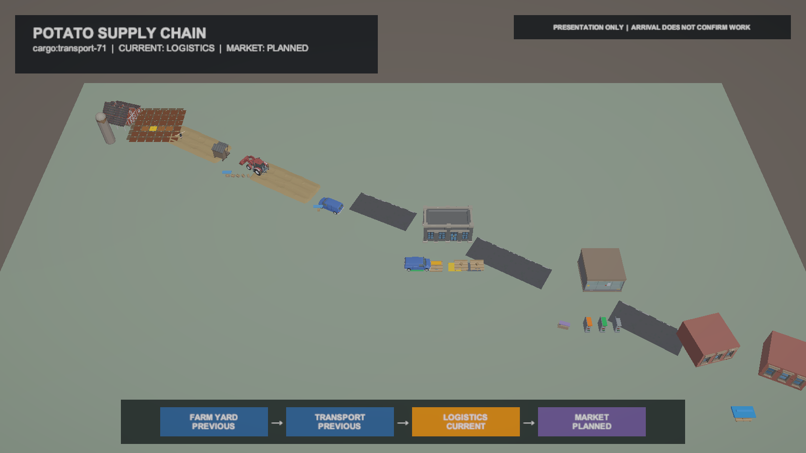
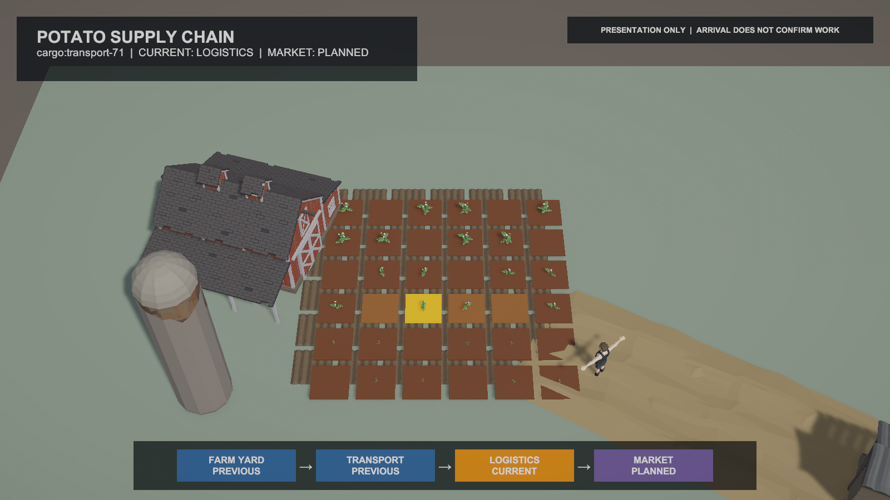
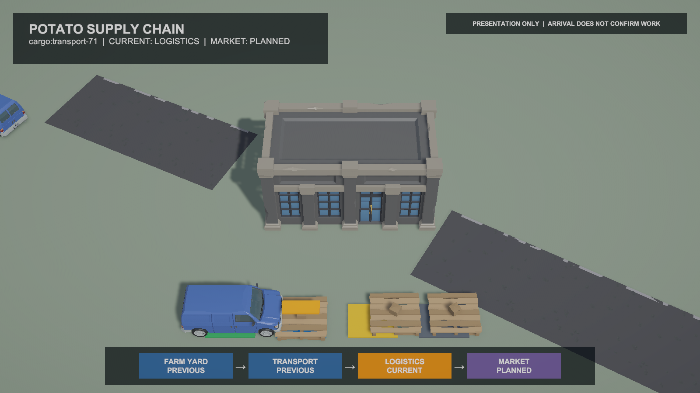
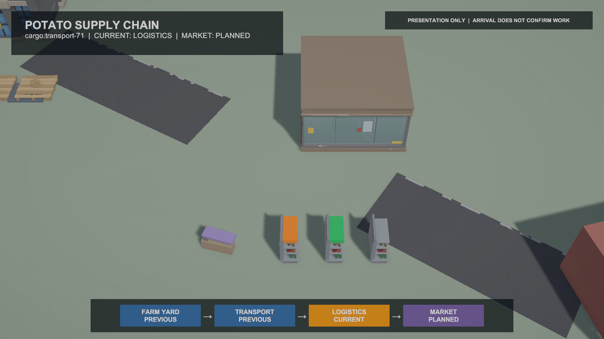

# Unity City·Farm WORLD-5 품질·성능 Gate

## 결과

제품 Unity 프로젝트 `C:\Users\user\ssalddel`에 WORLD-4 Scene을 보존한 별도 `Assets/Ssalddel/Experiments - 연구/CityFarmWorld/농장도시시각품질검증.unity` Scene을 저장했다.

이번 단계는 콘텐츠를 추가하는 단계가 아니라 최종 Visual Prototype의 읽기 규칙과 증거를 닫는 Gate다.

- World Overview는 기존 공급망 전체 구도를 유지한다.
- Zone focus distance는 34와 26의 Game View를 비교한 뒤 업무 Object가 더 명확한 26을 선택했다.
- 작게 깨져 보이던 3D `TextMesh` evidence는 품질 Gate Scene에서 숨겼다.
- 기존 `CargoJourneyView`를 읽는 camera-space Presentation HUD로 같은 cargo와 네 단계 상태를 표시한다.
- HUD는 `LOGISTICS CURRENT`, `MARKET PLANNED`와 `ARRIVAL DOES NOT CONFIRM WORK` 경계를 항상 표시한다.
- 원본 Synty prefab/material과 기존 PC/Mobile URP Asset·Renderer는 수정하지 않았다.

## 대표 Game View

### World Overview



### Farm



### Urban Logistics



### Urban Market



## Reference와 Architecture Gate

- `WorldVisualInstanceView`: 106개, catalog/prefab wiring 전부 유효
- vendor prefab source 연결: 누락 0
- null material·null shader·`Hidden/InternalErrorShader`: 0
- missing MonoBehaviour script: 0
- Console error: 0
- Cargo anchor: 4개, 동일 `cargo:transport-71`
- HUD는 기존 Presentation 상태만 읽으며 Command·Simulation Tick·Operational fallback을 실행하지 않는다.
- WORLD-5 root에 Season·Weather·Streaming·`LifetimeScope`·Simulation Controller를 추가하지 않았다.

## PC 기본 측정

현재 Editor는 `PC` quality와 `PC_RPAsset`을 사용했다.

| 항목 | 측정 또는 설정 |
| --- | --- |
| active MeshRenderer | 191 |
| active Animator | 1 |
| active ParticleSystem | 0 |
| fallback socket | 44 |
| Camera far clip | 300 |
| Draw call | 59 |
| SetPass | 14 |
| Triangle | 15,162 |
| Vertex | 28,000 |
| focus별 CPU frame 순간값 | 0.71~6.32ms |
| GPU timing | 0, 수집되지 않음 |

CPU·메모리 값은 Unity Editor, Pipeline server와 캡처가 함께 실행된 순간값이다. Player FPS나 배포 메모리 목표로 해석하지 않는다.

## PC와 Android 후보 분리

기존 설정을 읽기 전용으로 비교했다.

| 항목 | PC | Mobile/Android 후보 |
| --- | --- | --- |
| Render scale | 1.0 | 0.8 |
| Main shadow distance | 50 | 50 |
| Main shadow resolution | 2048 | 1024 |
| Shadow cascade | 4 | 1 |
| Soft shadow quality | High | Medium |
| Depth/Opaque texture | 둘 다 사용 | 둘 다 미사용 |
| Renderer Feature | SSAO 1개 | 없음 |

Mobile tier가 이미 분리되어 있으므로 이번 Gate에서 새 Quality mode를 만들거나 값을 추측해 더 낮추지 않았다. Android Player profiling 뒤 shadow distance, FX, Animator, far Zone detail, interior와 draw range를 순서대로 검토한다. Domain·Simulation·stable ID·VisualKey는 Quality tier와 무관하게 유지한다.

## 검증

- WORLD-5 집중 EditMode: 5/5 통과
- 전체 Unity EditMode: 52/52 통과
- 저장 Scene: active, dirty false
- 최종 recompile: 성공
- Console error: 0
- 대표 PNG: 1600×900 4종

## Visual 강제 중단과 FARM-2 진입점

WORLD-5 완료로 계절·낮밤·대규모 날씨·streaming·추가 interior·모든 NPC animation·모든 차량 구현·추가 Zone 작업을 시작하지 않는다.

다음 작업은 FARM-2다.

```text
Tile 선택
  → Tilling Preview
  → 명시적 Confirm
  → Simulation Tick
  → 새 Snapshot
  → Presentation Reconcile
  → Dirt → Dirt Row
```

NPC 도착, 쟁기 animation 종료와 FX 종료는 이 폐루프의 상태 확정 권위를 갖지 않는다.
