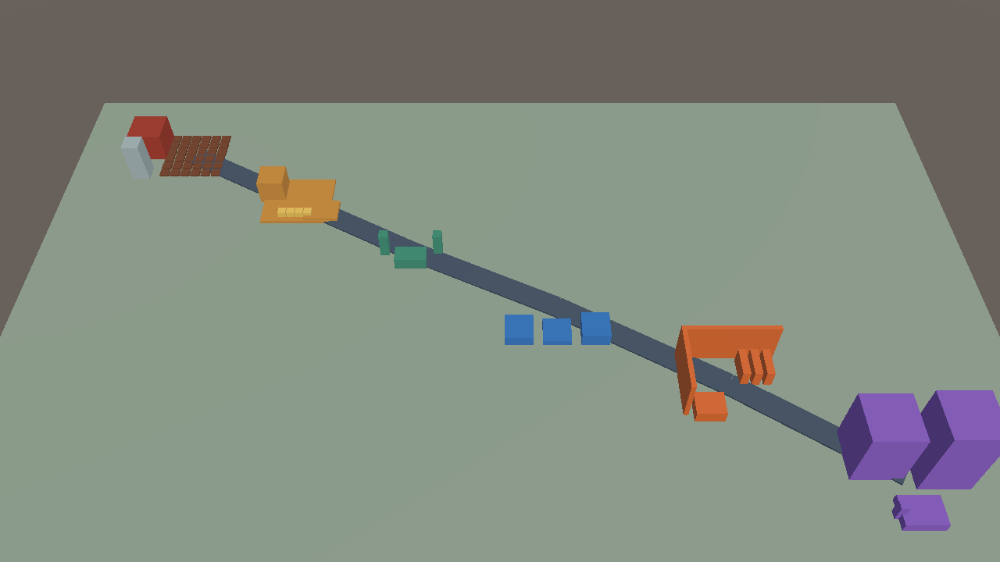
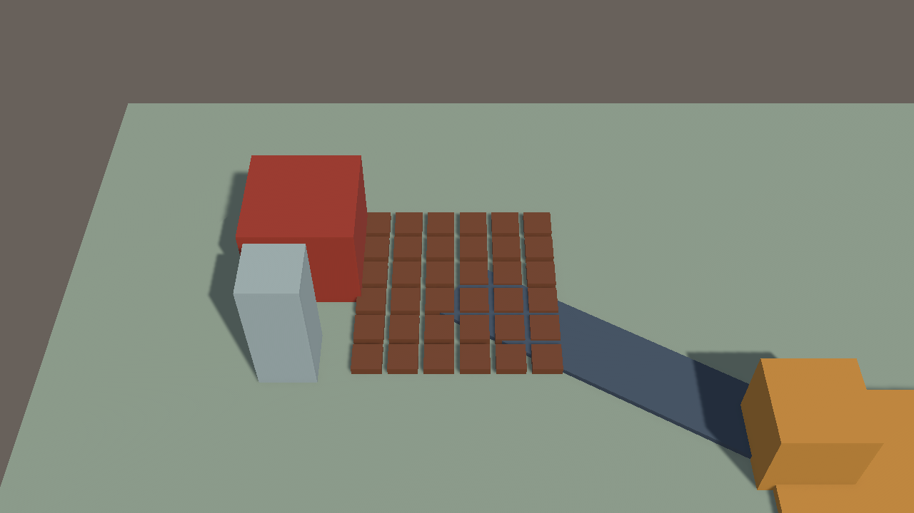
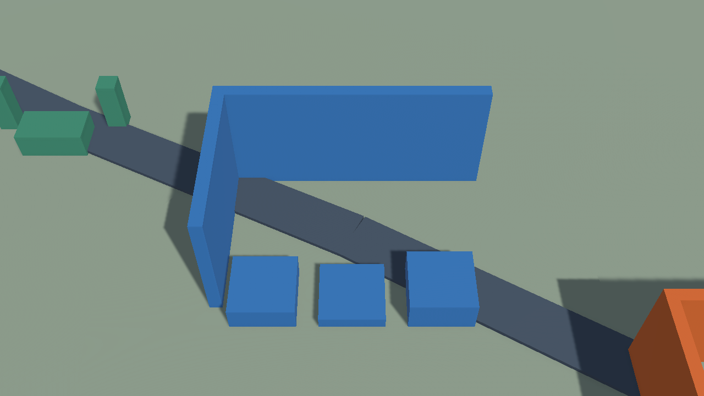

# Unity City·Farm 공급망 Macro World Blockout

## 결과

제품 Unity 프로젝트 `C:\Users\user\ssalddel`에 기존 Scene을 덮어쓰지 않는 별도 `Assets/Ssalddel/Experiments/CityFarmWorld/CityFarmMacroWorldBlockout.unity` Scene을 저장했다. Text 없이 Farm Production→Farm Yard→Transport Corridor→Urban Logistics→Urban Market→Residential Community 흐름이 읽히도록 6개 Presentation Zone과 5개 연결 route를 배치했다.

Farm Production과 Farm Yard는 기존 canonical `farm` Zone을 공유하되 Presentation subzone과 focus anchor만 나눈다. 카메라 focus, route, NPC·차량 placeholder는 Presentation이며 Simulation Tick이나 Operational Command를 발생시키지 않는다.

## 대표 Game View

### World Overview

### Farm Production

### Urban Logistics

### Urban Market

## 구현 경계

- 재사용: `WorldZoneCodes`, WORLD-0 `DioramaTopDownCameraRig`, foreground occlusion, 기존 Farm 6×6와 물류·마트 공간 의미
- 추가: asset-neutral 공급망 layout definition, Zone/Route View, 저장 Scene builder, 전용 blockout material, 저장 Scene 회귀 test
- 보존: Synty 원본 prefab/material, 기존 제품 Scene, URP Asset·Renderer, Build Settings, Simulation·Operational contract
- 의도적 제외: 실제 Synty prefab 선택, interior 장식, NPC animation, Cargo lineage runtime, Android 최적화

Unity `MonoBehaviour`의 저장 reference를 안정화하기 위해 `공급망WorldZoneView`와 `공급망WorldRouteView`는 타입명과 일치하는 개별 파일로 분리했다. Scene reload test가 6개 Zone·5개 route·camera reference를 다시 읽는다.

## 검증

- 공급망 layout·Scene 집중 EditMode: 4/4 통과
- 전체 Unity EditMode: 33/33 통과
- 최종 Scene: active, dirty false
- 최종 recompile: up-to-date, Console error 0
- 기본 수량: MeshRenderer 69, Animator 0, ParticleSystem 0

Test Runner 비동기 완료 callback에서 Pipeline package 내부 `TaskCompletionSource.SetResult` 예외가 별도로 발생했으나 33개 test 결과는 모두 통과했다. 이후 Console을 비우고 재컴파일해 제품 코드 기준 Error 0을 다시 확인했다.

## 다음 Gate

WORLD-2에서 실제 inventory allowlist를 사용해 Farm/Urban/Transition VisualKey와 catalog, wrapper scale·pivot, 공통 lighting·Volume·Renderer 영향을 비교한다. WORLD-1 primitive는 외형 교체 전후에도 route·focus·stable wiring이 유지되는지 확인하는 기준선으로 남긴다.
