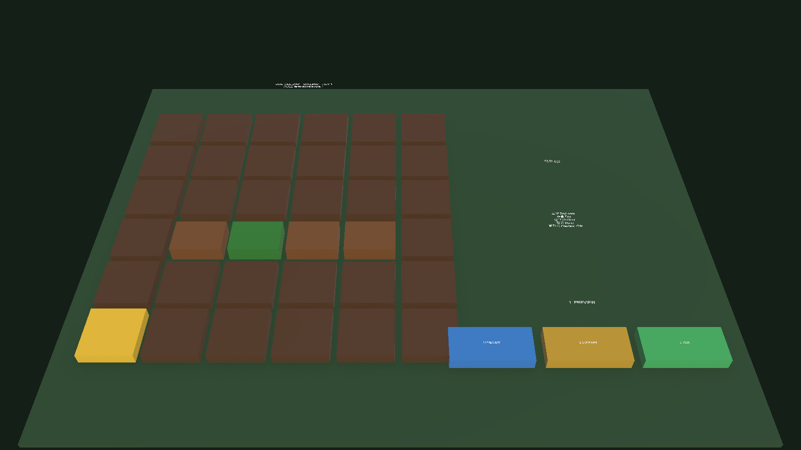
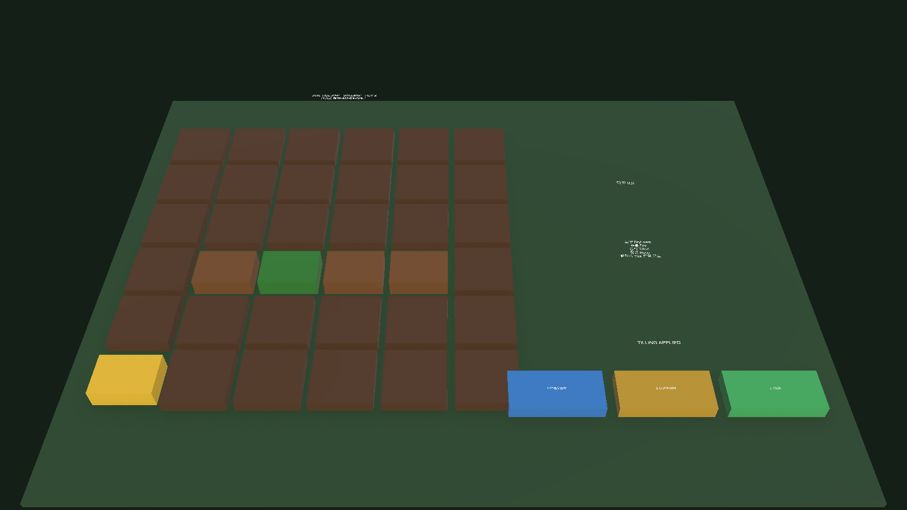

# Unity FARM-2 밭갈이 폐루프

## 결과

기존 FARM-0~FARM-1의 `FarmSoilTileSimulationDataSnapshot`, validator, Projector, 6×6 `FarmSoilTileGridView`와 stable-ID cell reconcile을 재사용했다. 새 타일 체계나 별도 Domain authority는 만들지 않았다.

구현된 흐름은 다음과 같다.

```text
Tile 선택
  → Tilling Preview
  → 명시적 Confirm
  → confirmed Simulation Command
  → Simulation Tick
  → revision 2 새 Snapshot
  → stable-ID View Reconcile
  → Untilled → Tilled / primitive Dirt Row
```

Preview와 Confirm 단계에서 원본 snapshot revision은 1로 유지된다. Tick만 새 snapshot을 반환하며 원본 객체는 수정하지 않는다. Command는 snapshot·scenario·rule·expected revision·tile stable ID와 Preview ID를 검증하고 forged/stale command를 거부한다.

## Unity 연결

- 제품 Scene: `Assets/SsalddelGenerated/Farm/FarmTillingVerticalSlice.unity`
- 기존 `FarmSoilTileSimulationController`에 Preview·Confirm·Tick 이벤트를 추가했다.
- `FarmSoilTileActionButtonView`는 클릭을 Grid View 요청으로 전달할 뿐 상태를 직접 변경하지 않는다.
- 타일 선택은 Preview·Confirm·Tick을 자동 실행하지 않는다.
- primitive fallback은 `Untilled`을 평평한 흙, `Tilled`을 높고 좁은 Dirt Row 형상으로 표시한다.
- NPC 도착, Animator Event, FX 완료와 Operational API 실패 fallback 경로는 추가하지 않았다.

## Game View 증거

선택 — revision 1, Preview 미생성:



Preview — revision 1 유지, 명시적 Confirm 필요:


Confirm — revision 1 유지, Simulation Tick 대기:


Tick 적용 — revision 2, `Tilled`, fallback row `(1.05, 0.34, 0.76)`:



## 검증

- .NET core `FarmSoilTileSimulationTests`: 10/10 통과
- Unity Farm View 집중: 6/6 통과
- Unity EditMode 전체: 55/55 통과
- Unity script recompile: 오류 없음
- 저장 Scene validator: 통과
- 최종 상태 직접 조회: `tick:2:Tilled:row=(1.05, 0.34, 0.76)`

Game View 단계 전환은 연결된 Editor에서 명시적 메서드를 순서대로 호출해 확인했다. Player build와 Play Mode 입력 클릭 전체는 이번 범위에서 실행하지 않았다.

## 다음 Gate

다음은 FARM-3 농부 작업 Presentation이다. Simulation Task가 제공하는 target tile을 semantic waypoint로 투영해 이동·정지·회전·최소 animation을 보여준다. NPC 도착과 animation 완료는 Command 확정이나 Simulation Tick 권위를 갖지 않는다.
