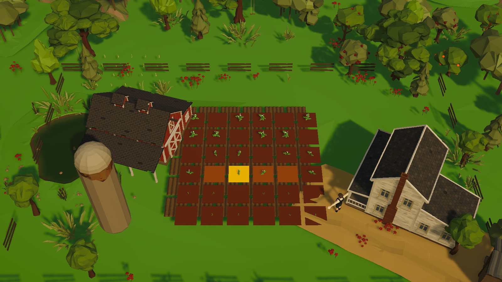
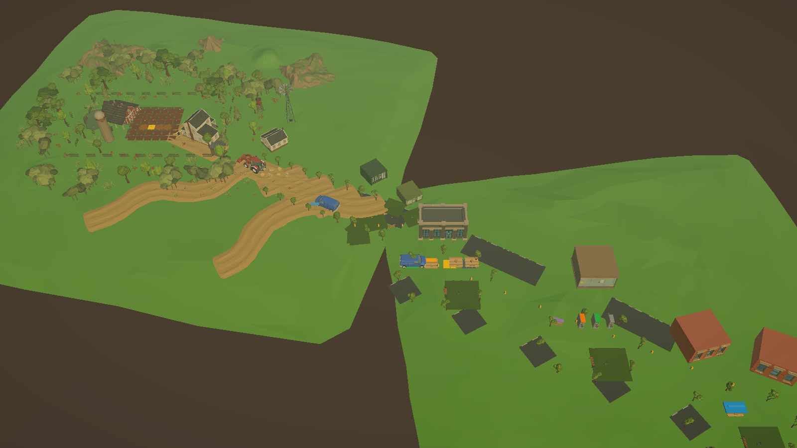
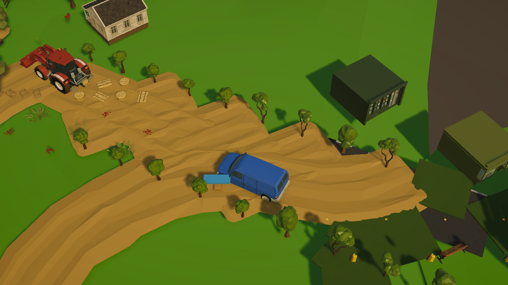
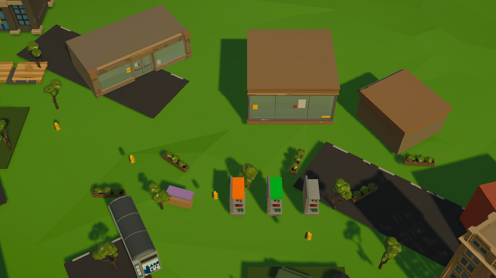

# Unity Farm·City 그래픽 배경 Showcase

## 결과

기존 `CityFarmVisualQualityGate`의 공급망 View·stable ID·Cargo wiring은 유지하면서, 구매한 `POLYGON Farm`과 `POLYGON City`를 Presentation 전용 환경 Catalog로 확장한 별도 `FarmCityGraphicalShowcase` Scene을 만들었다. 원본 vendor prefab과 material은 수정하지 않았다.

최종 Scene의 `Farm City Graphical Environment` 아래에는 환경 Wrapper 351개가 있으며 Farm 263개, City 88개와 Renderer 370개를 사용한다.

## 주요 변경

- Farm: 저폴리 지형, 산·언덕 원경, 수목 군락, 개별 나무, 사과·체리·오렌지 과수원, 풀·꽃, 연못·갈대·바위, Farmhouse·Windmill·Water Tower·Well·Fence·Hay, Wheat·Corn 장식 작물
- Farm Yard: 기존 Barn·Silo·Tractor·6×6 감자밭을 그대로 두고 주변 환경 밀도와 농촌 도로를 보강
- Farm→City: Dirt Road와 Farm/City 수목을 섞고 Van·상점·가로 시설을 배치해 농촌에서 도심으로 바뀌는 구간을 실제 Presentation 공간으로 유지
- City: Shop, Station, 소형 Office, 도로, 가로수, 화단, Bench, Bus Stop, Picnic Table, Umbrella, Light Pole을 추가
- Lighting: 전역 단일 Directional Light, Trilight ambient, fog와 별도 Showcase Volume Profile을 사용
- Camera: 기존 Perspective 3/4 Camera Rig과 World/Zone focus 계약을 재사용
- Showcase에서만 기존 회색 `SharedWorldGround`와 증거 HUD를 숨기며 원본 WORLD-5 Scene은 보존

## Architecture 경계

- 새 환경 key는 `environment.farm.*`, `environment.city.*`의 Presentation 전용 key다.
- 모든 Synty instance는 `WorldVisualInstanceView → VisualRoot → vendor prefab instance` 경계를 사용한다.
- Farm tile stable ID, Cargo stable ID/lineage, Simulation snapshot과 Operational contract는 변경하지 않았다.
- NPC 도착·Animation·FX에 Command나 Simulation Tick 권위를 추가하지 않았다.
- 원본 Synty prefab/material, 기존 URP Asset, Build Settings는 수정하지 않았다.

## Game View 증거

### Farm

6×6 밭, Barn, Silo, Farmhouse, 과수원, 연못과 수목 경계가 하나의 녹지 안에서 보인다.

### Overview

Farm→Farm Yard→Transport→City 방향을 확인한다. 이 캡처 뒤 City 쪽 Shop·Station·Office·거리 소품 밀도를 한 차례 더 높였으며, 아래 Market 캡처가 해당 최종 City 배치를 반영한다.

### Rural→City transition

Tractor와 Farmhouse가 있는 농장 도로에서 Cargo Van과 City 상점·가로수로 이어지는 전환을 확인한다.

### Market

Market shelf 주변에 Shop·Station·Office·화단·거리 소품을 배치한 최종 City 근접 화면이다.

## 검증 상태

- Unity script recompile: 성공, compiler error 0
- Showcase builder 실행 및 Scene 저장: 성공
- 빌더 내 wiring·vendor prefab·shader·missing script 검증: 성공
- 최종 Scene 생성 직후 Console Error: 0
- 측정한 Scene 환경 수: Wrapper 351, Farm 263, City 88, Renderer 370
- `FarmCityGraphicalShowcaseTests` 4개를 추가했으나 Unity Test Runner가 도메인 재로드 후 결과 collector 재연결 상태에서 고착되어 완료 결과는 얻지 못했다. 이 문서는 해당 테스트를 통과했다고 주장하지 않는다.
- Test Runner 고착 뒤 Pipeline 명령이 막혀 최종 Overview 재캡처와 최종 profiling은 미완료다. Unity Editor 재시작 승인 뒤 같은 Scene을 열어 테스트·Console·Overview·profiling을 다시 고정해야 한다.

## 의도적으로 하지 않은 것

- POLYGON Biomes Meadow/Forest Pack이 설치된 것처럼 새 계절·날씨·Meadow asset을 만들지 않음
- 원본 vendor prefab/material 직접 수정 없음
- Streaming, 낮밤, 대규모 날씨, interior 확장 없음
- Simulation/Operational 권위 변경 없음
- commit, push, build/deploy 없음

## 다음 진입점

1. Unity Editor를 안전하게 재시작한 뒤 Showcase 전용 테스트 4개와 전체 EditMode를 실행한다.
2. 최종 Overview·Farm·Logistics·Market Game View와 기본 performance stats를 다시 캡처한다.
3. 시각 범위를 다시 중단하고 FARM-3 농부 작업 Presentation으로 복귀한다.
