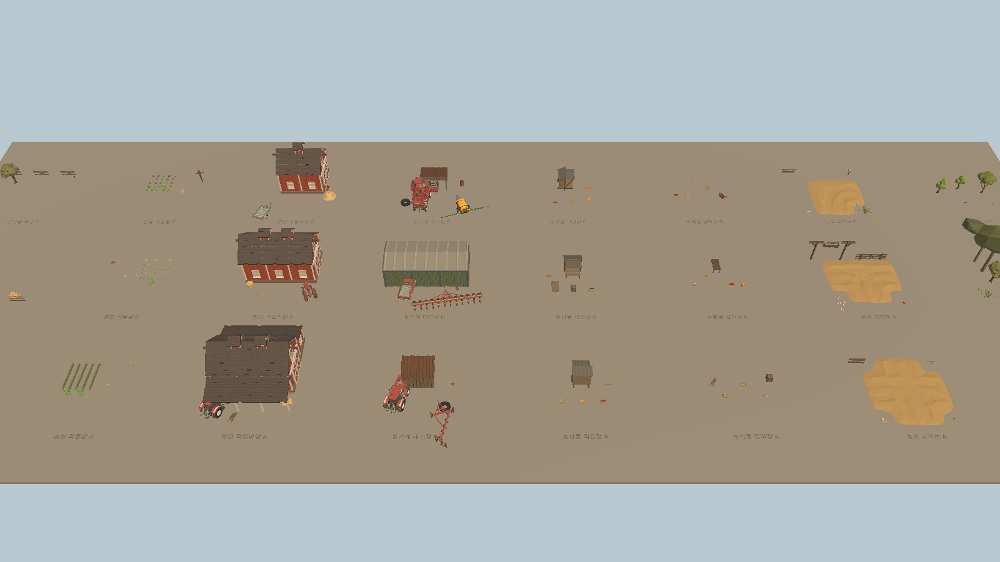

# Unity 농장 풍경 Composition Set Library

## 결과

제품 Unity 프로젝트 `C:\Users\user\ssalddel`에 POLYGON Farm 단일 prefab을 반복 가능한 작은 풍경으로 조합하는 `농장풍경CompositionSet` library를 추가했다.

- 한국어 풍경 세트 8종
- 각 세트 A/B/C 세 변형, 총 24개 prefab
- 실제 POLYGON Farm nested prefab 83종 사용
- footprint와 `EnvironmentRoot` 직렬화
- 실제감자밭·농부·차량·농기계·화물·상호작용용 `StatefulSockets` 분리
- `농장풍경CompositionCatalog.asset`에서 24개 조합 해결
- `농장풍경CompositionSetBuilder`로 prefab·catalog·preview Scene 재생성
- 원본 Synty prefab과 material은 수정하지 않음

## 대표 Game View



이 화면은 24개 조합을 한 번에 검사하기 위한 library preview다. 최종 농장 경영 Game View가 아니며, 실제 Farm Zone에 배치할 때 세트 간 scale·간격·전경 가림·업무 동선을 다시 조정한다.

## 구현 경계

```text
POLYGON Farm 원본 prefab
  → EnvironmentRoot의 nested prefab
  → 농장풍경CompositionSet A/B/C
  → 상태 연결 socket
  → 실제 Farm View 또는 Simulation Presentation
```

- 풍경 세트와 환경 object는 stable ID나 업무 상태를 소유하지 않는다.
- 감자밭 두렁 세트는 장식용 감자 생육을 만들지 않고 `실제감자밭` socket만 제공한다.
- 농부·차량·화물 socket은 위치 anchor이며 도착·animation으로 Command나 Simulation Tick을 실행하지 않는다.
- catalog와 prefab에는 server 권한, revision, 상품 수량과 작물 상태를 저장하지 않는다.

## 검증

- 새 Composition 집중 EditMode: 5/5 통과
- 기본 Unity EditMode assembly: 32/32 통과
- script recompile: 성공, compile error 0
- 24개 prefab의 Synty nested prefab source 연결 확인
- 세트별 A/B/C 완전성과 중복 key 없음 확인
- Simulation·Operational·Command·LifetimeScope component 없음 확인
- 저장 preview Scene: Composition Set 24개, Perspective camera, dirty false

Pipeline Test Runner 결과는 모두 통과했지만 호출 수명 종료 과정에서 Pipeline package의 `TestResultCollector`가 `InvalidOperationException`을 Console에 남겼다. 실패 test나 제품 코드 예외는 아니며, 후속 Pipeline package 검토 대상이다.
