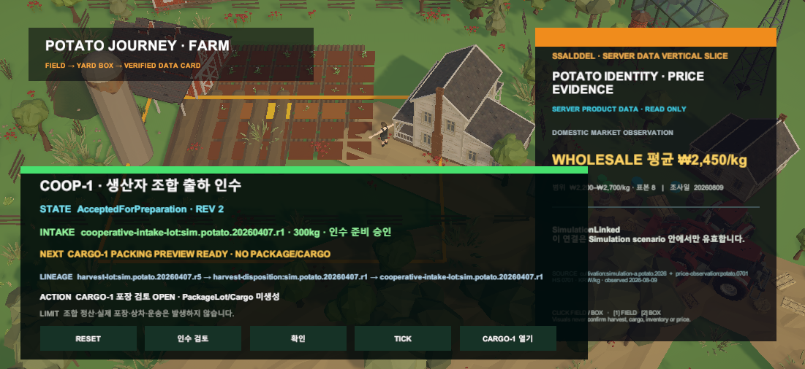

# Unity 생산자 조합 출하 인수

## 변경

- `CooperativeShipment` 판로가 결정된 300kg HarvestLot만 조합 인수 검토를 시작한다.
- 인수 Preview·Confirm·Simulation Tick 뒤 300kg 조합 인수 Lot과 CARGO-1 포장 검토 후보를 생성한다.
- 조합 인수 전에는 CARGO-1 adapter 연결을 거부한다.
- 승인 뒤에도 PackageLot과 Cargo는 만들지 않고 기존 CARGO-1의 포장 Preview 가능한 초기 snapshot만 연다.

## 경계

- 조합 정산이나 소유권 이전을 운영 상태로 기록하지 않는다.
- 실제 선별·포장·상차·운송을 실행하지 않는다.
- 원장 수량 300kg을 사용하며 화면의 상자 수로 수량을 계산하지 않는다.

## 대표 Game View

## 검증

- COOP-1 core 집중 테스트 8/8 통과
- Unity core 전체 313/313 통과
- Unity EditMode `CooperativeIntakeLifecycleViewTests` 4/4 통과
- Unity Play Mode Game View 직접 확인
